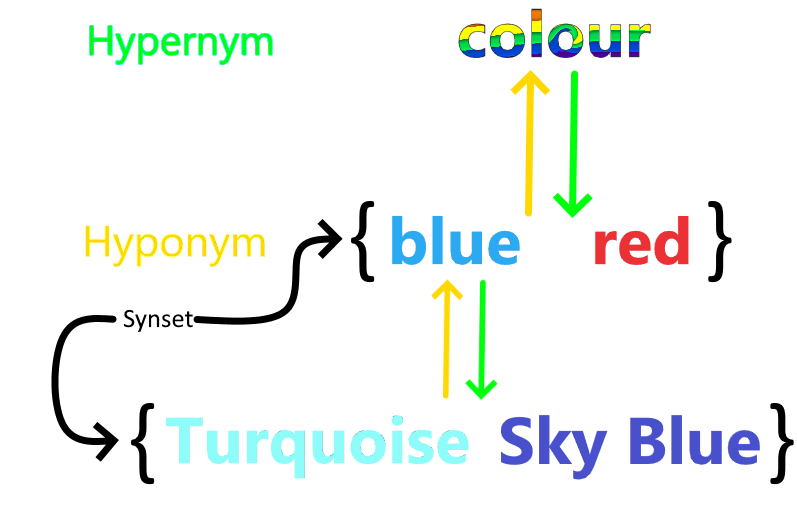

# Thesaurus

A thesaurus is a resource that groups [words](Words.md) by how similar their meaning is, from synonymy to autonomy, sometimes enriched with other relations and definitions. The difference between a thesaurus and a dictionary is that a thesaurus also has the relationships between words, it is like a network instead of a flat list. The plural of thesaurus is thesauri.

The most famous thesaurus for English is [WordNet](https://wordnet.princeton.edu). Words in a thesauri have **glosses**, which are an explanation of what a word means. There are nouns; verbs and adjectives and adverbs. In WordNet, you have synsets (near-[synonym](../Languages/Synonyms.md) sets) a set of things that are very similar because nothing is actually exactly the same. These synsets are connected by hypernym and hyponym (is a) relations. 

For example, a dog is a mammal and a human is also a mammal.   These are hypernym relations. The other way around is hyponym. So an example of a mammal is a dog.

**Human is a hyponym of mammal** and **mammal is a hypernym of human**.  Going down the tree is a hyponym relationship and going up the tree is a hypernym relationship. Also see the image below. Colour **is a** hypernym of blue and blue **is a** hyponym of colour. 

So you can traverse this tree, and then you can see how many steps it takes to get to another category. This is called the **path length** or maximum similarity. Two synsets are more similar the shorter the path that connects them.

So here, the path length between colour and Sky blue and plant is 2. 

Here is a bigger tree: 

 

So in this picture, finch is more similar to animal than tree because the path length of finch to animal is 2 while from tree to animal is 3. This picture is a simplification because remember instead of just one word there are always synsets of words which almost mean the same thing. 

## Resnik similarity
The Resnik similarity is a way to calculate [similarity](../Semantic-Similarity/Similarity.md) between synsets.

Path length by itself is a crude measure because every step is counted as 1. However, if you think about it, knowing that two things are a bird is more informative than knowing something is a mammal. You can already see this in the picture with bird having 2 hyponyms and mammal having 3 hyponyms. The Resnik similarity measure attempts to overcome this by calculating the information content each synset carries instead. So then when calculating the path length instead of always taking one you take the information content of the synset you go through.  

You can look at it as the information-content weighted path length: two words are more similar the **higher the information content** of their lowest common subsume. 

> **A common subsume** is a connection that both words have. So a common subsume of tree and flower is plant but also living and entity. Or finch and whale is animal and living and entity. The closest common subsume is the common subsume, which is the closest to both of your targets. The closest subsume of finch and flower is living. The closest common subsume of whale and bike is entity. The closest common subsume of tree and flower is plant.

> **The information content** is based on how often generally occurs. The more often something occurs, the lower the information content. Just like Shannon tells us. The more often something occurs, the lower the entropy and the lower the information content. **You can calculate it with 1/n** where n is how frequently it occurs in the corpus. 
> It makes sense. For instance, if a sentence starts with “the” then almost anything can follow, but if the sentence starts with “Rainbows” then much fewer things can follow that, so rainbow is more informative.

So in the example above, the Resnick similarity of whale and lion is lower than finch and penguin because mammal occurs more than bird. You would think, at least. 

So the less frequent the lowest common subsume is in a corpus, the higher the information content it has and the higher the Resnik similarity between two synsets.

### Example
So lets bird has information content of 0.5 and mammal has the information content of 0.2 and animal has an information content of 0.1 then the Resnik similarity between whale and finch is $0.5 + 0.2 + 0.1 = 0.9$. 

Now let's say the information content of vehicle is 0.3 and entity is 0.01 and living is 0.09. This makes the Resnic similarity between car and plant $0.3 + 0.01 + 0.09 = 0.4$. 

So, according to Resnic, whale and finch are more than twice as similar as plant and car. If you had just used path length, then they would have been the same lenght. 

## Lesk similarity
This type of similarity looks at the lexical overlap of the glosses of words. Two words are more similar the higher the lexical overlap between the glosses.

**Lexical overlap** is just the number of overlapping words in the glosses. So for instance: 

Cat: **Feline** mammal usually having thick soft fur and no ability to roar. 
Lion: Large gregarious predatory **feline** of Africa and India having a tawny coat with a shaggy mane in the male. 
Car: A motor vehicle with four wheels; usually propelled by an internal combustion engine. 

Cat and lion share a word, so their Lesk similarity is higher than cat and car. But at first glance, cat and car look more similar. Only one letter difference. 