Computational Linguistics

\pagebreak

# Topics 
Hi, this is the summary for the Computational Linguistics  [(800962-B-6)](https://uvt.osiris-student.nl/#/onderwijscatalogus/extern/examenprogramma/16322/8B218-2021?taal=en) course from Tilburg University created by Quinten Cabo. 

There are 5 topics:

- [Data](Data.md)
- [Classification](Classification.md)
- [Prediction](Prediction.md)
- [Languages](Languages.md)
- [Semantic-Similarity](Semantic-Similarity.md)

There are also some notes that are not in a topic. These are:

- [Goals](Goals.md)
- [Learning](Learning.md)
- [Bert Lecture](Other/Bert%20Lecture.md)
- [Quiz Questions](Other/Quiz%20Questions.md)
- [Practice Questions](Other/Practice%20Questions.md)
- [Things that he said come at the exam](Other/Things%20that%20he%20said%20come%20at%20the%20exam.md)

Is this summary based on a web of notes and explanations to wordy for you? Then there is also [Aurea's linear summary](Other/Computational-Linguistics-Aurea.pdf) which uses  short paragraphs and bullet points instead. 

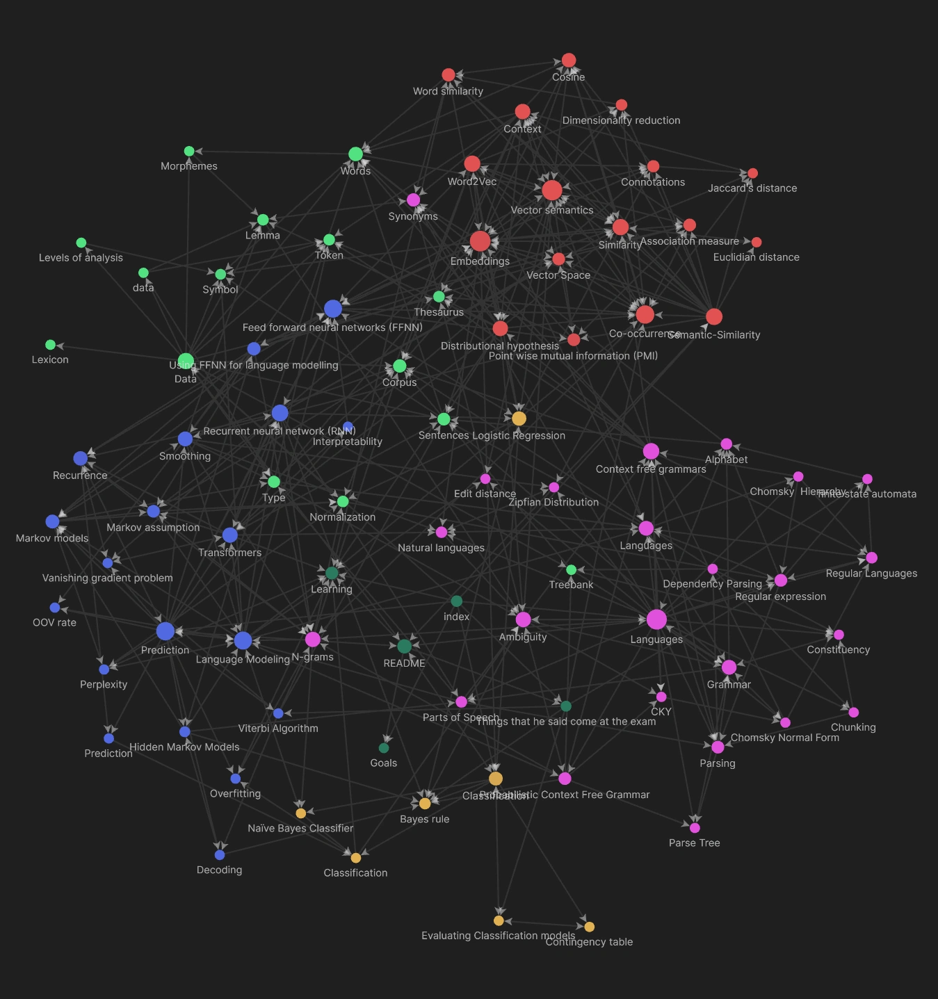


https://user-images.githubusercontent.com/24190849/172182045-0a225ef8-b56c-4190-be9e-6895417ee45e.mp4


# Disclaimer 
Although I have tried my best to make sure this summary is correct, I will take no responsibility for mistakes that might lead to you having a lower grade. 

# Issues 
If you see anything that you think might be wrong then please create an issue on the [Github repository](https://github.com/tintin10q/computational-linguistics-summary) or even better, create a [pull request](https://www.dataschool.io/how-to-contribute-on-github/) 😄 

# Support
If you appreciate my summaries and you want to thank me then you can support me
here: 

- [PayPal](https://www.paypal.me/quintencabo)
- [Tikki€](https://tikkie.me/pay/c3cp0dcfd8mautn8ud79)


>Every model is wrong, but some models are useful.
# Lexicon
A lexicon is a list of words enriched with some attributes. Plural is lexica. It is much simpler than a [corpus](Corpus.md). Usually a list of words within some domain or a list of words with some property, often represented with numbers.

Lexica do not contain the semantics of the word. So a dictionary is **not** a lexicon. 

# Words 
What is a word? This is a hard question to answer and is very language dependant. Today, one might say it is the characters between spaces? But spaces actually didn't exist yet until 400 years ago. There are also languages without words. This is why we have to talk about [morphemes](Morphemes.md) to define it better and to segment words.

This is also why when doing analysis, you want to tokenize your text, which is basically deciding what the words are from the string. 

## Representing words as numbers 
We usually think of words and letters as [symbols](Symbol.md). In that case, each symbol identical to itself and equally different from all other symbols of the same [type](Type.md). 

Alternatively, you can also encode words and letters as numbers or [lists of numbers](../Semantic-Similarity/Vector%20semantics.md) 
called vectors or [embeddings](../Semantic-Similarity/Embeddings.md). When you do this, a wide range of math tools become available to analyse **graded relations** between symbols. This allows you to say things about how similar dog and cat are. 

# Symbols

A symbol is what you decide is your smallest unit. This can be [tokens](Token.md), words etc whatever you want.


# Token & Type & Lemma Example

I will eat what you eat, even if I have never eaten it before.

- 14 [Token](Token.md) (16 with punctuation).
- 12 [Type](Type.md) (eat and eat are of one type, and the two I as well.)
- 11 [Lemma](Lemma.md) (eat and eaten are the same lemma (not the same type))


# Treebank 

A treebank stores syntactic trees. Treebanks provide [corpora](Corpus.md) consisting of syntactically annotated sentences. The Pann Treebank has annotated the Brown, Switchboard, ATIS, and WSJ corpora and some Arabic and Chinese. More treebanks exist for other languages. 

The Penn treebank uses bracketing to mark [constituents](../Languages/Constituency.md). Some phrases come with annotations about their grammatical function and semantic function. 

You can derive the [grammar](../Languages/Grammar.md) of a language with a treebank. However, [natural languages](../Languages/Natural%20languages.md) are infinite. 

# Lemma
A lemma is the dictionary entry of a word. So this is always a word, not just a character. Types and tokens can also be characters. So if you have “The ape shared bananas with the other apes” then ape and apes here are the same lemma. It is like removing the 's and like the extra things. These extra modifier things are called [Morphemes](Morphemes.md). Walking and walk are considered the same lemma. Is and am are also considered the same lemma. 

The citation form is a [synonym](../Languages/Synonyms.md) for lemma. 

## Word forms 

Word forms are the other possible versions of a lemma, which mean the same thing. For instance, the verb *sing*. Sing is the lemma for the word forms sing, sang and sung. 

## Lemmatization

Lemmatization is the process of **reducing each word-form** found in a corpus **to its corresponding lemma**.

### Examples
- Went → Go
- Geese → Goose
- Best → Good
- Talked → Talk
- Apples → Apple
- Biked → Bike
- Biking → Bike
- Bike → Bike

You go to the base form. Sometimes the base is language specific. Lemmatizers are specific for languages. [Here](./data.md) is an example of how lemmas compare to tokens and types.

## Word sense 

The meaning of a word can be considered separately from the word symbol. **The meaning of a word is captured in the word sense**. A word sense can be expressed in text. So the word sense of apple is a mostly round fruit. Interestingly, in this explanation I relied on other word senses for instance fruit to explain the word sense of apple.  

### Polysemous – Multiple meanings
Sometimes a lemma can have multiple word senses. For instance, apple can also refer to fruit or an organization. When this occurs, a lemma is called **polysemous** (have multiple senses). These multiple meanings lead to [ambiguity](../Languages/Ambiguity.md). In the book on page 103 the example of mouse is given. A mouse can be a rodent or an input device for a computer.  Each of these separate meanings is called a **word sense**. 

# Morphemes 

Morphemes are the smallest meaning bearing unit of languages. But this is controversial. 

When doing [lemmatization](Lemma.md), you turn a word into its lemma form. The lemma of apes is ape. Here, you removed the 's'. The parts you removed were **affixes**, and the part that stays behind is the **stem**. Both stems and affixes are **morphemes**. 

- **Stems** is the main meaning bearing unit in a word.
- **Affixes** are the strings that modify stems in some way.

For something to be a morpheme, it has to have meaning. For instance, if you have walk then if you remove anything of this:  

>['alk', 'Tlk', 'Tak', 'Tal', 'lk', 'ak', 'al', 'k', 'l', 'k', 'a', 'l', 'a', 'lk', 'Tk', 'Tl', 'k', 'l', 'k', 'T', 'l', 'T', 'ak', 'Tk', 'Ta', 'k', 'a', 'k', 'T', 'a', 'T', 'al', 'Tl', 'Ta', 'l', 'a', 'l', 'T', 'a', 'T']

These all have no meaning. 

## Inflected 
When affixes are added to a stem, the word becomes **inflected**. For example, if you have the stem green then green**er** is an **inflected** version of green. Another example is house and houses (houses is inflected). 

## Stemming

Stemming is when you remove all the affixes of a stem. It doesn't have to be the same as lemmatization. Because you don't have to go to the dictionary version. For instance, with irregular verbs. Broke is the past version of break. However, both are stems. 

So if you stem on *broke* you get *broke*. If you stem on *break* you get *break*. If you stem  *breaking* you get *break*. If you do lemmatization on broke, you get break. 

So stemming only removes affixes, lemmatization goes to the lemma. 

Sometimes a word with affixes occurs separately in the dictionary. For instance, the word “lemmatization”. If you stem this, you get lemma. If you lemmatize it, you get “lemmatization” because lemmatization also occurs separately in the dictionary (with the affixes). 

So sometimes stemming is more disruptive, sometimes lemmatization is more disruptive, it depends on the dictionary and the kind of affixes. 

# Kinds of affixes

## Inflectional
The inflectional affixes don't create new words in the dictionary. This means that they are removed by lemmatization. They tend to encode number, tense, aspect, gender, case. Inflectional affixes are fully productive. This means that with any (regular) verb, noun etc you can add these to indicate the meaning. You can always add `+ed` to a verb to indicate the past. You can always indicate more than one by adding an -s. One human, multiple humans. 

So words of the same class can get the same inflectional affixes. These affixes are morphine's. Irregular words can not. For instance, one sheep and multiple sheep.

## Derivational 
The derivational affixes create new words in the dictionary. They do this by either changing the grammatical category of the word, which changes the meaning of the word. Or by encoding things like negation, nominalization, reiteration ... which directly changes the meaning of the word.

- Happy → unhappy 
	- Stem: happy
	- Lemmatization: unhappy
- Happy → happy + ness → happiness
	- Stem: happy
	- Lemmatization: happiness
- Happy → un + happy + ness → unhappiness 
	- Stem: happy
	- Lemmatization: unhappiness

# Compounding 
Sometimes you can also combine stems together to produce new meaning. For instance:

- fire + fighter = firefighter
- tele + vision = television
- motor + bike = motorbike

These types of words are called compounds. In Dutch, it's called dubbel worden, double words. 

The meaning of a compound can be very clear and easy to guess to very opaque where the meaning is not very much if at all related to the constituents.

# Morphological complexity
Words can have different morphological complexity. A word is <b><u>Mono</u>morphemic</b> when they only consist of a single morpheme (plus possible inflectional morphemes) 

<b><u>Poly</u>morphemic</b> is when the word includes derivational affixes or are compounds. 


# Token
A token is every entry in a [corpus](Corpus.md). The idea is that no token is the *same*. If you have the sentence “The boys like boys who like apples” then the word boys occurs multiple times, but we consider it a different token. 

# Corpus

The main resource for data are corpora.  A corpus is a **computer readable** collection of linguistic productions. Text, speech, gestures. You have **one corpus** and there are **multiple corpora**.

## Variants of Corpus 
So structured data. Corpora are made by different people, this also makes them vary a lot. 

- Who produced it?
	-	Age, gender, education, ethnicity....
- What language(s) is it?
- When was the text produced?
	- Synchronic corpus is if no time period information is in the corpus. 
	- Diachronic is when there is a time dimension. 
- For which goal or function was the corpus produced?
	-	Genre, medium

These questions make corpora vary.

## Choosing a corpus based on this is important.
Sentences in languages are mostly infinite. This is why selecting a corpus that is **representative** of the phenomenon you want to model is very important. Your model will only be as good as the data you base it on. 

## Properties of a corpus
- Crawled/manually curated 
	- Crawled is fetched from the internet 
- Balanced/imbalanced
- Single author/more authors 
- Diachronic/Synchronic 
	- Diachronic is organized along the time dimension
	- Synchronic is not organized along the time dimension
- Written/spoken/mixed/video (the modal)
- Single language/multi-language/parallel 
	- Parallel is when the different languages talk about the same things. 
- ...

# Sentences

A sentence is a sequence of [symbols](Symbol.md). So sentence = sequence, they are [synonyms](../Languages/Synonyms.md). Often when talking about a sentence, we mean a sequence of [words](Words.md). So in that case, we consider words as symbols.

# Type
A type is every distinct word in a [corpus](Corpus.md). So with “The apple boys like boys who like apples”. Here the 2 boys tokens are of the same type. So types can occur more often, so you can connect a frequency to them. Apple and apples are not the same type! 

Types are typically unambiguous. More than 80% of words in the English [language](../Languages/Languages.md) are [unambiguous](../Languages/Ambiguity.md). But the types that are [ambiguous.](../Languages/Ambiguity.md) occur frequently. Almost two thirds of the [tokens](Token.md) in a corpus are ambiguous.

# Thesaurus

A thesaurus is a resource that groups [words](Words.md) by how similar their meaning is, from synonymy to autonomy, sometimes enriched with other relations and definitions. The difference between a thesaurus and a dictionary is that a thesaurus also has the relationships between words, it is like a network instead of a flat list. The plural of thesaurus is thesauri.

The most famous thesaurus for English is [WordNet](https://wordnet.princeton.edu). Words in a thesauri have **glosses**, which are an explanation of what a word means. There are nouns; verbs and adjectives and adverbs. In WordNet, you have synsets (near-[synonym](../Languages/Synonyms.md) sets) a set of things that are very similar because nothing is actually exactly the same. These synsets are connected by hypernym and hyponym (is a) relations. 

For example, a dog is a mammal and a human is also a mammal.   These are hypernym relations. The other way around is hyponym. So an example of a mammal is a dog.

**Human is a hyponym of mammal** and **mammal is a hypernym of human**.  Going down the tree is a hyponym relationship and going up the tree is a hypernym relationship. Also see the image below. Colour **is a** hypernym of blue and blue **is a** hyponym of colour. 

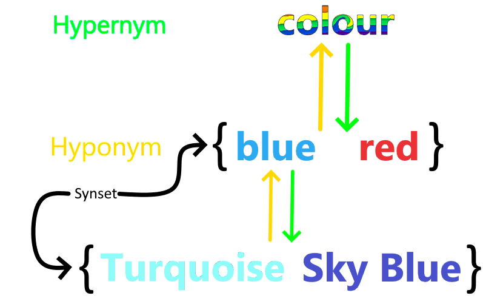

So you can traverse this tree, and then you can see how many steps it takes to get to another category. This is called the **path length** or maximum similarity. Two synsets are more similar the shorter the path that connects them.

So here, the path length between colour and Sky blue and plant is 2. 

Here is a bigger tree: 

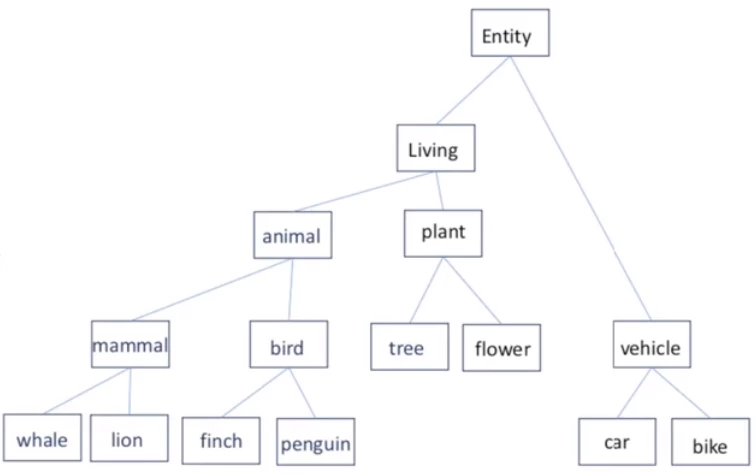 

So in this picture, finch is more similar to animal than tree because the path length of finch to animal is 2 while from tree to animal is 3. This picture is a simplification because remember instead of just one word there are always synsets of words which almost mean the same thing. 

## Resnik similarity
The Resnik similarity is a way to calculate [similarity](../Semantic-Similarity/Similarity.md) between synsets.

Path length by itself is a crude measure because every step is counted as 1. However, if you think about it, knowing that two things are a bird is more informative than knowing something is a mammal. You can already see this in the picture with bird having 2 hyponyms and mammal having 3 hyponyms. The Resnik similarity measure attempts to overcome this by calculating the information content each synset carries instead. So then when calculating the path length instead of always taking one you take the information content of the synset you go through.  

You can look at it as the information-content weighted path length: two words are more similar the **higher the information content** of their lowest common subsume. 

> **A common subsume** is a connection that both words have. So a common subsume of tree and flower is plant but also living and entity. Or finch and whale is animal and living and entity. The closest common subsume is the common subsume, which is the closest to both of your targets. The closest subsume of finch and flower is living. The closest common subsume of whale and bike is entity. The closest common subsume of tree and flower is plant.

> **The information content** is based on how often generally occurs. The more often something occurs, the lower the information content. Just like Shannon tells us. The more often something occurs, the lower the entropy and the lower the information content. **You can calculate it with 1/n** where n is how frequently it occurs in the corpus. 
> It makes sense. For instance, if a sentence starts with “the” then almost anything can follow, but if the sentence starts with “Rainbows” then much fewer things can follow that, so rainbow is more informative.

So in the example above, the Resnick similarity of whale and lion is lower than finch and penguin because mammal occurs more than bird. You would think, at least. 

So the less frequent the lowest common subsume is in a corpus, the higher the information content it has and the higher the Resnik similarity between two synsets.

### Example
So lets bird has information content of 0.5 and mammal has the information content of 0.2 and animal has an information content of 0.1 then the Resnik similarity between whale and finch is $0.5 + 0.2 + 0.1 = 0.8$. 

Now let's say the information content of vehicle is 0.3 and entity is 0.01 and living is 0.09. This makes the Resnic similarity between car and plant $0.3 + 0.01 + 0.09 = 0.4$. 

So, according to Resnic, whale and finch are twice as similar as plant and car. If you had just used path length, then they would have been the same in similarity. 

## Lesk similarity
This type of similarity looks at the lexical overlap of the glosses of words. Two words are more similar the higher the lexical overlap between the glosses.

**Lexical overlap** is just the number of overlapping words in the glosses. So for instance: 

Cat: **Feline** mammal usually having thick soft fur and no ability to roar. 
Lion: Large gregarious predatory **feline** of Africa and India having a tawny coat with a shaggy mane in the male. 
Car: A motor vehicle with four wheels; usually propelled by an internal combustion engine. 

Cat and lion share a word, so their Lesk similarity is higher than cat and car. But at first glance, cat and car look more similar. Only one letter difference. 

# Normalization

Normalization is the act of trying to reduce noise, so the signal becomes stronger, and so it can be picked up. When analysing a text, normalization can be useful. This can entail:

- Segmenting sentences from text
- Segmenting individual words (tokenization)
- Lemmatization
- Spelling correcting
- Making everything lowercase. 
- Eliminating undesirable characteristics
- Remove the most frequent [words](Words.md).

Sometimes you want to create a bag of words after you have done lemmatization if you don't care about the variability between dog and dogs. 

You can also use [regular expressions](../Languages/Regular%20expression.md) to transfer words that you consider the same into the same word. Or transfer all email address to EMAIL. Or you could say DAYOFWEEK for each week day. 

## Losing information
You always lose information when normalizing, so you have to be careful. Often you want to lose this information, but for instance God and god can mean different things and things like this you might want to keep. Or so and soooooo can be considered the same or not, it depends. You might care about this difference and loose it if you normalize it. 

## Ambiguous words
- gold-digger, 2 words? 1 word?
- Clitecs: I'm, 2 words? 1 word?
- Abbreviations: e.t.c. 3 words? 1 word?

You can keep going. 

This is why you have **tokenizers** that turn the text into tokens. The tokens don't have this problem.

### LCD

LCD is a standard for tokenizing . 

For instance, you always consider `.` a separate token. Abbreviations are one word. `Doesn't` should be tokenized, as `does` and `n't`. The people that made LCD thought hard about what tokenizing decisions should be made.


# Levels of analysis
Computational linguistics is about analysing and producing language with computers. You can analyse languages on different levels. Here they are:

## Phonology

Studies linguistic sounds to construct **inventories of sounds with a linguistic role**. A phonetic is a basic sound. There is a fixed list of basic sounds that humans can make. From these sounds, words are formed. The idea of phonology is to analyse the languages by looking at the basic units. Because switching them up changes the meaning. **We won't look at this one much, if at all.**

## Segmentation
In the context of computational linguistics (CL) segmentation is the task of splitting text or speech into [symbols](Symbol.md) of the appropriate granularity. In a text, words are symbols, but they are made up of letter symbols etc. 

Segmenting speech is harder because it is unclear where the spaces are. Fun fact, spaces were only invented 4 centuries ago!

## Morphology 
This studies how words are built up from smaller meaning-bearing units, the [Morphemes](Morphemes.md). The classic view of CL is that a morpheme is the smallest linguistic unit that can carry meaning. This is a controversial point, apparently. Morphological complexity varies between languages more simple or super complex. So the word "apple" is a morphine, which means 🍎 (that is supposed to be an apple emoji). Then if you have "apples" you also have the morpheme s which means more than one apple. 

The complexity is determined by the amount of morphologic units are in one symbol. 

## Syntax

Studies of the set of rules, principles and processes for combining symbols according to the structure of the language. This asserts whenever a sentence is well-formed. **But it doesn't look at meaning at all**. So you can have something like the chicken cooked the ropes from the chimney. It is formed ok, but the meaning does not make sense. It is quite hard to make sentences which don't mean anything. 

## Lexical semantics 
This describes the meaning of single symbolic units like words, morphemes and collocations. It looks to classify and decompose lexical structures cross linguistically, and understand similarities. So this is about units, analysing and comparing units of syntax. 

## Compositional Semantics
This studies how atomic meanings are combined into larger meaningful units, such as sentences, paragraphs etc. Because you can't just keep adding atomic units together. 

## Pragmatics
This analyses how context influences meaning. This encompasses semantics, linguistic knowledge of participants, situational context, shared knowledge, goals and intent. Super hard for computers to do. 

# What to do when analysing language 
1. Identify the language we are dealing with.
2. Identify the linguistic units of interest (letters, morphemes, words, phrases, sentences, paragraphs ...)
3. Find the structure beneath the service.
4. Understand what each symbol means.
5. Understand what the whole message aims to convey
6. Respond appropriately (by a computer) 

Number 6 is the gold jewel of this whole field. That is what it is all for. 

# Co-occurrence

Co-occurrence is a simple way of comparing the meaning of words in a corpus without the need for annotation or a [thesaurus](../Data/Thesaurus.md).  The idea is to create a co-occurrence sets for the two words from the [context](Context.md) they appear in. 

You do this by specifying the length of your context, for instance a sentence, and then you just add all words to a set which co-occur in that context around the target word.  
 
After you have these sets, you can use the [Jaccard's distance](Jaccard's%20distance.md) to derive at a similarity measure. If you want, you can also visualize this as a [vector](Vector%20semantics.md) instead of a set where every value in the vector is either 0 or 1 to indicate if the word appeared in the context of the target word or not. 

|       | Cat | Food | Music | Beans |
| ----- | --- | ---- | ----- | ----- |
| Cat   | 1   | 1    | 0     | 0     |
| Food  | 1   | 1    | 1     | 1     |
| Music | 0   | 1    | 1     | 0     |
| Beans | 0   | 1    | 0     | 1     |

This method is very flat and coarse. There is no information about co-occurrence frequency or about context similarity,, and it is prone to chance co-occurrences. Basically every item only exist once in a set, so there is no frequency taken into account. To do that, you need to look at co-occurrence counts.  

# Co-occurrence counts 
To improve upon co-occurrence, you can also count how often a word appears in the context of a target word. Instead of just adding words which appear in a context of a target word to a set. 

I would do this like this:

```python
from collections import defaultdict

# Get the corpus data
with open('corpus.txt') as corpus_file:
	corpus = corpus_file.read()

# A word will have the default value of a default dict with 0 as default value
co_occurence_counts = defaultdict(lambda : defaultdict(lambda : 0))

words_in_corpus = set(corpus.split(' '))

sentences = set(corpus.split('.'))

for target_word in words_in_corpus: # Make the count for every word 
	for sentence in sentences:  # Sentence is the context here
		sentence = sentence.split(' ')
		if target_word in sentence:
			sentence.remove(target_word) # Don't co occure with yourself
			for word in sentence:
				co_occurrence_counts[target_word][word] += 1

# Now you have a dict with all the words and the counts of the words in their context

# Because of the default dict all other words will be 0 if accessed.

# Hopefully you can see how the dict relates/can be easily transformed to a matrix/vector space 
```

This then gives you a matrix something like this (but then bigger):

|       | Cat | Food | Music | Beans |
| ----- | --- | ---- | ----- | ----- |
| Cat   | 20   | 16   | 2     | 6     |
| Food  | 16  | 4    | 1     | 70    |
| Music | 2   | 1    | 40     | 0     |
| Beans | 6   | 70   | 0     | 100     |

This matrix represents the **vector space**. Then you can compare rows of this vector space (which are the embeddings) by computing the [Cosine](Cosine.md) angle between two rows (vectors). 


## Hyperparameters 
Both these methods have hyperparameters which can vary. For instance, you can pick different context sizes, leave out the x most frequent words in the corpus. Assign different occurrence counts the further a word is from the target words, and on and on. You can also use [N-grams](../Languages/N-grams.md) instead of words, for instance.

# Problems with count based embeddings
We are just assigning the same number to each word which occurs in the context. However, some words in the context might provide more information than others. This method currently does not take advantage of that. Basically, the raw frequency counts don't take into account the information provided by the context. 

The vectors are **very space** (because of the [Zipfian Distribution](../Languages/Zipfian%20Distribution.md) of language) as the vectors are the same size as every distinct word in the corpus, often like 40,000 in size. The most of the vector will just be 0. These things could be solved somewhat by tweaking the hyperparameters described above. You want to apply [dimensionality reduction](Dimensionality%20reduction.md) to make the embeddings more usable. 

## Association measure
To solve the not taking into account of information problem is to weight each count collected for each word which appeared in the context by an **[association measure](Association%20measure.md)** before you compute the cosine angle between two vectors. 


# Cosine 
The **cosine** [similarity](Similarity.md) can calculate the semantic similarity between two [words](../Data/Words.md), [sentences](../Data/Sentences.md) or two documents when represented as [vectors](Vector%20semantics.md) or [embeddings](Embeddings.md). 

The idea of the cosine metric when comparing [embeddings](Word%20similarity.md) is to calculate the cosine of the angle between the vectors (in n-dimensional space) This means that the two word vectors you want to compare have to have the same shape/dimensionality. 

Let's say we have the words Village and Waiter and those are represented with the vectors **v** and **w** of the same size. Now we want to use cosine to calculate the similarity of **v** and **w**. First you can take the dot product of the two vectors: $$\textbf{v} \cdot \textbf{w}$$
> **Reminder**
> Dot product is defined as: $$\sum\limits_{i=1}^Nv_iw_i=v_1w_1+v_2w_2+...+v_Nw_N$$

The dot product acts as a similarity metric because it will tend to be high just when the two vectors have large values in the same dimensions and vectors that have zeros in different dimensions (orthogonal vectors) will have a dot product of 0, representing their strong dissimilarity.

This raw dot product favours vector length long vectors because the dot product is higher if a vector is longer (with higher values in each dimension). More frequent words have longer vectors, since they tend to co-occur with more words and have higher co-occurrence values with each of them. 

This is not good because it would mean longer vectors are more similar, which doesn't make sense. Longer here is not the number of items in the vector, it is the length of the vector from the center of the n-dimensional space to 'final location' of the vector. See below:

> The vector length is written as $|\textbf{v}|$ so with those two | |
> The vector length is defined as: $$|\textbf{v}| = \sqrt{\sum\limits^{N}_{i=1}{v^2_i}}$$ 
> So you take the sum of the elements after you multiplied all the elements of the vector by themselves, and then you take the square root of that.  

We would like a similarity metric that tells us how similar two words are regardless of their frequency. To overcome this issue, we modify the dot product to normalize for the vector length by dividing the dot product by the lengths of each of the two vectors. $$\frac{\textbf{v} \cdot \textbf{w}}{|\textbf{v}||\textbf{w}|}$$
This normalized dot product turns out to be the same as the cosine of the angle between the two vectors . 

$$\frac{\textbf{v} \cdot \textbf{w}}{|\textbf{v}||\textbf{w}|} = \cos{\theta}$$
So then this is also true:$$\textbf{v} \cdot \textbf{w} = |\textbf{v}||\textbf{w}| \cos{\theta}$$
This means we calculate the **cosine** metric between two vectors **v** and **w** as: $$\text{cosine}(\textbf{v},\textbf{w}) = \frac{\textbf{v} \cdot \textbf{w}}{|\textbf{v}||\textbf{w}|} = \frac{\sum\limits^N_{i=1}{v_iw_i}}{\sqrt{\sum\limits^N_{i=1}{v_i^2}}\sqrt{\sum\limits^N_{i=1}{w_i^2}}}$$
These are all the same. Even though the most to the right looks daunting, it is just the dot product on top and the vector length calculations expressed with the sum sigma notation.


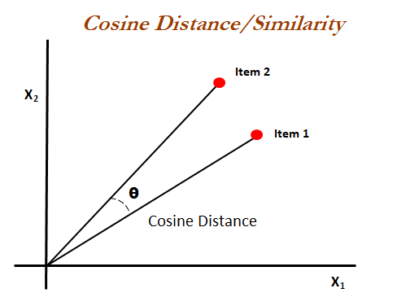

# Jaccard's distance
 The Jaccard distance is a simple way to quantify how similar the [context](Context.md) is of two words is. 

The idea is Jaccard's distance is that you divide the intersection of two sets and the union of two context sets. This gives a value between 1 and 0. With 1 being complete overlap and 0 being no overlap. This is a more general method to compute the similarity of two sets. 

This is idea can be expressed with this math: $$\text{Jacc}(\textbf{x},\textbf{y}) = \frac{\textbf{x}~\cap~\textbf{y}}{\textbf{x}~\cup~\textbf{y}}$$

You can use Jaccard distance to calculate the similarity between two [co-occurrence](Co-occurrence.md) sets. 

This method is very flat and coarse. There is no information about co-occurrence frequency or about context similarity,, and it is prone to chance co-occurrences. Basically every item only exist once in a set, so there is no frequency taken into account. To do that, you need to look at  [Co-occurrence counts](Co-occurrence.md).


# Word similarity 
Sometimes [words](../Data/Words.md) are [synonyms](../Languages/Synonyms.md) of each other. But they can also be related in other ways. For instance, coffee and cup are related but might not seem related to a computer. 

## Asking humans 
One way is asking humans to say how related they think word pairs are and using those scores. This requires a lot of effort. 

### Semantic fields 
One way of asking humans is by asking them if a word belongs to a semantic field. Words that are in the semantic field *hospital* could be related like surgeon, scalpel, nurse, aesthetic, hospital, operation, disease, recovery and so on. 

**Topic models** use semantic fields to discover abstract semantic fields in documents. A topic model can say which semantic fields are similar. 

Semantic fields and topic models can be used to discover the topical structure of a document using unsupervised [learning](../Other/Learning.md). 

### Semantic Frames
A semantic frame is a set of words which encapsulate perspectives or participants in a particular type of event. For instance, a commercial transaction is an event where one entity trades something (usually money) to another entity in return for something valuable, like a service or a some goods. Now verbs like buy, sell or nouns like buyer, seller, goods, money, service encode this event lexically. Frames have semantic roles, and words in the sentence take roles in the event. Knowing about the frame allows paraphrasing a sentence: *Quinten bought the book from Ling* as *Ling sold the book to Quinten,* for example. 

## Using vectors 
You can get a sense of the meaning of words by [assigning vectors to words](Vector%20semantics.md). This approximates meaning. Basically, the computer can never grasp the meaning of a word, but it can know if two words are likely to mean the same / are [synonyms](../Languages/Synonyms.md) because the vectors are [similar](Similarity.md). The closeness is dependent on the way you decide to calculate distance, usually this is done with [cosine](Cosine.md). 


# Association measure
When using [Co-occurrence](Co-occurrence.md) to create  a [Vector Space](Vector%20Space.md) from a corpus, you are just assigning the same value to each word which occurs in the [context](Context.md) along a target word. However, some surface forms in the context might provide more information than others. Basically, the raw frequency counts don't take into account the information provided by the context.  To overcome this, it is useful to apply an association measure. 

The idea is to **warp the [Co-occurrence](Co-occurrence.md) patterns to weigh the more informative contexts more and the useless ones less** (or not at all). One way to compute these weights is with the [Point wise mutual information (PMI)](Point%20wise%20mutual%20information%20(PMI).md).

# Distributional hypothesis

The **distributional hypothesis** says that [words](../Data/Words.md) which are [similar](Similarity.md) in meaning tent to appear in the same context and places in [sentences](../Data/Sentences.md). In other words, similar words are used with the same other words. 

For instance, *eye doctor* and *oculist* are a [synonym](Synonyms.md). However, a computer doesn't know this without looking at for instance a [thesaurus](../Data/Thesaurus.md). With the distributional hypothesis, a computer can also [learn](../Other/Learning.md) which words are similar semantically by looking if they appear in the same places and context in sentences. 

So the distributional hypothesis says that two words are more similar when the overlap of their contexts is large.

Models which use the distributional hypothesis are called distributed semantic models (DSM).

> **You shall know a word by the company it keeps**
> J.R. Firth (1957)

## Example 
Suppose you didn’t know the meaning of the word ongchoi (a recent borrowing from Cantonese) but you see it in the following contexts: 
- Ongchoi is delicious sautéed with garlic.
- Ongchoi is superb over rice.
-  ...ongchoi leaves with salty sauces... 

And suppose that you had seen many of these context words in other contexts: 
- ...spinach sautéed with garlic over rice... 
- ...chard stems and leaves are delicious... 
- ...collard greens and other salty leafy greens 

The fact that ongchoi occurs with words like rice and garlic and delicious and salty, as do words like spinach, chard, and collard greens might suggest that ongchoi is a leafy green similar to these other leafy greens. The same thing can be done computationally by just counting words in the context of ongchoi. The computer would not know what ongchoi means, but it would know that it shares meaning with food words. 


## Problem with the distributional hypothesis
One large problem with the distributional hypothesis is that some words can have multiple [senses](../Data/Lemma.md) (multiple meanings). For instance, table can be something like this (sense 1):


Or something like this (sense 2):

| Number | A     | B   | C   |
| ------ | ----- | --- | --- |
| 1      | Red   | 5   | Birds    |
| 3      | Blue  | 5   | Dogs    |
| 7      | Green | 500 | Green Birds    |

This would mean that a word's [Co-occurrence](Co-occurrence.md) with different contexts both where table means sense 1 and other where it means sense 2. So in a way it does capture the fact that table means 2 things, but this is not great because it means that the table vector will be related with both waiter and cells. But of course in real life we only mean one for instance of sense 2. So it conflates to two meanings. 

Ultimately this leads to lower [similarity](Similarity.md) scores because the part of the vector which is high because of sense 1 will lower the similarity of sense 2. Both cancel each other out and lower the similarity for the other sense.  

So these models don't deal well with [ambiguity](../Languages/Ambiguity.md). Or maybe they deal too well with it? 

[Transformers](../Prediction/Transformers.md) are able to deal with this well. The idea is to compute the embeddings on the fly. Instead of all beforehand.   


# Euclidean distance 
The Euclidian distance calculates the distance between two points by:

1. Calculating the distance between each coordinate of the point and 
2. Multiplying each distance by itself 
3. Summing all the distances from every coordinate 
4. Taking the square root of that. 

If we have the two vectors $\textbf{v}$ and $\textbf{w}$ this can be expressed with math like so: $$d(\textbf{v}, \textbf{w}) = \sqrt{(\textbf{v}_{0}-\textbf{w}_{1})^2+(\textbf{v}_{0}-\textbf{w}_{1})^2+...+(\textbf{v}_{n}-\textbf{w}_{n})^2}$$ 
Here d stands for distance. 

For [embeddings](Embeddings.md) this is **not** a good measure of [similarity](Similarity.md) because it is heavily influenced by absolute large differences. For example, if the distance of only one coordinate is really high, for instance 300 and all the other distances are around 3 then the computer still thinks the two embeddings v and w are far away from each other. 

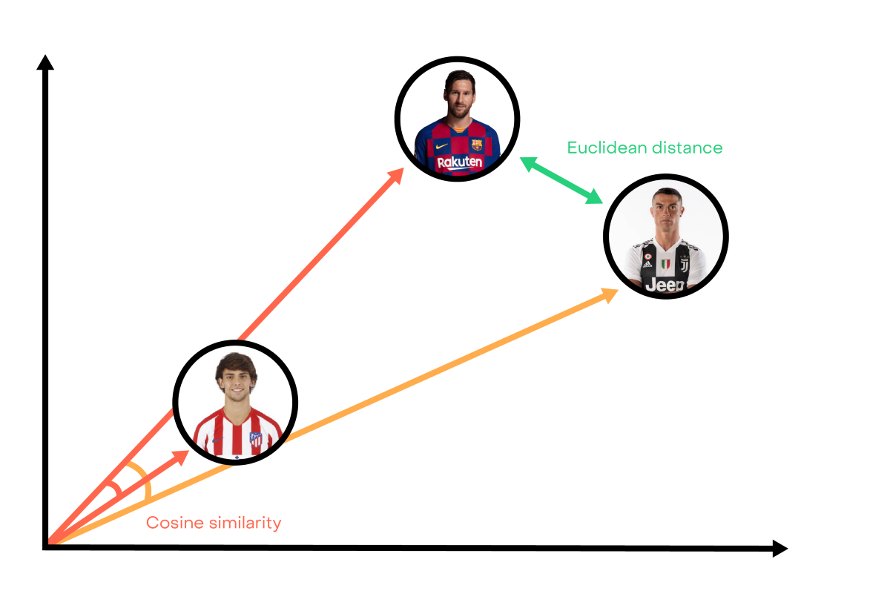

# Word2Vec
The Word2Vec model is a popular way to use [neural networks](../Prediction/Feed%20forward%20neural%20networks%20(FFNN).md) to create [word Embeddings](Embeddings.md). Using neural networks, you can immediately get dense vectors instead of the space vectors you get with [counting based methods](Co-occurrence.md).  

Word2Vec has **two possible architectures**. One of them is called **skip gram with negative sampling (SKNS)** this tries to predict the words in the context from the target word. The other one is **continues bag of words (CBoW)** which tries to predict the target word from the context. 
With both methods we don't care about the actual predictions but rather the hidden layers which are created as a result of training for good predictions. **The hidden layers are selected as the embeddings**. This is called representational learning. Let's now go in more detail below. 

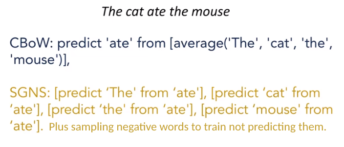

## Skip gram with negative sampling – SKNS 
The idea behind SKNS is build around the intuition that you don't need to count [Co-occurring](Co-occurrence.md) words, but you should **predict co-occurring words**. The prediction is not the goal, but the way to learn the representations. If the prediction gets good results, you have a good [embedding](Embeddings.md). We don't care about the prediction outcome, only about how it influences the embeddings.  The embeddings are taken directly from the weights used in the neural network. 

### How to do this?
1. Pick a target word.
2. Isolate a window of co-occurring context words. Window = context size. The window is a bag of words.
3. Update the representation (the weights used in the network) of the target word such that it **maximizes the probability of predicting its neighbours as neighbours** and minimizes the probability of predicting the other words as neighbours. 

So we try to train a neural network which will predict high co-occurring words for a target word while not predicting non co-occurring words for a target word. The weights which lead to the best model are chosen to represent the target word. Using the weights of a good performing network to represent the target word I find really clever. 

The reason why this is called skip gram with negative sampling is that you (would) have to use all the negative example classes (words which don't co-occur with the target word) to train the model. However, this would take waayy too long. Plus, not all words are equally informative. So instead we only **sample** a few **negative classes** (words which don't co-occur also called foils) to train on, and this also works well. **Sample the negative words by picking the words with probability inversely proportional to word frequency.** This makes sure words which are very frequent don't get used as negative class as these tent to be words like the or of which are not very informative because they appear everywhere. When training the model, you do always use all the positive words (the words which do co-occur) as classes.

This is a form of unsupervised learning. Text supervises itself as using this method embeddings can be learned without having annotated data. You don't need annotations to calculate the loss. Everything you need is already in the text. This is great because annotating data is expensive. 

### A simple binary prediction task
Word2Vec was designed to be very efficient. It achieves this by framing what is described above as a binary problem. The system doesn't predict which word occurs in the context, but **only if a word does**. This is binary instead of multinomial, which is much more efficient to calculate. 

In practice, this is done by first paring the target word with a co-occurring word and updating the network until the probability of predicting the positive word is high. Then you also take one negative sample and keep updating the model until the weights don't predict that word. Then you just repeat these two steps by paring the target word with another positive word and negative word. Typically, you do this until you have gone through every positive word. This is many comparisons, but they are cheap individually. The weight vector in the end becomes the word embedding. 

However, we are still going to use the [softmax](../Classification/Logistic%20Regression.md) function instead of a sigmoid function because we would like to have a probability for every word in the corpus at every position and not just a probability for negative or positive words. Naturally, you want the probability for the words which appear in the context to be bigger and smaller for the words which don't. The number in each output node is **the probability of picking the corresponding word as neighbour of the target**.

This approximates meaning because if two words have similar meaning the [Distributional hypothesis](Distributional%20hypothesis.md) says there are used around the same words (or generally have the same neighbours). So the model should generate similar hidden layer representations (weights) for words with similar meaning, as this generates similar output. Another way to view this is that the network with push or put vectors closer together in the [Vector Space](Vector%20Space.md) which have similar contexts. 

That results in something like this:

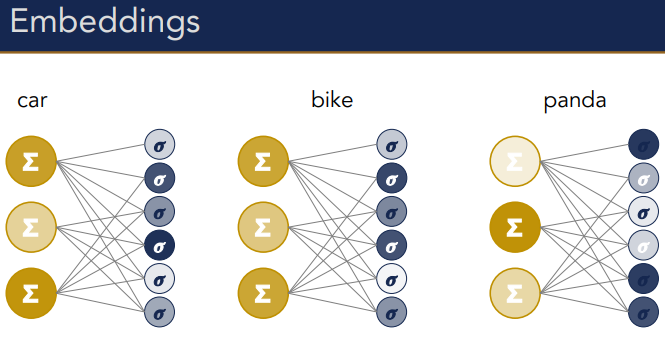 

### Representation learning
This type of learning described above is called representation learning. The goal of the training is to get good internal representation of the words. **By optimizing for prediction, we learn better representations.** You don't really care about the predictions. They are just the way to do unsupervised learning to get the representations. The loss function, if you will. 

Usually good representations are a by product of good predictions, but in this case we are actually more into the representations as we can use measures like [Cosine](Cosine.md) to actually compare the meaning of the resulting word representations. This is quite different to what we have seen with machine learning up till now. One example of this mentioned is to compute the representation of sentences and then compare how similar a paraphrased sentence is. 

### Two embeddings 
In practice we actually get two embeddings per word as each word can be the target word or the in the context (positive or negative). After doing Word2Vec you will get an embedding for the word-as-context and the word-as-target. 

## Continues Bag-Of-Word (CBoW)
The other architecture of Word2Vec is continues bag of words (CBoW). This is similar to SKNS, but you flip the problem. Instead of predicting the context (neighbouring words) from the target word, you try to **predict the target word from the context words**. You also **discard the order information** (bag of words). 

This is kind of like a fill in exercise like this  

But remember that you discard the order of the words. So from the bag of words you want to get the target word. 

But how do we feed the context to the model? Some contexts might be different sizes as well. The best way is to combine the vectors of the words in the bag somehow into one vector. There are infinite ways to do this, but Word2Vec gets the input to the network with by taking the average vector of all the word vectors which co-occur in the context bag of words. This is quite a simple method, but it actually works well. 

So if you have *I like banana*, and you want to predict *like* you get *I ___ banana* which gives the context bag {"I",  "banana"}. Then you average the vectors of I and banana to get the input vector like, and then you train the model to predict like.

## Comparing CBoW and SGNS

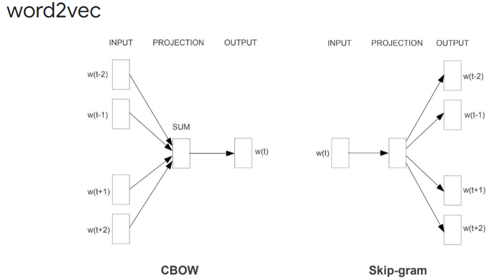

### Rare words

**CBoW** maximizes the probability of the target word given the context. Hence, given the context *yesterday was a really ___ day*, CBoW will get rewarded more often for predicting *beautiful* or *nice*, then for saying delightful. As delightful appears less in [language](../Languages/Languages.md) than *nice* and *beautiful*. 

**SGNS** predicts the context from the target. Given the word *delightful*, it assigns a large probability to the context words *yesterday*, *was*, *really*, *day*. **Independently,** as these are trained separately. 

With **CBoW** the word *nice*, *beautiful* and *delightful* kind of compete to fill the space. 
In **SGNS** the words *delightful* + context pairs are treated as new observations which avoid the competition and **penalizes rare words**. 

>This sort of gets back to [the problem with words having multiple senses](Distributional%20hypothesis.md). SGNS I think kind of solves the problem of multiple senses, as the representation of the word is trained to deal well with all the different contexts it appears in. But this is just what I think. Let me know if you think this is wrong. 

>I think CBoW is more in line with what people do when processing language. You learn words by the contexts they appear in. 

Because Skip-gram rely on single words input, it is less sensitive to overfit frequent words, because even if frequent words are presented more times that rare words during training, they still appear individually, while CBOW is prone to overfit frequent words because they appear several times along with the same context.

### Efficiency 
The CBoW architecture is computationally more efficient than the SKNS method because you only use the context once instead to predict the target word, instead of doing a lot of training for all the positive context words and samples of negative context words. So there are fewer comparisons with CBoW. This can also be seen in this image below.


In the original paper of Word2Vec they wrote that CBOW took hours to train, SGNS 3 days.

### Choosing between CBoW and SGNS
Choose SGNS or CBoW depending on your task and constraints. 

## Semantic drift 
If you have a diachronic [Corpus](../Data/Corpus.md), you can also estimate different embedding spaces for different time periods and look at **which words have changed in meaning** and track this change. 

## Evaluation 

### Visualizations 
One way to intrinsically evaluate your model is making sense is by creating visualizations. This is done by reducing many dimensions to just 2 or 3 to be able to plot them in our word. This can be done with PCA or tSNE (in combination with PCA for lage spaces). This is effectively a form of [Dimensionality reduction](Dimensionality%20reduction.md). 

When you plot the vectors that are [more similar](Similarity.md) should be the ones with similar meaning. While the ones which are far apart should not have similar meaning. If this is shown in the visualization, the model works well. 

Below is a visualization of a 60 dimensional space visualized in 2 dimensions. 


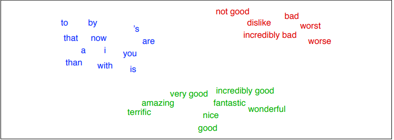

### Intrinsic evaluation 
Further intrinsic evaluation assess the goodness of a semantic space by how well it can capture **human intuitions about word relations**. Basically ask a bunch of humans how they think words relate and average the results and see if the model can perform in this way. There are datasets for this, for instance TOEFL or SimLex999. You can also say that some words contain other words. So for instance if you subtract the vector of paris with France and add the Itally vector you should get Rome. 

## Extrinsic evaluation 
This is when you use the resulting representations for another downstream task. If the performance of this task improves, then you know your model does well. Basically, it seems that the performance of every task in computational linguistics improves. For this reason, word embeddings are part of almost every architecture.

## Biases
The models are not magic and only as good as our data. **Garbage in is garbage out**. If your data incorporates societal biases, these will occur in the results of your model.    Choose your data carefully without biases. This is currently an active problem in the field. 

For instance, if in your corpora fathers are more often doctors and mothers are more often nurses then this will be encoded in the word encodings. Or when using [connotations](Connotations.md) what if the names of one nationality are more often closer to positive sentiment, while other nationality names are closer to negative words. This can have an unwanted effect on sentiment analysis predictions for instance.  

What can you do about this? This is still an active research field. There seem to be two ways either change the data to represent society in the way that we want. For instance you can apply [Normalization](../Data/Normalization.md) and replace all sex words like girl or boy with SEX for instance. Or you can try to subtract a special bias vector. Or you can try to change the model which actively debias things they find in the data. 

## Summary of Word2Vec
With word2vec we use neural networks to learn better word embeddings by optimizing hidden layers to yield better prediction in a binary classification task. Given a source and a target word, predict whether the target is a co-occurring word or a foil. After learning, the hidden layer for each word encodes its semantic representation as learned from text. This is called representation learning. You have to be careful with biases.


# Vector Space
When you have computed [Embeddings](Embeddings.md), basically represented a bunch of words into vectors. Usually these vectors are the same length because you check all the [context](Context.md) for with all the target words. This means you can put all the embeddings on top of each other because they have the same columns if you wil.  

This then represents the vector space. The n-dimensional space in which all word embeddings reside.  

 A vector space is essentially a matrix created by putting all the vectors on top of each other. Rows are targets, columns are contexts. Targets and contexts can be anything. You can imagine the vector space as a large n-dimensional space in which all the vectors have a location. 

Tree examples below. The first one is with [Co-occurrence](Co-occurrence.md) of words in context around targets words. The second one counts how often words occur in certain document contexts. You can also derive them using neural networks, which leads to less interpretable vector spaces. The last example is a vector space plotted in 3d space to give an idea how you can imagine the vectors having a position in a high dimensional space. 

The cat cell I think means that around the target word cat, cat appeared again. 

|       | Cat | Food | Music | Beans |
| ----- | --- | ---- | ----- | ----- |
| Cat   | 5   | 16   | 2     | 6     |
| Food  | 16  | 10   | 1     | 70    |
| Music | 2   | 1    | 40    | 0     |
| Beans | 6   | 70   | 0     | 4     | 


|       | Document 1 | Document 2 | Document 3 | Document 4 |
| ----- | ---------- | ---------- | ---------- | ---------- |
| Cat   | 20          | 16         | 2          | 6          |
| Food  | 16         | 3          | 1          | 70         |
| Music | 2          | 1          | 15          | 0          |
| Beans | 6          | 70         | 0          | 60          |


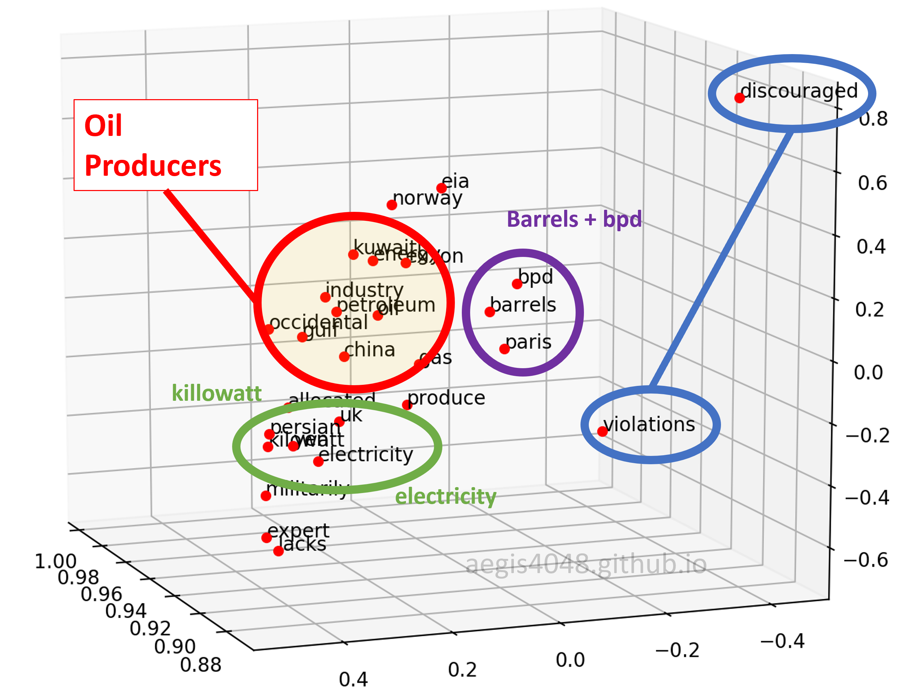

# Dimensionality reduction 
When using [Co-occurrence](Co-occurrence.md) to derive a [Vector Space](Vector%20Space.md) becomes very large with each row being typically having 10^5 dimensions of which most of the values are 0 because the target words never appearing with other words in the context. This takes a lot of storage and feeds into the curse of dimensionality. 

## Goals 
Every [context](Context.md) is considered an atomic context. This basically means that each context is considered separate. So we consider the context cat and lion to be separate, but they are not. 

So ultimately want to 

- **Reduce noise and brittleness**: Some co-occurrences may happen by chance or under a very specific, non-conventional use of a word. It is a good idea to give these low importance. 
- **Discover latent meaning**: Leverage the fact that some contexts are similar and may represent a broader domain. 

So, how can we reduce the dimensionality of the vector space?

## Projection 
We can project the vector space into a lower dimension. So you turn the matrix into a new matrix with the same number of rows and a lower number of columns. Each column is one dimension and also one context. You can compute which context provides the most information and only keep those contexts around. The columns with low information will have a lot of zeros. You have to decide how many columns to keep. 

More formally, we can **project** the distributional matrix of dimensionality N\*M into a lower-dimensional space N\*K where K < M (and K < N) **such that the reduced space preserves the maximum amount of variance possible**. You only want to get rid of redundant information. This should result in row vectors which are real-valued and dense (not a lot of zeros).

There are a lot of techniques for dimensionality reduction trough projection. There are many ways to project into lower dimensions like:

- Singular Value Decomposition 
- Non-negative Matrix Factorization
- Kernel Principal component Analysis 
- Latent Dirichlet Allocation (used with [Topic models](Word%20similarity.md)). 
- ... (there are more)

 The simplest trimming columns are explained below, in this method. The simplest way to remove not, so useful information from your vector space is to just trim entire columns from the matrix based on how many 0 there are. 

## Trimming Columns 
**When two targets have 0 in the same dimension, it doesn't influence the Cosine** because the angle between 0 and 0 is 0. So there is no reason to keep this around. You can just remove the columns with the most 0 in them, and then keep a certain number of columns around. 

This is quick and transparent (easy to interpret) but it doesn't reduce noise and doesn't bring latent meaning to the surface. Also, you can still interpret the remaining columns as the contexts. 


# Vector Semantics
The idea of vector semantics is to represent words (or your surface form) as a vector of numbers. These vectors represent a word, a point in a multidimensional semantic space. This allows you to compare the words on a deeper level because vectors can be more or less [Similar](Similarity.md)  instead of being all equally different or based on [Edit distance](../Languages/Edit%20distance.md).  

These vectors can be derived from the distributions of word neighbours / context of the other words because of the [distributional hypothesis](Distributional%20hypothesis.md). This allows computers to compare the meaning of words with just a [corpus](../Data/Corpus.md) and without something like [wordnet](../Data/Thesaurus.md). This is deeper than looking at [edit distance](../Languages/Edit%20distance.md).

## Getting the vectors 
An early idea to get the vectors was with [connotations](Connotations.md). This requires humans to annotate data in a 3 dimensional space of valence, arousal and dominance. Later, linguists started looking at the [context](Context.md) around words to create the vectors. 

### Connotations
Early on this was done with [connotations](Connotations.md). The idea is to ask a bunch of humans to rate words along the valence arousal and dominance dimensions and average the results. This then gives you vectors 3 numbers for each word. An advantage of connotations is that the resulting vectors can be meaningfully interpreted. If a word has a vector of high valence, then you know it is probably a positive sentiment word.  

### Context
Later, linguists started looking at [context](Context.md). This can yield vector representations from a corpus without needing humans. One way of doing this is with counting. You can use an algorithm that scans a corpus and counts which words are used close to other words. If eye dokter and oculist are used in the same contexts next to the same words, then the computer will assign the similar vectors to these words meaning, as they will be close in the vector space. This is based on the [distributional hypothesis](Distributional%20hypothesis.md). Ways of getting the vectors include [Co-occurrence (counting)](Co-occurrence.md) and using hidden layers of neural networks like  [Feed forward neural networks (FFNN)](../Prediction/Feed%20forward%20neural%20networks%20(FFNN).md) for instance using [Word2Vec](Word2Vec.md) or [Recurrent neural network (RNN)](../Prediction/Recurrent%20neural%20network%20(RNN).md) .  

All the vectors have a place in a [vector space](Vector%20Space.md) this allows to compare them.

The vectors derived from context are also called [embeddings](Embeddings.md) in the more recent literature. This new name is given because you can't directly interpret the resulting vectors any more, like you can with connotation vectors. 

## The pipeline 
So how to you do get the vectors? 
1. Choose a [Context](Context.md) size (documents, sentences, paragraphs etc.)
2. Derive the base vectors either by using [Co-occurrence](Co-occurrence.md) or [machine learning techniques](../Classification/Logistic%20Regression.md) (Word2Vec). 
3. Choose an [Association measure](Association%20measure.md) like [PMI](Point%20wise%20mutual%20information%20(PMI).md) or don't.
4. Use a [Dimensionality reduction](Dimensionality%20reduction.md) technique, or don't.
5. Use a [Similarity](Similarity.md) measure to compare vectors. Basically always [Cosine](Cosine.md).

Models that use this pipeline fall under the name of **distributional semantic models**. Which all make use of the distributional hypothesis. 

# Point wise mutual information (PMI) 
One way to get weighs for an [association measure](Association%20measure.md) to the embeddings with is **point wise mutual information**. This is an intuitive method. The idea is to weight the co-occurrences of words that happen **more often than expected by chance** more, since these co-occurrences capture some linguistically relevant phenome. 

If [language](../Languages/Languages.md) was random (entropy at the max) we would have no association weights, everything would be as likely as everything else. PMI works because language is not random. This means you can know how often something should appear. When things appear more often together then you would expect, then you weigh it more. 

To do this, you can count the frequencies of the words in the entire corpus divided by the total number of [tokens](../Data/Token.md) to get an expected chance. If you then observe co-occurrence counts with higher chance than you calculated, you weight these counts higher, as this might encode the linguistic meaning you are after. You can also weight the counts which are at chance level lower.

Calculating the PMI of a word [embedding](Embeddings.md) $\mathbf{w}$ can be expressed in math as: $$PMI(\textbf{w},\textbf{c}) = \log_2\frac{p(\textbf{w},\textbf{c})}{p(\textbf{w})p(\textbf{c})} = \log_2\frac{\frac{\text{count}(\textbf{w},\textbf{c})}{V}}{\frac{\text{count}(\textbf{w})}{V}*\frac{\text{count}(\textbf{c})}{V}}$$
Up top you have: The probability of the co-occurrence happening.  

At the bottom, you have: You have an independent probability. How likely are the word and the context to occur together. You get this by multiplying the probability of how likely the target word is and how likely the context is when they occur alone. 

Here $V$ is the total number of tokens in the corpus. $\textbf{c}$ is the context, $\textbf{w}$ is the target word.

Now if the PMI is high then the co-occurrence count is probably interesting because it is higher than chance. 

Remember, we calculate PMI to be able to get weight for the association measure. So we multiply the PMI with the embedding. After that, calculate the cosine. This resolves the problem where you don't take into account information from the context. So the PMI is the weight.

Also, you use log to smooth things out when the frequencies get large. 

## Positive PMI (PPMI)
Cosine similarity can take the values between -1 and 1. Where 0 means nothing in common, 1 means same angle. -1 means opposite direction. No one has been able to interpret -1 cosine values, so to avoid negative similarity scores (which we can't interpret) we force all cells in the vector space to be positive. This is done by saying if something co-occurs less often than expected by chance, we just say its PMI is 0 which then weights by 0 which result in 0 instead of a negative number. 

The things that get the highest PMI are things like names, which don't occur often and always appear together. Like NEW YORK. Also, colours like blue and red get a high PMI. So things which are rare which occur together get high PMI.

You could express this in math as $PPMI(x) = \text{abs}(PMI(x))$

## Problems with PMI
Things which co-occur together more expected than chance get a boost and things which co-occur less often than change get dragged down (matter less). But if you have two things which only occur once and also co-occur together will get a PMI score of 1 as in this case its $\frac{1}{1*1}$. 

So if two rare things occur together, they have the highest PMI, which in general favours low-frequency co occurrences generated from low-frequency targets and contexts. 

From this the computer thinks that if the first word appears then the second word also always appears. However, if a word only appears once, then this it could be an error and not really display a pattern in the language.  

### Example 
If the words "entry" and "shell" only occur once in a [corpus](../Data/Corpus.md) and also co-occur the only time they do occur, so like *You enter through the entry shell.* This means that in theory you get all the information of shell by observing entry. This will get a PMI of 1. But really the corpus just lacks more occurrences of entry and shell. You can solve this by adding a bias. There are two examples of bias below.

### Local mutual information 
To deal with this you multiply the result of the PMI formula which is the log frequency of target co-occurrence. This is just taking the log of how often the co-occurrence appears. The log of 1 is 0 so then all things which only occur once disappear. 

Things which often occur still get boosted because the log of the absolute occurrence will still be high. So now to get a high PMI score you need to occur frequently and also often together with something else which is exactly what we want.

### Context exponent
You can also include an exponent when computing the context probability such that it increases the probability of rare events.

## PMI tutorial

How to calculate PMI. Let's say you have a [Vector Space](Vector%20Space.md) like this:

|     | of   | the  | dog | run |
| --- | ---- | ---- | --- | --- |
| of  | 5    | 1000 | 100 | 55  |
| the | 1000 | 400  | 500 | 100 |
| dog | 100  | 500  | 10  | 40  | 
| run | 55   | 100  | 40  | 20  |

And we want to calculate PMI between **dog** and **the**?

We want $PMI(\textbf{dog},\textbf{the})$

We do this by using the formula $PMI(\textbf{dog},\textbf{the}) = \log_2\frac{p(\textbf{dog},\textbf{the})}{p(\textbf{dog})p(\textbf{the})} = \log_2\frac{\frac{\text{count}(\textbf{dog},\textbf{the})}{V}}{\frac{\text{count}(\textbf{dog})}{V}*\frac{\text{count}(\textbf{the})}{V}}$ 
So we start with: 

$$\log_2\frac{\frac{\text{count}(\textbf{dog},\textbf{the})}{V}}{\frac{\text{count}(\textbf{dog})}{V}*\frac{\text{count}(\textbf{the})}{V}}$$
Remember the numerator is the count of the word and the context co-occurring divided by V. **Calculate V at the end if you have to, and it is not given**. The $\text{count} ( \textbf{dog}, \textbf{the} )$ in $\frac{ \text{count} ( \textbf{dog}, \textbf{the} )}{V}$ in the nominator is exactly what the table describes, so it can be directly read from the table (in this case the dog, the cell). This cell is 500 so that gives: $$\log_2\frac{\frac{500}{V}}{\frac{\text{count}(\textbf{dog})}{V}*\frac{\text{count}(\textbf{the})}{V}}$$

To get $\text{count}(\textbf{dog})$ you just sum the **dog** row. So $\text{count}(\textbf{dog}) = 100 + 500 + 10 + 40 = 650$.

For $\text{count}(\textbf{the})$  and you sum the **the** column. You sum the column because **the** in this case is the context. So $\text{count}(\textbf{the}) = 1000 + 400 + 500 + 100 = 2000$. We can now fill that in to the formula:  $$\log_2\frac{\frac{500}{V}}{\frac{650}{V}*\frac{2000}{V}}$$
He said he will ask if you have to take the $\log_2$ or not. He also said that the first word will always be the target word (row) and the second word will always be the context (column).

# Embeddings
The vectors derived by looking at [context](Context.md) are called **embeddings**. This new name is given because you can't directly interpret the resulting vectors any more, like you can with [connotation](Connotations.md) vectors. Although embeddings derived by counting are still very interpretable. It more means that to interpret one column, you need the other columns. But embedding is basically a [synonym](../Languages/Synonyms.md) for vector part of a [vector space](Vector%20Space.md). Embeddings are used in the more recent literature. 

There are many ways to derive these vectors which all differ and result in different sizes. 
Depending on how the vectors are derived the same word (the same surface from, as in it could also be tokens) can also have the different embeddings.  However, **the actual values of the vector don't mean anything by themselves**. You can't interpret the numbers like you can with connotations, it is just to find the distance to other embeddings. The dimensions of an embedding space are **not symbolic**. 

Below is a 60 dimensional embedding space [projected](Dimensionality%20reduction.md) down to 2 dimensions.  


Using word embeddings seems to work really well in [Natural Language](../Languages/Natural%20languages.md) Processing (NLP) applications as it allows comparing words on a deeper level than where they appear beyond just [symbols](../Data/Symbol.md) which are all equally different. With embeddings, words can be compared through where they appear in the n-dimensional space. Embeddings are used everywhere because they work really well. 

For instance, [classification](../Classification.md) models can assign sentiment as long as some words seem to have [similar](Word%20similarity.md) meanings, i.e. being close to other positive sentiment words in the embedding n-dimensional space. 

## Deriving embeddings 
### One hot encoding 
To change the categorical data into numbers, you can use one hot encoding. The idea is to make a Boolean dimension features for each possible category, in this case words. This results in something like this:

|       | Cat | Food | Music | Beans |
| ----- | --- | ---- | ----- | ----- |
| Cat   | 1   | 0    | 0     | 0     |
| Food  | 0   | 1    | 0     | 0     |
| Music | 0   | 0    | 1     | 0     |
| Beans | 0   | 0    | 0     | 1     | 

This does not really encode the meaning though. 

### Co-occurrence 
One way to derive embeddings is to use [co-occurrence](Co-occurrence.md) (counts). The idea is to count and put in a table how often some words occur in a context with other words. This encodes meaning because according to the [Distributional hypothesis](Distributional%20hypothesis.md), words with the same meaning are used around the same words. So words which mean the same should result in similar vectors.

This is much like how our cognition deals with words. There are much more ways to get embeddings from words, supervised and non supervised, with different hyperparameters to tweak. Some might work better for the problem you are trying to solve than others. 

This generates **[Vector Space](Vector%20Space.md)**. A vector space is like an all the generated occurrence count vectors stacked on top of each other to form a matrix from the vectors. We can put all the embeddings in a matrix because they all occupy the same space. All the vectors are the same length. 

This is how a vector space might look like (real ones are much bigger):

|       | Cat | Food | Music | Beans |
| ----- | --- | ---- | ----- | ----- |
| Cat   | 20  | 16   | 2     | 6     |
| Food  | 16  | 21    | 1     | 70    |
| Music | 2   | 1    | 16    | 0     | 
| Beans | 6   | 70   | 0     | 15     |

Or like below where the contexts are documents. Knowing something about the document will also tell you something about the co-occurrences. 

|       | Document 1 | Document 2 | Document 3 | Document 4 |
| ----- | ---------- | ---------- | ---------- | ---------- |
| Cat   | x          | 16         | 2          | 6          |
| Food  | 16         | x          | 1          | 70         |
| Music | 2          | 1          | x          | 0          |
| Beans | 6          | 70         | 0          | x          |


The rows (word at the left) are the target words, and each column keeps track if a word occurred in the context of that target word.  

There are a lot of different variations you can apply when deriving embeddings. You can leave out the top x most frequent words, as these don't provide a lot of information, for example. 

Usually you also apply an [association measure](Association%20measure.md) to in an attempt to bring out more useful information and lower less important information. 

### Neural networks 
Instead of using counting to derive embeddings, you can also use machine learning techniques to derive embeddings. In particular, using [Feed forward neural networks (FFNN)](../Prediction/Feed%20forward%20neural%20networks%20(FFNN).md). This has the advantage of getting dense vectors immediately instead of first having sparse embeddings and then projecting them into lower dimensions like with the count based methods. A popular way to do this is [Word2Vec](Word2Vec.md).  


# Connotations 
In the fields of computational linguistics, the word connotation means the aspects of a word's meaning related to the writer or reader's emotions. Osgood et al.., 1957 quantified this in 3 dimensions:

- **Valence – The pleasantness of the stimulus 
- **Arousal – The intensity of emotion provoked by the stimulus
- **Dominance – The degree of control exerted by the stimulus. Slave is low in dominance and master is high. 

When words score the same across 2 or 3 of these dimensions, you can maybe assume the words are similar. 

The actual values of the connotations have to be gathered by asking a bunch of humans and then averaging the results. This leads to tables of words like below: 

|  **Word**   | **Valence** | **Arousal** | **Dominance** |
|-------------|-------------|-------------|---------------|
| courageous  | 8.05        | 5.5         | 7.38          |
| music       | 7.67        | 5.57        | 6.5           |
| heartbreak  | 2.45        | 5.65        | 3.58          |
| cub         | 6.71        | 3.95        | 4.24          |

This now allows you to represent all these words as a vector of 3 scalers across 3 dimensions. So cub can be represented as [6.71, 3.95, 4.24].  This is a powerful idea, see [vector semantics](Vector%20semantics.md). One way to compare words when represented as vectors is with the [Cosine](Cosine.md) angle between the two vectors, or the [Jaccard's distance](Jaccard's%20distance.md). However, arriving at these vectors with the connotation's method requires human annotation. 

> Vectors are basically just lists of numbers 


# Context 
The context are the parts of a discourse that surround a word or passage and can throw light on its meaning. So the [words](../Data/Words.md) or [tokens](../Data/Token.md) around the words or tokens you are analysing. 

To learn about the meaning of a word, you can look/count the words surrounding the words you're interested in (the context). If you do this with a lot of text, you get an idea of what the context around a particular word usually is. Then you can compare the context of one word with the context of another word to see how similar it is. If the context seems similar, the word probably means something similar. This can be said based on the [distributional hypothesis](Distributional%20hypothesis.md). From these counts of words appearing in the context you can also construct a [vector](Vector%20semantics.md) which words really well as you can then compare words based on how [similar](Similarity.md) the vectors are.

This is very much the same as the [Lesk similarity](../Data/Thesaurus.md). There you check the overlap in the glosses of two words in the [thesaurus](../Data/Thesaurus.md). But with context, you just do it with the contexts of words in a [corpus](../Data/Corpus.md). Arguably this is better, than for this no human annotation is required. 

This approximates meaning. Basically, the computer can never grasp the meaning of a word, but it can know if two words are likely to mean the same / are [synonyms](../Languages/Synonyms.md) because the vectors are close. 

Contexts can be any size you want. You can take an entire document as a context or for instance a sentence. 


# Similarity 
The similarity refers to how much overlap there is between two things. Knowing how similar two things are can be very useful for instance because you can often substitute similar things with each other. 

## Word similarity 

Using a [thesaurus,](../Data/Thesaurus.md) you can find out how similar two words are using path length with path length, Resnik similarity or Lesk similarity. Another way of doing this is [edit distance](../Languages/Edit%20distance.md). 

## Vector similarity 

There are a large number of ways to calculate the similarity between two [vectors](Vector%20semantics.md) or [embeddings](Embeddings.md). Here, similarity is quantified by the distance between points in space. There are a large number of ways to calculate distance between points in space. The ones discussed in the course are [Jaccard's distance](Jaccard's%20distance.md), [Euclidian distance](Euclidian%20distance.md) and [cosine](Cosine.md).

Jaccard is used to compare [Co-occurrence](Co-occurrence.md) sets.  [Euclidian distance](Euclidian%20distance.md), while being a more intuitive distance measure, it is very much influenced by just one coordinate of the vector being far removed from another word in the [embeddings space](Embeddings.md). Cosine is much better than Euclidian, as cosine gives prominence to similarity in relative values.

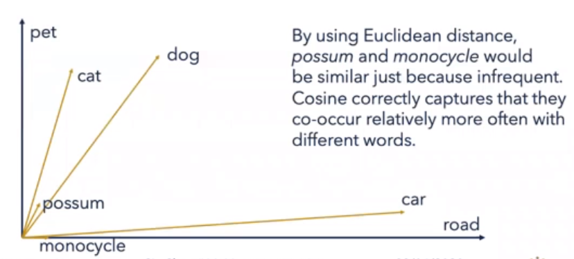

In this figure above, if a vector is high in y it occurs often with pet and high in x occurs high in road.  The absolute distance between possum and monocycle is very small, but the angle is large. While the angle of cat and possum is more similar, which is also correct.  

Here is a more fun image:

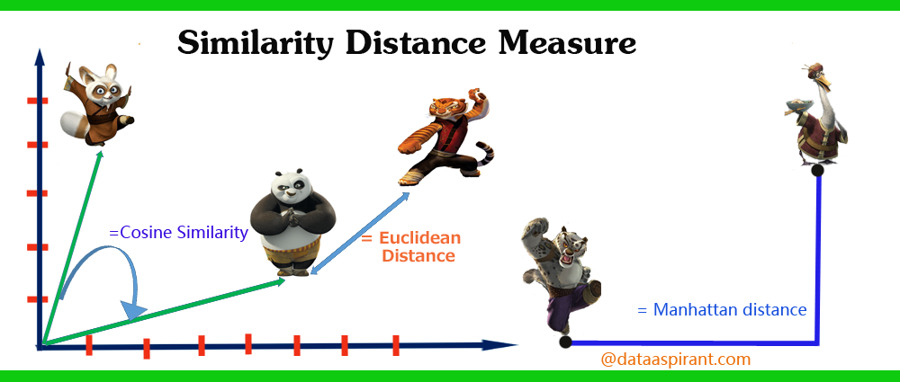

# Smoothing 

Smoothing (in the context of language models) means increasing all the probabilities of a probability distribution by a little bit, so you don't have impossible continuations (zero probability). What it does is that we never say that a probability of a transition or N-gram occurring is zero. We just make it a small number above zero but never zero.

## The infinite problem
When training [language models](Language%20Modeling.md) you always have the problem that [Natural languages](../Languages/Natural%20languages.md) are infinite. This means that any sample that you train your model on is actually just a small sample of the entire data or population. It is a **finite number** of [tokens](../Data/Token.md), [types](../Data/Type.md) and [lemmas](../Data/Lemma.md). This also means that the it is guaranteed that a model will encounter things it has never seen before in the future. This will cause the model to say that a sequence is ungrammatical. Most often this is true and what we want, but it could be false. 

### Unknown words  (OOV words)

If the model encounters a word it didn't see in training it can't even start looking for transitions from the preceding [N-gram](../Languages/N-grams.md). This can be quantified in the [OOV rate](OOV%20rate.md) (percentage of never seen before words in the test set). Because language is infinite the OOV rate will always be more than 0 when using the model in the wild. 

### Zipfian 
Because natural language follows a [Zipfian Distribution](../Languages/Zipfian%20Distribution.md) there are a lot of words that only appear once in a [corpus](../Data/Corpus.md) less but still a lot of words that appear twice in a corpus but not a lot of words that often appear in a corpus. 

Because there are few words that appear often and a lot of words that appear once or twice in a corpus the sequences that contain rare words are frequent. So transitions with rare words are frequent but hard to predict. Because you can't just have of the same words. So how do you estimate rare transitions?

## Solutions
How do we deal with this all this?

### Make it a close world
We pretend that an open vocabulary situation is a closed vocabulary problem where we know all the possible words in advance by replacing some words in training (usually the rare ones) with a single token, for instance called |UNK|. Then, with this token you make the maximum likelihood estimates the usual way. Now in the future you can just replace all the unknown words in a new sentence with |UNK| and you can use your model again with any sentence. Pretty clever I would say. This is basically normalization by replacing all the unknown words with the unknown words token. Kind of like replacing all the emails addresses with the EMAIL token.

Basically we say rare things are the same. We leverage the relationship between rare things that they are rare. 

You can look at this by saying that you reserve some probability mass for unknown words. 

## The zero probability transition problem
Replacing words that the model hasn't seen before with a special token solves part of the problem but what if the model encounters a transition that it has not seen before? This means an N-Gram that doesn't appear in the transition matrix. Then the model will think that the probability of it occurring is zero. As soon as this happens the model will get stuck because [Markov models](Markov%20models.md) uses the Markov chains which means that if you multiply by 0 or take the log of 0 you get problems. So we can not afford the probability of a word or transition to be 0. 

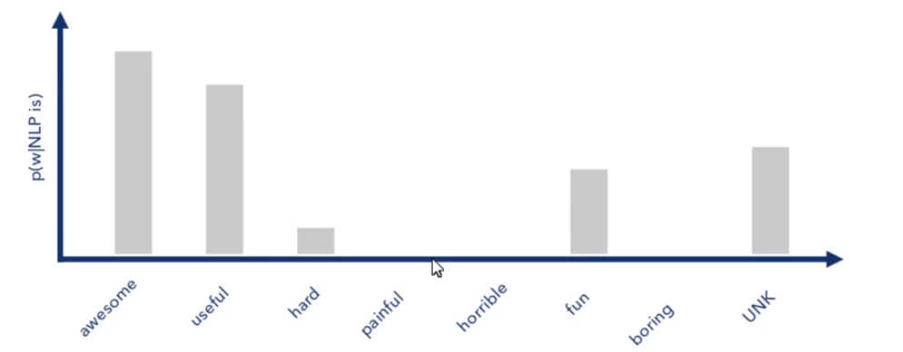

In this example the continuation painful, horrible and boring is zero and that is a problem. 

To solve this zero probability transition problem we apply **smoothing**. 

If we were to apply smoothing on the model from the picture from before we would get:

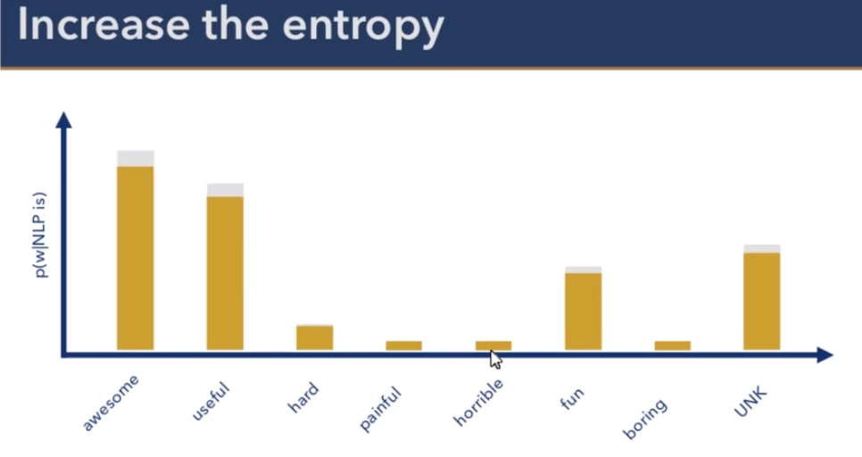

Now everything is above zero. 

Of course there are multiple algorithms to do smoothing with different results.

### Laplace
The Laplace smooth method just adds 1 to all frequency counts of words before normalization. We have to be sure that we can still turn the frequencies into a probability distribution. 

For transitions this means that transitions with a frequency of 0 in the training corpus get a frequency of 1, transition with a frequency of 1 get a frequency of 2, ... In maths this looks like $$c^{*}= (c+1)\frac{N}{N+V}$$ 
Where N is the number of tokens, V is the number of types and c is a count of how often something occurs in the training data.

In the lecture Laplace smoothing is called a quick and dirty solution. Because with large vocabularies and not so high frequencies, smoothed probability are too different from the non-smoothed ones. This is because there are only 100 percentage points to give out and even if we assign a little probability to unobserved transitions, there are still really a lot of unobserved transitions. This makes it so that the probability distribution shifts a lot. This is captured in the image below:

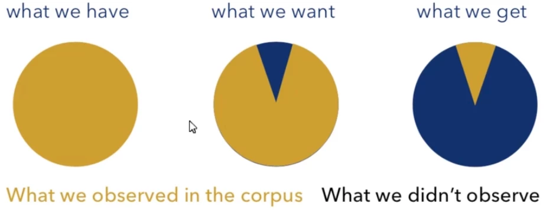

We want that what we don't observe gets a small probability but because there are so many things we didn't observe adding 1 to every count makes what we didn't observe a lot more likely than we would like. 

#### Add K
An improvement is to decrease the amount of probability mass which gets moved around by adding less than 1 to each count. We can just add 0.001 or something in the probability. Now the smoothing looks like this: $$p^{*}(W_{n}|W_{n-1}) = \frac{c(W_{n-1}\cdot W_{n}) + k}{c(W_{n-1}) + k \cdot V}$$

This means adding less than one. Apparently you have to do k on both sides otherwise it is not a probability any more. 

But really this is just a hack upon a hack. Estimates have too little variance and are still off. 

### Interpolation Smoothing
We can try to look at more sources of data and assigns weights to the data which indicates how sure we are about it. Higher weights to more reliable sources of knowledge. 

#### Linear combinations
This interpolation is done with linear combinations. The idea is to always also consider transitions for smaller n-grams using a weighted linear combination of the probabilities. So you look at other N-grams and assign a weight to each different type of N-gram which indicates how much you want to rely on the data. The weights are called $\lambda$ here. This causes the formula for a probability of a transition in a language model to look like this (When considering trigrams): $$\hat{p}=(w_i|w_{n-2}, w_{n-1}) = \lambda_1(w_i|w_{n-2}, w_{n-1}) + \lambda_2(w_{i}|w_{n-1}) + \lambda_3(w_i)$$

This math translates to: 

the probability of a word given the previous word and the previous word
= the probability of the word given the previous word and the previous word \* a weight 
\+ the probability of the word given the previous word \* a weight 
\+ the probability of the word alone \* a weight. 

Everything on the right comes from the probability distribution. 

So you assign weights to each source of information, telling you something about the probability. This allows you to consider different N-grams because we can add another constrained: $\lambda_{1}+ \lambda_{2} + \lambda_{3} = 1$. Of course, the amount of lambda's depends on the N you choose for your N-Grams. 

Now the trick is that $\lambda_3(w_i)$ is never zero because we are still applying the closed word assumption. If we don't know the word, it turns into |UNK| and that (also) has a probability of occurring. Just like the probability of other words. So as long as $\lambda_3$ is not zero, this formula with linear combinations will never be zero. Even if the transitions are 0. 

### Back off 

Backof is an algorithm that instead of doing weights reclusively uses the best source of information it can find.  So if there is an 4-Gram use that, but if there is not then go to 3-gram etc until, if you have to, use probability of the word and disregard the context. This never fails because of the |UNK| token if it is needed.  

Anytime a transition from an n-gram to a state found in the test set didn't occur in training, recursively fall back on to the smaller n-grams (For example from "why did you" to "did you" to "you") until a non-zero transition is found. 

This sounds really good. But it does mean that you no longer have probabilities because you no longer have the thing that the lambdas add up to 1. 

# Using FFNN for language modelling
You can also use [Feed forward neural networks (FFNN)](Feed%20forward%20neural%20networks%20(FFNN).md) for language modelling. These models make the same [Markov assumption](Markov%20assumption.md) as [Markov chain models](Markov%20models.md). So the neural network is tasked with finding the preceding word to the n-gram it gets as input. FFNN seem to work better than models based on a large matrix of probabilities.

The neural networks are very popular because of the following advantages:

## Advantages of FFNN 
- No need to apply [Smoothing](Smoothing.md) 
- Can handle longer histories ([N-gram](../Languages/N-grams.md) with large n)
- Generalize better over histories consisting of similar but not identical words. 

The main reason why this approach works and the reason for these advantages is because [embeddings](../Semantic-Similarity/Embeddings.md) are used to represent the words. Embeddings are an antidote to sparsity. A better antidote than smoothing. They also allow the model to deal with n-grams they have not seen before by just comparing them with vectors which are [similar](../Semantic-Similarity/Similarity.md) (are close together in the [Vector Space](../Semantic-Similarity/Vector%20Space.md) and thus probably have similar meaning) and just using those vectors. 

### Example
So for example if the model has not seen the n-gram “the silver pike” but it does have the word embeddings for “the”, “silver” and “pike”. The model can look for similar embeddings for all of these words for which it has seen an n-gram. So a close embedding to “silver” is "blue" and a close embedding to “pike” is “fish”. Then the model has seen the engram “the blue fish” before, and the most likely next token after that was stored as “swims”. So based on all that, the model will assign a high probability to “swims” as the next word. 

## What does it mean

So you can see that you can use embeddings to switch out words which you the model doesn't know much about to other words which the model knows more about. This removes the need to move probability space around like with smoothing. 

You can use higher n with the n-grams when using embeddings. This increases the change that you get an N-gram you haven't seen because, but the neural network models can deal with this by switching the tokens you have not seen before with the closest embeddings you have seen before. With [Markov chains](Markov%20models.md), when you encounter an N-gram you have not seen before you are basically out of luck and you have to use [smoothing](Smoothing.md). However, you can still not increase N by a huge amount as you will still need larger corpora when you do and there is a limit as you will run in to the language is infinite problem.

## How to get embeddings 
You can get off the shelves embeddings which have been trained by someone else. These you can also fine tune to your specific problem. You can of course use any corpus that you want. The N-grams of some corpus might work better for your problem. You can also derive your own embeddings of course.  The embeddings derived by the big companies will be much larger than you can probably ever really make. 

## Can we get rid of the Markov assumption 

The [Markov assumption](Markov%20assumption.md) **limits the size of context arbitrarily** by specifying only one n in the n-grams. Sometimes however we care about short windows and sometimes we care about longer windows. But so far we have always been using the same n while saying that a higher n will lead to better predictions (if you have enough data to back it up). Recurrence can be used to overcome this problem. 

FFNN still assume the Markov assumption. We can use [recurrence](Recurrence.md) to overcome this problem. This leads to recurrent neural networks. 


# Perplexity

Perplexity is the standard way to intrinsically evaluate whether a predication system is working. Perplexity computes **how surprised** the system is of seeing what it is actually sees in the light of what it expected to see given what it knows. 

What the prediction system expects is caused by the training data. 

## More formally
At any new token in the data, the language model outputs a probability for every possible type as a continuation given the previously observed history and the transition probability matrix it [learned](../Other/Learning.md) on some other data. 

**The higher the probability a model assigns to new valid sentences, the better the language model, the lower the perplexity.**

Perplexity based cased by the interaction of the model and the test set. But really it is caused by the test set because the model is a probability distribution matrix over the test set. This means that you can say that perplexity is the **inverse probability** of the test set under a language model, [normalized](../Data/Normalization.md) by the number of tokens (the more tokens there are, the lower the final probability of a sequence). In maths this is:

$$pp(W) = 2^{-l}$$ where $$l = \frac{1}{|w|}\sum\limits^{|W|}_{i=1}\log p(w_i|w_{i-i-n~:~i-1})$$ with $w_{i} \in W$ where W is a sequence of tokens. We use log, so we can use sum ($\Sigma$) for calculating the probability. This avoids underflowing, as the probabilities can get really small. 

So basically you have to normalize the perplexity to compare language models. Which means that you can only compare the complexity of models that use the same test set. 

Since we’re taking the inverse probability, a **lower perplexity** indicates a **better model**.

## Best practices for evolution
1. Estimate the [language model](Language%20Modeling.md) (states and transition matrix) on some corpus. 
2. Fine tune the model on different corpus (test data)
3. Test the model to check how it fits on new data (validation data). 

NEVER test on the same data you trained on and NEVER validate on the test data! **[Learning](../Other/Learning.md) is not remembering.** If it were, it wouldn't be useful.  

Again, you can only compare perplexity of different models if you use the same test set. Because otherwise the probability distribution is not the same. So the result states have to be the same.

Perplexity is an average, so it depends on the number of tokens in the vocabulary.

# Recurrent neural networks (RNN)
A recurrent neural network is a neural network which uses [recurrence](Recurrence.md) to take into account previous states. Instead of relying on n-grams and the [Markov assumption,](Prediction/Markov%20assumption.md) there is a **chain of recurrence**. The idea is to update some hidden layers in the neural network based on values of other (later) hidden layers. 

Instead of parsing the input into [N-grams](Languages/N-grams.md) and giving those as input, you select an input sequence and give the network one token of the sequence at a time. Each time, the hidden layers will update and update the previous layers based on the further layers. This causes previous words to influence the current prediction through recurrence. The words you feed into the model before you make the prediction are called the **chain of recurrence**. The chain of recurrence usually (almost) goes back to the beginning of a sequence, which is typically a sentence. We say almost because the most recent words affect the current state more than the words further away.

## Advantages of RNN
The chain of recurrence allows avoiding the [Markov assumption](Prediction/Markov%20assumption.md) as the hidden layers encodes information from all states (more about the more recent ones) that you give it. So with RNN you can use sequences of arbitrary length instead of a fixed n because the RNN don't rely on n-grams existing in the corpus. It works because you feed parts of the sequence and the model just updates and updates until you want to make a prediction. However, if you make the sequences too long, you run into the [vanishing gradient problem](Vanishing%20gradient%20problem.md).  

This is great because then you can also use different lengths of input once you have a model. 

You don't have to do smoothing with RNN because you can represent the input words to an RNN as [embeddings](Semantic-Similarity/Embeddings.md) which project words into a [continues space](Semantic-Similarity/Vector%20Space.md) where we can leverage [similarity](Semantic-Similarity/Similarity.md) relations to guess how our new n-gram should behave in case you did not see it yet. Also, because you input one token at the time, the chance of finding words you have not seen yet is smaller. So is it not RNN themselves which avoid the smoothing, but the combination of RNN and embeddings. 

## A new set of weights 
To make recurrent neural networks a new type of weights is needed. A RNN normally consists out of 3 sets of weights. 
- The weights which connect the input to the hidden layer (W) 
- The weights **between the previous hidden state and the current hidden state** (U).
- The weights between the current hidden state and the output (V) 

The W and V are the same as with [FFNN](Feed%20forward%20neural%20networks%20(FFNN).md) and the U weights are added. 

There is also a fourth set of weights **of the embedding layer (E)** which connects the input to the embedding layer, which are then connected to the hidden layer through the set of weights W. The embedding layer is optional but almost always added. 

The rest is the same as with FFNN with a loss function, gradient descent and back propagation. However, the back propagation is a bit different, it is back propagation through time. 

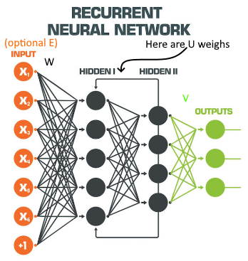

## Making predictions 
So the output (the production) depends on two things:
- The embeddings of the current input word 
- The hidden layer as influenced by the previous step(s) 

This is the [Bayes rule](Classification/Native%20baiyes/Bayes%20rule.md) intuition, where with the current evidence and the previous evidence you make up your mind about the future. 

This information is coming from the current input (embedding) and the hidden layer is summed to obtain a new hidden layer which is transformed using the [softmax](Feed%20forward%20neural%20networks%20(FFNN).md). This then gives you probabilities for different classes. This could either be a probability for each word in the language indicating how likely it is to be next or for instance a [Parts of Speech tag](Languages/Parts%20of%20Speech.md) or any other label.  These probabilities change every time you input another embedding (you say they change at every time step). When predicting words, you at some point stop giving input, and you take the class with the highest probability. Of course, if you sum these probabilities, you get 1.

When predicting tags or labels, you will need to have the correct label for training, as the loss function needs to know what the correct answer is. This requires annotation, which is expensive. With language prediction you don't need annotation because you can just use an existing text to have a correct answer. This kind of prediction can also be done with [ FFNN](Feed%20forward%20neural%20networks%20(FFNN).md) however they don't remember the context.

## Stacking layers.
We can stack as many recurrent hidden layers as we want (but the more, the slower the training). You can also stack the neural networks themselves, just like with [Logistic Regression](Classification/Logistic%20Regression.md). In this case, you could use the entire sequence of outputs from one RNN as the input to a next RNN or different type of neural network. The Neural networks are mostly **self-contained modules** which can be combined in an infinite number of ways, however you should motivate layer choices because the bigger the NN the more expensive running it gets. 

In essence stacking computes a slightly more abstract version of the input than the last version. This is especially useful if you have noisy data. We would like the network to learn how to use the abstract feature bundles from the input. The lower layers are tuned towards something closer to the signal, while the higher layers are tuned to more and more abstract features.  This is also how your brain does it, with vision and sound going through multiple layers. 

### Bidirectional 
RNN do not only go forward (left to right) but they can also go in the reverse. You can decide in which order you process the input sequence. You can go left to right or right to left. You could even have read middle out if you want. This will result in different dependencies. 

Nothing prevents us from having **two RNNs which read the input sequence in different directions and then combine their higher hidden layer** to encode a single representation of a sequence. This combines reading left to right and right to left, for instance, into a single representation.  There are many ways to combine the representation of hidden layers. For instance, concatenation or element wise sum/multiplication. RNN that do this called **bidirectional**.

## Back propagation through time 
A different back propagation is needed as to make a prediction we have to run the model multiple times. Normally with backpropagation it happens after you have just run the model once.

It works by in the forward pass, going through the whole sequence and keeping track of the loss. Only at the end of the input sequence do you start the backwards pass and **go all the way back, processing the sequence in reverse**. At every step, you compute the required error terms gradients (with derivatives) and save the error to compute the gradients at the next (which is the previous) step. 

So it sort of like a step up from normal back propagation because you have to include make an improvement while the model ran multiple times. 

## Vanishing gradient
One problem with RNN is the [vanishing gradient problem](Vanishing%20gradient%20problem.md). If the sequence which is processed by the model step for step is very long, the gradients in backpropagation through time are multiplied several times (as many times as words in the sequence) and may end up being zero. The smaller the gradients, the smaller the change in the weights. **If the gradients hit zero, the changes to the weights to stop**. 

There are variants of RNN like LSTMs and GRUs which modify the recurrent layers to handle the vanishing gradient by **forgetting** some information, which won't be carried on to the later input steps (and hence doesn't influence gradient computation). By forgetting, this information doesn't have to be carried to later input steps, and this reduces the vanishing gradient issue to some extent. 

There is another good further explanation found by Ethel of LSTM [here](https://colah.github.io/posts/2015-08-Understanding-LSTMs/).

## Applications of RNN

Apparently in 2017 bidirectional LSTM (with attention) were the state of the art for almost every task in NLP. They are still very much used, but now the state of the art is [transformers](Prediction/Transformers.md). 

### Probability of the sequence 
You can get the probability of the input sequence itself. You do this by making the model predict the next word for every token of the sequence you give to the model. Then you take the predicted probability for the class of the correct next token and store it, calculated with softmax. You know the correct next token because you have the sequence. Do this for the entire sequence, and then you multiply the probabilities or sum the logs to get the probability of the entire sentence under the trained language model. 

So the **product (or sum of log) of the probabilities of each correct continuation under the softmax** is the probability of the whole sequence under the trained language model. 

### Autoregressive 

When a model is autoregressive it means it can generate new language. 

This is done in the following way:

- Take the embedding of the beginning of sequence tag (BOS) as input to the RNN. Take the word with the highest softmax probability, or sample from the top x words. 
- Take the embedding of the generated word, run the network on it, and again take the word with the highest probability (or sample the top x) in the softmax. 
- Repeat till EOS (end of sequence symbol)

When doing this you **only need 1** beginning of sequence symbol and not multiple like with [Hidden Markov Models](Prediction/Hidden%20Markov%20Models.md). This is because the hidden layers will 'remember' that it has seen a beginning of sequence symbol. 


### Predicting Pos tags

Like said above, you can use RNN to predict labels. You can also use them for predicting [Parts of Speech](Languages/Parts%20of%20Speech.md) tags. However, the performance is not much better than with [Hidden Markov Models](Prediction/Hidden%20Markov%20Models.md).

### Named entity recogntion and labeleing
This task is about finding and appropriately labelling words which denote entities (countries, people, organizations .... ). So, for instance, you get the sentence "New York is a big city". The model should find out that New York is both a named entity and also the same named entity and also a city. 

### Structure prediction 
This task is about, given an input, producing the correct set of actions to achieve the desired output. Think of Alexa or Google assistants. RNN are useful for this because of the longer histories which can be used. 

### Sequence to label 
You can use RNNs to classify whole sequences as something. These models are called Seq2Label).  

To do this you run the model through a whole sequence and add the end **the hidden layer will encode a representation of the whole sequence** (more from the end). So like deriving an embedding for an entire sequence basically. You can then put simple [Logistic Regression](Classification/Logistic%20Regression.md) on top and train it to correctly classify these representations. The loss now refers to the class of the whole sequence. This is not a generative model, but a discriminative model. 

### Sequence to Sequence

Sequence to Sequence (seq2seq) is **a model that takes a sequence of items and outputs another sequence of items**.  Rather than emitting a label at the final step, you give out another sequence. 


You try to predict a sequence from another sequence without necessarily having a one to one mapping between units in both sequences. I think these are the most interesting problems, like translation or summarizing text. 

These types of models are usually made out of two connected subnetworks. The first **encodes the source** sequence (input) in a hidden state which yields an embedding. The second **[decodes](Decoding.md) the representation** from the hidden state into the target sequence. Training happens by jointly updating the weights of the encoder and the decoder in such a way that the decoded output resembles the target output as closely as possible. 

You might see this as a model taking in the label from a seq2label model and then predicting a sequence from that.

Nowadays, the underlying neural network architecture of these has changed, but the idea is still the same. 

# Hidden Markov Models 

Hidden Markov Models (HMM) are like a [Markov model](Markov%20models.md), but we also care about hidden states. In PoS tagging we don't observe the states we want to predict as we do in [language modeling](Language%20Modeling.md). Basically, the [PoS](../Languages/Parts%20of%20Speech.md) tags are hidden. We observe a sequence of words and want to find the best sequence of tags for that particular sequence of words out of all possible sequence of tags.

A Hidden Markov Model (HMM) consists of the following components:
- Q – A finite set of N states (hidden).
- A – A state transition probability matrix.
- $\pi$ - An initial probability distribution.
- O – A sequence of T observations.
- B – An observation likelihood matrix. Probability for a specific observation. 

The last 2 of these are different from normal Markov models. But the difference is that we use Q, A and $\pi$ for the hidden states. So the states in Q are not visible on the surface any more. With O and B we encode what we know or what is visible. We do know that Q contains BoS and EoS.

## Components

### Q
Rather than consisting of words or engram, Q consists of PoS tags. So, Q contains the states of the HMM. This also includes BoS and EoS. 

### A

A is a |Q|-by-|Q| matrix, where each cell $A_{ij}$ indicates the probability of moving from state $i \in Q$ to state $j \in Q$. This means that we need some corpus with annotated data where we can observe PoS tags.

We can do the estimation using maximum likelihood estimates. The formula of that is: $$p(t_{i}, t_{i-n:i-1}) = \frac{c(t_{i-n:i-1}, t_{i})}{c(t_{i-n:i-1})}$$
c is a count function. So you divide the frequency of the current tags by the frequency of the preceding tags. That gives you the probability of the tag given the preceding tags. 

### $\pi$
Similarly to the [Markov Chain](Markov%20models.md) $\pi$ encodes the probability that each state $q\in Q$ follows the BoS symbol. $\pi$ can be fixed in advance if you want to put constraints on what can come at the start, or you can estimate it from a corpus. So instead of words, is about tags. 

### O 
The set of observed events: In PoS tagging, O contains words. This set has to be finite, otherwise we can not finish. Every observation in O has to be able to be tagged from a state in Q. 

### B

B is another matrix. It is of size |Q|-by-|O|, where each cell $b_{qo}$ indicates the probability that a word $o \in O$ is generated by a state $q \in Q$. 

To compute B, we need to find out how often each word occurs tagged with a particular PoS tag in a corpus. Again this needs annotated data.

So B encodes the probability that a certain word occurs since we observed a certain tag. Given that we observed a noun, how likely is it that this noun is exactly dog for instance and not aardvark. 

This is also calculated with ML: $$p(w_{i}|t_{i}) = \frac{c(t_{i},w_{i})}{c(t_{i})}$$

This divides the number of times a specific word is tagged as a certain tag. 

So we want to know the likeliest tag for a word, but we compute the likeliest word after observing a tag. This is like [Bayes rule](../Classification/Native%20baiyes/Bayes%20rule.md). We aim for the posterior but compute the likelihood and the prior, and then estimate the posterior. 


## Assumptions 
Both of these assumptions simplify the problem to make it possible to compute. 

### Markov Assumption
The probability of the next tag is only determined by the local history, not the whole sequence.

### Output independence 
The probability of a word only depends on the state that produced the corresponding tag, not on any other state or word. 


# Vanishing gradient problem 
When using [recurrence](Recurrence.md), the effect an input has on the current prediction lowers the further it is in the past. This causes the **vanishing gradient problem**. This is not so noticeable for short to medium length sequences, but for long sequences, RNN will stop improving. The reason for this is that with the backpropagation trough time algorithm, the gradients of the earliest parts of the sequence go to 0. Basically, the further in the past a part of a sequence is, the less impact it has on the current prediction. If you go too far away, the impact will become 0 and back propagation stops working.  STM & GRU architectures mitigate this issue by forgetting about parts of sequence too far in the past, but this causes information to be lost through recurrence. 

[Transformers](Transformers.md) attempt to solve this issue without forgetting. 

# Markov Assumption 
The Markov assumption says (in the language modelling domain) that <b>the conditional probability of a word appearing next in the sequence can be approximated by <u>looking at its local history instead of the entire history</u></b>. In this case the preceding history is an [n-gram](../Languages/N-grams.md) of words which indicates how far you look back. This can be expressed with maths: $$p(W_{1},...,W_{m}) \approx \prod^{n}_{i = 1}(p(W_{i}|W_{i-n~:~i-1}))$$
Here W is a sequence of words. $W_1$ is the first word in this sequence. $W_m$ is the last word in this sequence. We don't explicitly define m to indicate that the sequence can be arbitrarily large. You can approach ($\approx$) the probability ($p$) of the sequence $W$ appearing by multiplying ($\prod$) the probability of n words which came before it. 

The sequence of symbols you consider trying to predict the next symbols is called the [context](../Semantic-Similarity/Context.md). The context is defined by [N-grams](../Languages/N-grams.md). The bigger the N in N-gram the bigger the context you consider.

So basically don't look at the entire history, but just look at the context (an N-gram at the end). 

## Bigram model 
With the Bigram model, you take N=2. Only look at the preceding word as history and then find the probability of the next word. 

So if you use this model and try to predict what comes after “a tree has” and you look at “leaves” then you would get $p(\text{has}|\text{leaves})$. You would get $p(\text{a tree has}|\text{leaves})$ if you were to consider the entire history (a 4-gram in this case). 

So here we are working under the assumption: $\text{p}(\text{a tree has}|\text{leaves}) \approx \text{p}(\text{has}|\text{leaves})$ this assumption is the Markov assumption. 

The nice thing here is that “has leaves” is much more likely to appear in a [corpus](../Data/Corpus.md) than “a tree if leaves”. This is good because if your n-gram does not appear at all in the corpus, the probability will be 0 and then all is lost. 

### Pros
- Easy to estimate transitions, reduces sparsity. 
- We can use smaller corpora.
- With bi-grams, the chance that you don't find the n-gram in the corpus is the smallest as possible.

### Cons
- Throws away a lot of information, as can be seen above. Tree gives a lot of information, much more than has. However, you could filter words like has out with [normalization](../Data/Normalization.md) because that in general does not give a lot of information. 


### Maximum likelihood 
The probabilities that we compute are maximum likelihood estimates. So if we wanted to do has leaves, it would be: 

1. Find and record the occurs of “has” followed by the word “leaves”. 
2. Divide by the frequency count of all the bigrams that start with “has” regardless of what follows (frequency of “has”).

If we do this, then we maximize the likelihood of the corpus used to collect the counts. This means that given the model, the input corpus is the likeliest set of sequences we could expect in the [language model](Language%20Modeling.md). This makes sense because the data that the model is based on decides the probability distributions. 

## How to choose n?
Choosing n is a trade of between being able to predict and the information needed. In practical applications, trigrams (or higher) models are usually preferred to bigram models as they provide a larger context and practical application often use larger corpora because they can afford it. Because if you increase n, you really need a much larger corpus to be able to predict things. 

The higher the n the more fine-grained the information, the weaker the Markov assumption, and the more severe the sparsity. 


# Recurrence 

Recurrence is the idea of allowing the**previous state of a model to influence the current state**, rather than using the previous [N-grams](../Languages/N-grams.md) to [predict](../Prediction/Prediction.md) the next event based on the [Markov assumption](Markov%20assumption.md). When using recurrence in a [neural networks](Feed%20forward%20neural%20networks%20(FFNN).md) it becomes a [recurrent neural network (RNN)](../Prediction/Recurrent%20neural%20network%20(RNN).md).

Thanks to **recurrence**, the value of a hidden unit doesn't simply reflect the weighted sum of the input, but also **reflects the previous hidden state**. 

The idea is that you update a hidden layer not only based on the current input, but also based on another hidden layer from previous [predictions](Prediction.md). 

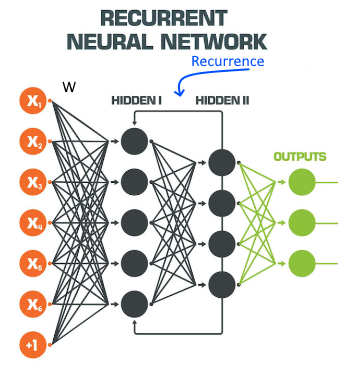

Using recurrence suffers from the [vanishing gradient problem](../Vanishing%20gradient%20problem.md).


# OOV rate 
When testing a [language model](Language%20Modeling.md) there might be words in the testing set that the language model has never seen before. This can be expressed in the OOV rate. The OOV rate is the percentage of words in the test set which never occur in training. If it is high, there is a representability problem. 


# Overfitting 

Overfitting is when you make a supervised [learning](../Other/Learning.md) model too focused on the training data that you have. When this happens, your model will be great at predicting your training data, but it will suck at predicting data that you have not seen before, especially if it is close to the decision boundary. 

This can generally be seen in big difference in training scores and test scores, where training scores are high and test scores a low. 

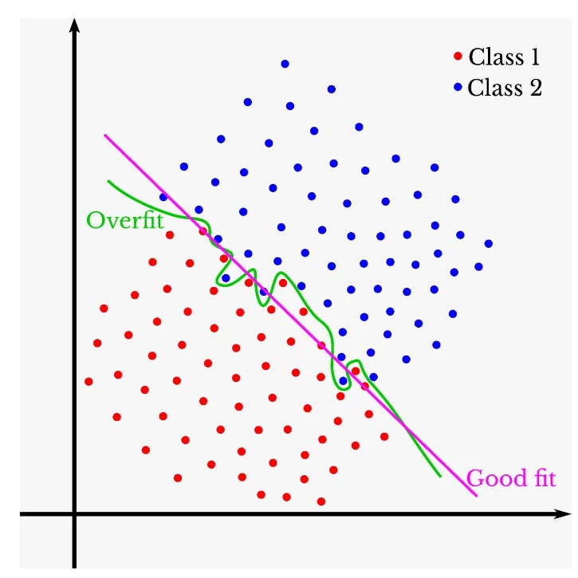

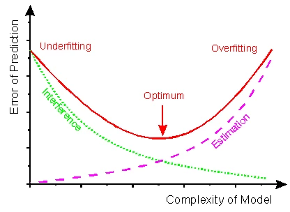

When you have overfitted your model can predict the training data extremely wel, but it is not generalizable to new data. 

## Preventing overfitting

You can prevent overfitting by splitting your data into different groups. You take the biggest part of the data as the **training data**. The data that the model actually uses to make predictions. Then you have the **test data or development data**, which you use to access the models' performance during training. When this is done you need to have a third set of data, the **validation set**, to check if you didn't overfit on the test data. 

In the knowledge clip, the 3 sets are called differently. See the image:

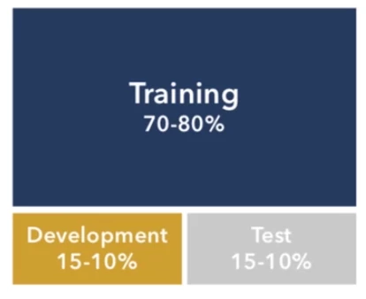

## K-fold cross validation
Here you split the data into k portions of the same size, then iteratively train on k-1 sub sets and test on the remaining sub-set. Then you average scores of the k runs. K is typically like 5 or 10. 


# Prediction 
Closely related to [classification](../Classification/Classification.md) in language, but prediction is trying to anticipate **what comes next given what has happened before** rather assigning a class to an instance. 

The difference between classification and prediction is that with classification you try to predict nominal, classificatory or ordinal variables based on features of an input while with prediction you try to predict interval or ratio variables.

But you could see this as classification but just with a lot more classes to predict. Or an infinite number of classes you can predict.


# Language modelling

Language modelling is the activity of creating a computer model which automatically [learns](../Other/Learning.md) one or more things about [language(s)](../Languages/Languages.md) and can then make [predictions](Prediction.md) for a certain task. 

Can we even do this? Yes we can. Language is a sequence of things, and that sequence is not random.  What comes before affects what comes next. This is the heuristic which is used to make good language models.  

## Probabilities 
A language model makes it predictions using a large probability matrix which encode probabilities about the language which are useful for the specific task which the language model is trying to solve.

To get these probabilities, a language model is first trained on a bunch of correct text of a language from a [corpus](../Data/Corpus.md). This gives the model a **large probability distribution of sequences in the language**. When the model receives a new (unfinished sequence) it can assign a probability to sequences of symbols that might come next in the sequence.  

There are multiple ways of deriving the probability matrix. Two ways discussed in the course are counting and neural networks. 

These probability distributions can also give a probability of how likely an entire sentence is to appear in a language. This way, the model might say that: “The sun rotates around the earth” is less likely than “The earth rotates around the sun”. Or, the sentence “A house is bigger than a person” is more likely than “A person is bigger than a house”.

## Uses of language models 

Language models are usually a means to an end, rarely the goal. They are useful for:

- Scoring sentences before choosing the best one
- Scoring machine generated language.
- Investigate language processing in humans to inform the development of bots.
- Speech/handwriting recognition. In disambiguation, if you have a piece of unclear text could be multiple things, you could pick the one the language model says is more likely. 
- Spelling correction if more alternatives have the same [edit distance](../Languages/Edit%20distance.md).
- Scoring machine translation models or translation options. 
- Which sequences are part of a [language](../Languages/Languages.md) and which are not?
- How should a certain sequence be continued?
- What words should be filled in to a blank spot. 
- Translation
- ....

## Generating language

If the model knows the probability distribution of a language, then you could give it an unfinished sequence of [symbols](../Data/Symbol.md) and the model can tell you which next sequence of symbols most likely to be next. The model does this by picking the continuation with the highest probability to appear next in the sequence when following the probability distribution (what we already know or what happened before). So language models can actually predict what is the most likely to come next. Instead of taking the most likely continuation, you can also sample according to the probability matrix. 

You could then take the sequence of symbols that was the most likely and add it to the sequence you had to further the sequence. Now after you have done this once you can of course do another prediction on the new sequence and there you go now you're generating language. Language models, which generate language, we call **generative models**. 

### Always the same sentence
In a model as described above when we give the same sequence and always take the most likely continuation, the model will always give the same results because the probability distribution is static. This can cause you to hit loops if you only consider the last x number of symbols in a sequence. 

## Evaluating language models 
How do you know whether a language model is good? In this case, good is that the model encodes probabilities well and assigns high probability to real, correct sentences and low probabilities to wrong sentences. The best language models can mimic human performance. 

### Extrinsic evaluation
With extrinsic evaluation, you evaluate how much impact a model has on a **downstream task**. For instance, how many new customers did we get after we bought that translation software? How large was the decrease in calls to our support center after we installed that chatbot. 

### Intrinsic evaluation

 With intrinsic evaluation, you evaluate the model itself, often according to some scoring metric from the literature. If you see an improvement in the intrinsic evaluation, you can say that you may expect an improvement of the downstream task, but you can not be sure. 
 
 So how do we do intrinsic evaluation? You feed the model new data and check how well it predicts each token in the sentences and how well it scores sentence probabilities. 
 
 A good language model will **fit the new data well**. This means it will usually predict the correct word type or assign a high probability to the sequences in the new data. This type of evaluation is called [perplexity](Perplexity.md). 

### Bidirectional models 
A bidirectional model is a language model which analysis text from both left to right and right to left. It could also mean analysing the text that came before what you try to predict and analysing what comes after what you try to predict given that is available.

## Techniques for NLP

Techniques for language modelling discussed include [Naïve Bayes](../Classification/Native%20baiyes/Naïve%20Bayes%20Classifier.md) (doesn't really take preceding words into account), [Markov chain models](Markov%20models.md) (we do take preceding words into account with n-grams), [Probabilistic Context Free Grammar](../Languages/Probabilistic%20Context%20Free%20Grammar.md) (using production rules to expand non terminals to terminals to generate language) and [Feed forward neural networks (FFNN)](Feed%20forward%20neural%20networks%20(FFNN).md) and [Recurrent neural network (RNN)](Recurrent%20neural%20network%20(RNN).md) and [Transformers](Transformers.md). 


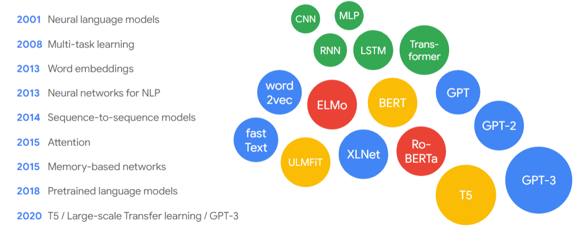

# Viterbi Algorithm

How do you actually do [Decoding](Decoding.md) in practice? Because there is a large growth in the input. Given a sequence of 4 words and 45 tags there are $45^4$ possible sequences. So it's $O(Q^{|T|})$. This grows fast. This means we can not calculate all the sequences. 

The basic principle is to use recursion to compute the best path that could lead to a certain point given:
- The HMM
- The observations up till the point you are
- The most probable state sequence to have generated the observations given the HMM.

The idea is just to compute the best path for the first part of the sequence. This is not so hard. But then **we know that the best path of the first part of the sequence is the best path up till that point**. This means that we don't have to recompute the probabilities for that part of the sequence. So if you have word 1 and 2 and 3. You can first compute the maximum likelyhood tag for 1, and then you can use that to calculate the maximum likelihood for 2 without recomputing 1. 

This means we can start from 3. To calculate the best one we need 2, to calculate the best one we need 1.  Then we hit the base condition, so we calculate 1 and return it. Now that it returned we can use it to calculate 2 and return that now that 2 returned we can calculate 3. So basically you leave the work until you finished another problem. 

Using the recursion we get $O(Q^nT)$ where n is the n in [N-grams](../Languages/N-grams.md). This is also called the **order of the model**. So n = 2 is a bigram. So this makes it much better, and you need a lot of data to get higher n. 

## Trellis 
The trellis represents the probability that the HMM is in state $q \in Q$ after seeing the previous events $o_{1}...o_{t}\in O$ and passing through the most probable sequence of states. The trellis is the name we give to this table we have been building. 

The value of each cell at successive states is computed by **multiplying the current transition and emission probabilities by the most probable sequence** which could lead to that cell. This means we have to find the probable sequence. We do this by taking the max(transition probability * each column of the A matrix - BOS).

## In practice 

Create a matrix M with as many rows as there are states $q \in Q$ and as many columns as there are events $o \in T$ to be decoded (so that is the [sentence](../Data/Sentences.md) you want to tag + BoS and EoS). 

The value of each cell $M_{qo}$ is computed as follows: $p(t_{o}|t_{o-n:o-1})p(w_{o}|t_{o})$. So it's the prior multiplied by the likelihood. This means that each cell contains the posterior probability of finding each tag given the current word after having observed everything that came before. 

Each posterior in this matrix is depended on the **emission and the local transition** at each word $w_t$ with $t \in T$, compute the posteriors considering  

## Tutorial 

For an example, we need an already filled A and B matrix. $A_{ij}$ encodes the probability that the tag in column j occurs, given the tag in row i before it. $B_{ik}$ encodes the probability that word k is observed given that tag i was before. The rows sum to 1. 

| A    | Det     | Adj     | Noun    | Verb  | EOS   |
|------|---------|---------|---------|-------|-------|
| Det  | 0       | 0.2     | 0.8     | 0     | 0     | 
| Adj  | 0       | 0.3     | 0.6     | 0     | 0.1   |
| Noun | 0       | 0       | 0       | 0.5   | 0.5   |
| Verb | 0.5     | 0.1     | 0.2     | 0     | 0.2   |
| BOS  | **0.5** | **0.2** | **0.3** | **0** | **0** |

So for instance if you find and Adj you have a 0.3 chance to find another adjective and a 0.6 chance to find a noun. So given adj (on the side) you have a probability of 0.3 to find another adjective next and 0.6 to find a noun next. So given what's on the side, you have probability to find something at the top. Because the row values are probability, this is why rows sum to 1. 

The BOS vector at the bottom is $\pi$. The initial distribution. Given BoS what is the most likely to follow.

| B    | dog  | the | chases | cat | fat |
| ---- |------| --- | ------ | --- | --- |
| Det  | 0    | 1   | 0      | 0   | 0   |
| Adj  | 0    | 0   | 0      | 0   | 0   |
| Noun | 0.5  | 0   | 0      | 0.4 | 0.1 |
| Verb | 0.1  | 0   | 0.8    | 0.1 | 0   |

The same here. Given a noun, the chance is 0.5 that the word is dog. 

So A only looks at tags following other tags and B actually looks at words.

### Now we can start the algorithm. 

First, create the table. |Tag| rows by |words| columns + the BoS and EOS|. This table is called the trellis.

| Trellis | BoS | The | dog | chases | the | fat | cat | EOS |
|---------|-----|-----|-----|--------|-----|-----|-----|-----|
| Det     |     |     |     |        |     |     |     |     |
| Adj     |     |     |     |        |     |     |     |     |
| Noun    |     |     |     |        |     |     |     |     |
| Verb    |     |     |     |        |     |     |     |     |

First, we can fill in the probabilities for the BoS row by filling in $\pi$, but you don't have Bos and Eos on the side. So just to be clear, we filled in $\pi$ and $\pi$ is the bottom row of the A matrix (the row with BOS). So we flipped that row 90 degrees and also left out the last element (because EOS doesn't follow BOS). $\pi$ is marked bold in the A table.

| Trellis | BoS | The | dog | chases | the | fat | cat | EOS |
|---------|-----|-----|-----|--------|-----|-----|-----|-----|
| Det     | 0.5 |     |     |        |     |     |     |     |
| Adj     | 0.2 |     |     |        |     |     |     |     |
| Noun    | 0.3 |     |     |        |     |     |     |     |
| Verb    | 0   |     |     |        |     |     |     |     |

Now we want to take the next word "the" and take the "the" column from the B matrix. This is the emission probability.

| Trellis | BoS | The | dog | chases | the | fat | cat | EOS |
|---------|-----|-----|-----|--------|-----|-----|-----|-----|
| Det     | 0.5 | 1   |     |        |     |     |     |     |
| Adj     | 0.2 | 0   |     |        |     |     |     |     |
| Noun    | 0.3 | 0   |     |        |     |     |     |     |
| Verb    | 0   | 0   |     |        |     |     |     |     |

Now you want to multiply the column we got (emission probability) with the previous column (the transition probability). This gives us:  

| Trellis | BoS | The           | dog | chases | the | fat | cat | EOS |
| ------- | --- | ------------- | --- | ------ | --- | --- | --- | --- |
| Det     | 0.5 | 1 * 0.5 = 0.5 |     |        |     |     |     |     |
| Adj     | 0.2 | 0 * 0.2 = 0   |     |        |     |     |     |     |
| Noun    | 0.3 | 0 * 0.3 = 0   |     |        |     |     |     |     |
| Verb    | 0   | 0 * 0 = 0     |     |        |     |     |     |     |

Now, the *the* column indicates the posterior probability of the determiner given that the first token is "the". We have now decoded the sequence BoS. Now we can move on to the next item, which is *dog*. 

The value of each cell at successive states is computed by **multiplying the current transition and emission probabilities by the most probable sequence** which could lead to that cell. This means we have to find the probable sequence. We do this by taking the max(transition probability * (the full A matrix – BOS)).

So to find the most probably continuation for, we want to multiply (multiply not dot product) the current word in the trellis with the entire A matrix (without the BoS) and take the max. 

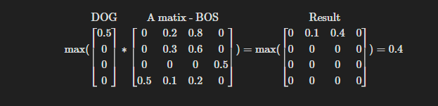

Now the max is 0.4. Now we multiply this with the emission probability of the current word (dog) so we get: 0.4 * [0, 0, 0.5, 0.1] = [0, 0, 0.2, 0.04]. This becomes the new column in the trellis. 

So we got [0, 0, 0.2, 0.04] by multiplying the dog column with A and then taking the max (0.4) and then multiplying the dog column with the max. 

| Trellis | BoS | The | dog   | chases | the | fat | cat | EOS |
|---------|-----|-----|-------|--------|-----|-----|-----|-----|
| Det     | 0.5 | 0.5 | 0     |        |     |     |     |     |
| Adj     | 0.2 | 0   | 0     |        |     |     |     |     |
| Noun    | 0.3 | 0   | 0.2   |        |     |     |     |     |
| Verb    | 0   | 0   | 0.004 |        |     |     |     |     |

We also want to mark which column gave the max in the multiplication. In this case, it was the first column. It is not guaranteed that this is always the highest value from the previous column. It depends on A. So now we have the posterior probabilities for The dog. We don't have to recompute for dog. 

| Trellis | BoS | The     | dog   | chases | the | fat | cat | EOS |
|---------|-----|---------|-------|--------|-----|-----|-----|-----|
| Det     | 0.5 | **0.5** | 0     |        |     |     |     |     |
| Adj     | 0.2 | 0       | 0     |        |     |     |     |     |
| Noun    | 0.3 | 0       | 0.2   |        |     |     |     |     |
| Verb    | 0   | 0       | 0.004 |        |     |     |     |     |

So as you can see, we need 3 pieces of information each time. 

- The posterior probability up to the previous state (the trellis) 
	- This makes it dynamic and saves time
- The transition probabilities from state $q_i$ to state $q_j$ 
	- This is the prior
- The emission probabilities for observation $o_j$ given state $q_j$ 
	- This the likelihood

So let's continue:

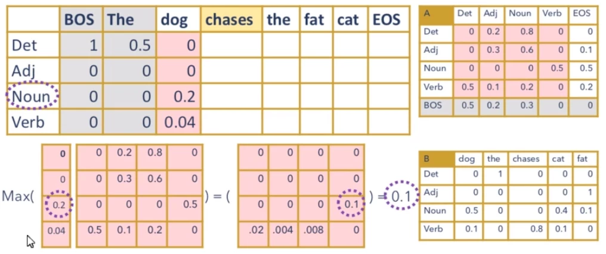

We found that 0.1 is the highest after multiplication. Then we multiply it with the emission which is [0, 0, 0, 0.8] so 0.1 * [0, 0, 0, 0, 0.8] which becomes [0, 0, 0, 0.08]. Now we can fill that in, and we should mark the third column.

| Trellis | BoS | The     | dog     | chases | the | fat | cat | EOS |
| ------- | --- | ------- | ------- | ------ | --- | --- | --- | --- |
| Det     | 0.5 | **0.5** | 0       | 0      |     |     |     |     |
| Adj     | 0.2 | 0       | 0       | 0      |     |     |     |     |
| Noun    | 0.3 | 0       | **0.2** | 0      |     |     |     |     |
| Verb    | 0   | 0       | 0.004   | 0.08   |     |     |     |     |

When we have filled the entire trellis, you can make the sequence of tags by picking the tag on the side of the column that has the marked number in each row. So, so far we get [Det, Noun] which is correct. 

Now we can repeat. The probabilities get small quick.

## More context 
We can also look at the maximum of the previous transitions from each posterior more than 1 previous column.  So like n = 2 previous columns. However, it increases complexity but also brings scarcity. We don't want 0 transition to hijack the computation. Because often a transition is not actually impossible, just a really small chance.  To somewhat solve this we can use smoothing just like with [Markov models](Markov%20models.md). We can also use interpolation to guess the transition probability, which is estimated by linearly interpolating using smaller n-grams. A guessed probability is better than no probability.

You can also use pseudo morphology → words consist of smaller units which influence their PoS tag. We can look at this to add bias to the probability, or we could compute emission probabilities for part words (suffixes of different lengths, down till single characters). Whenever you hit an unknown word, use the emission probability for the suffixes instead. Something is better than nothing.

# Forward Algorithm 
This is similar to the Viterbi algorithm, but used to compute the likelihood of a sequence of observed events given a HMM. So it tries to find the likelihood of a sequence appearing at all in the set of all possible sequences. We want to find the culminative probability at each step. 

All this does is replacing the max with the sum. You do this because you want to take into account the probability of all possible paths' through the hidden states, not find the likeliest path. Also, you don't need backpointers because we don't try to find a tag. 

# Decoding 

Decoding is the task of turning something that is in code form into a non code form.   

In the case of this course decoding has to do with [Hidden Markov Models](Hidden%20Markov%20Models.md). It is the task of **determining the sequence of hidden variables given a sequence of observed events.** 

The decoding task takes an estimated HMM $\lambda$(A, B, $\pi$) and a sequence of observations O as input to output the likeliest sequence of states Q to have generated O. 

Decoding is also mentioned in this course as the task of decoding an abstract representation of a sequence to another sequence in the context of [Recurrent neural network (RNN) and seq2seq](Recurrent%20neural%20network%20(RNN).md) and [Transformers](Transformers.md)

## Formally
If we want to write this down formally we get: $\hat{t}_{1:n} =\text{argmax}_{t_{1:n}} p(t_{1:n}|W_{1:n})$.

So the approximated tag sequence is the sequence of words with the highest posterior probability. If you actually calculate this with [Bayes rule](../Classification/Native%20baiyes/Bayes%20rule.md) you get $\hat{t}_{1:n} =\text{argmax}_{t_{1:n}} p(t_{1:n}) \cdot p(W_{1:n})$. 
We plug in the formulas to estimate both terms under the [Markov assumption and the output independence assumption](Hidden%20Markov%20Models.md). So for a whole sequence:

$$\hat{t}_{1:n} \approx \text{argmax}_{t_{1:n}} \prod^{n}_{i = 1} p(t_{1:n}) \cdot p(W_{1:n})p(w_{i}|t_{i})$$

You can also do this in log space to avoid overflowing. Here you can also see the output independence. The last p only looks at the i word with the i tag. 

## Transition and emission
The posterior is the product of the **transition probability** PoS tag n-grams to PoS tag and the **emission probability** from the PoS tag to word.

### Transition Probability
Transition probabilities (A) captures the prior. This is how likely the tag is given the context. Comes from the A matrix stays with the tags and sort of enforces the Markov assumption in the model.

### Emission Probability 
The emission probability is the probability of the word given the word. This enforces the output independence. You only look at the current tag.


# Feed forward neural networks 

Feed forward neural networks (FFNN) can be used to overcome the linearity problem with [Logistic Regression](Logistic%20Regression.md). To achieve this we feed the output of one logistic regression multiply-the-weights-vector-with-the-input-vector-step as input into another logistic regression model. We can also just keep doing the multiply vector and weights a lot of times before we do the classification function and making it probabilistic steps. We can also multiply the input vector with multiple weight vectors only then apply a classification function to some of the cells of the result vector to create a new vector of a different size and keep going. It is quite flexible, to see the graphical representation below.  

So stacking logistic regressors will create non-linear classifiers which can learn **arbitrary decision boundaries** for linear classifier. This turns logistic regression into (feedforward) neural networks.

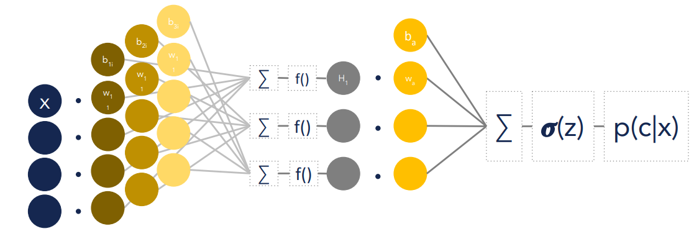

So what you see above is taking the input vector and multiply with multiple weight vectors every time also adding a bias. Then you take the sum of these cells and pass it to a function. Typically, a non-linear function to add non-linearity. This then gives you a new vector (the gray dots). This is then called a **hidden layer** because you can not interpret it any more back to the input. It is a more abstract representation of the input. 

We then keep going, multiplying the hidden layer by another weights vector and adding a bias and on and on. However, we want to go to a scaler in the end so to do that you just take one sum from the vector you are at and apply the classification function (for instance sigmoid or softmax) to turn the output to a certain range and into a probability.  

## Matrix representation 

If you would actually make a computer do this it is useful to use matrixes to kind glue the weights vectors together and computers know how to deal with matrixes well and fast. You can visualize the above picture with matrixes like below:

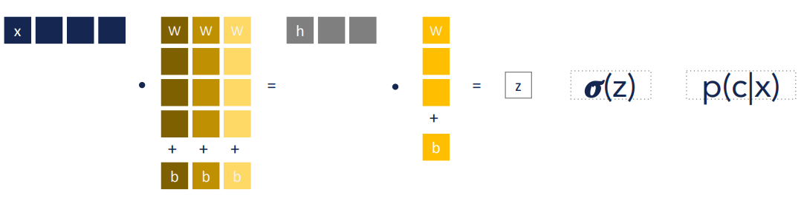

## Feed forward  
These types of networks are called feed forward because the output of a lower layer only affect higher layers and do not feed back into the same layer or lower layers. 

These types of networks also sometimes called Multi Layer Perceptrons (MLP) although perceptron's don't use non-linear [activation functions](Logistic%20Regression.md) while FFNN do.

There are also neural network architectures which are not feed forward. For instance, you can take the previous states of the model into account with [recurrence](Recurrence.md). When this happens, the neural network becomes a [recurrent neural network (RNN)](../Prediction/Recurrent%20neural%20network%20(RNN).md).  

## Fully connected 
MLP are typically fully connected (or dense). Each hidden unit computes the weighted sum over **all** the units in the previous layer. There is a direct connection for every pair of hidden units (or neurons) in each pair of adjacent layers (including the input and output layers). So basically in the drawing, there is a line from each circle of one layer to each other circle in the next layer.  If this is not the case, then a network is not fully connected.

## Hidden layers
There can be arbitrary many hidden layers even though one is enough to learn any kind of function (given infinite time, and resources). Stacking hidden layers may help learning. Hidden layers can also change the size of the vector, like seen in the graphical representations with the gray layer. 

## Back propagation
Adjusting the weights with FFNN is more complicated than with logistic regression.  Backpropagation is the algorithm used for this, but this course does not go into further detail about it. You can [read more here](http://neuralnetworksanddeeplearning.com/chap2.html).

The general idea is that you apply the forward pass where you generate the outputs. Then you calculate the loss with the objective function with the correct outputs vs reality. This requires labels. Then you do the **backwards** pass, where you take the error and compute all the derivatives at every layer. This will sort of show which weights caused the largest error, and then you adjust those more in the direction which will cause less error.

## Learning rate 
The learning rate decides the size of the improvement steps taken in back propagation. It basically scales the adjustments which need to be made according to the backpropagation algorithm. The larger steps make the model improve the weights faster, but you can also overshoot and improve into a 'wrong' direction. It captures **how confident we want to be in updating our hypothesis** given the input data you just evaluated and error that caused. You can also start with a higher learning rate and lower it every time you improve the model. The learning rate is one of the hyperparameter of the model. 

## Creating a FFNN 
How do you start of? It seems the best to start all the weights with small random numbers. The weights are the parameters of the model which will be learned.  

FFNNs have parameters which are learned (the weights) and hyperparameters which are set by the modeler (you): how many layers, how many units in each layer, which activation function, which loss, which optimizer, which input representation, the learning rate. It is important to explore several constellations and check on a dev. Finding the hyper parameters can be automated with GridSearch. But hopefully you know what hyper are as it has been 3 years at this point.  

## Applications of FFNN
We can use neural networks to create [word vectors](../Semantic-Similarity/Vector%20semantics.md) also known as [word embeddings](../Semantic-Similarity/Embeddings.md). Instead of just [counting words](../Semantic-Similarity/Co-occurrence.md) we train a model to predict the neighbouring words. This has the advantage of **directly building dense vectors** instead of first making space vectors with the counting based models and then projecting them into lower dimensional space. One popular technique to representation learning is [Word2Vec](../Semantic-Similarity/Word2Vec.md). 

Another application is to [use FFNN for language modelling](../Prediction/Using%20FFNN%20for%20language%20modelling.md). This works better than [Markov models](../Prediction/Markov%20models.md) because you don't have to do smoothing. 


### Side note about this 
It was found by that paper mentioned in the guest lecture [(Levy, O., et all)](https://scholar.google.nl/scholar?q=improving+distributional+similarity+with+lessons+learned+from+word+embeddings&hl=en&as_sdt=0&as_vis=1&oi=scholart) that what logistic regression is doing is very much similar to doing co-occurrence counts with [PMI](../Semantic-Similarity/Point%20wise%20mutual%20information%20(PMI).md) [Association measure](../Semantic-Similarity/Association%20measure.md) as weights. We can explain what it is doing. So that is very intresting. This does not hold up for larger neural networks. 

This is the abstract:

*Recent trends suggest that neural network-inspired word embedding models outperform traditional count-based distributional models on word similarity and analogy detection tasks. We reveal that much of the performance gains of word embeddings are due to certain system design choices and hyperparameter optimizations, rather than the embedding algorithms themselves. Furthermore, we show that these modifications can be transferred to traditional distributional models, yielding similar gains. In contrast to prior reports, we observe mostly local or insignificant performance differences between the methods, with no global advantage to any single approach over the others.*


# Markov models 

A Markov model is any [language Model](Language%20Modeling.md) model which makes use of the [Markov assumption](Markov%20assumption.md). A Markov model is also called Markov chain. 

Markov models make use of: 

- A set of history states **Q** $\{q_{1},q_{2}, q_{3}, ..., q_{n}\}$ 
- A set of predicted states **R** $\{r_{1},r_{2}, r_{3}, ..., r_{m}\}$ (What you try to predict)
- A transition probability matrix A (size: NxM)
- An initial probability distribution $\pi$

## States
In a bigram model, Q and R are the same set. With larger [N-grams](../Languages/N-grams.md) models, they are not the same. Q is bigger than R because the histories are longer. 

A difference between Q and R is that Q will contain the BoS while R contains the EoS.

## Transition matrix 
The transition probability matrix A encodes the probability of going from a state $q \in Q$ to a state $r \in R$, such that a cell $a_{ij} \in A$ with $i \leq |Q|$ and $j \leq |R|$ encodes the probability of finding state j given state i.

Q usually corresponds to the rows of A and R to the columns. This is done, so we can get relative frequencies by row-normalizing counts. 

## Initial distribution 
This is starting state. The initial distribution is given by the transitions between states Q which only consist of BoS symbols and the r states. This is where all sequences start. The initial distribution can be set in advance or estimated. 

This is usually just embedded in A by augmenting Q with the BoS state.

So usually this a row in A with only beginning of sequence symbols. It is the initial state.

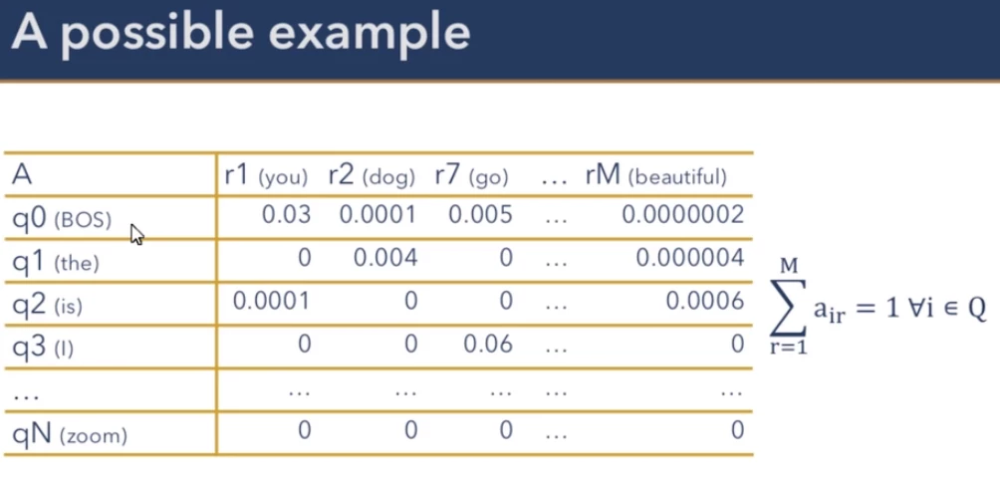

Looking at this table really makes it more concrete. The idea is that the sum of the entire row is one. The sum of a column does not have to be one. 

## Fine tuning

How do you decide on the n-gram size? Which [discounting](Smoothing.md) method you will use? What k will you use if you use Laplace [smoothing](Smoothing.md)? etc.

We can do this like any other machine learning problem. In this case the loss/cost/error function is [perplexity](Perplexity.md), and we want to minimize it. Try to minimize the perplexity of the dev set by tuning the hyperparameters.  


## Trade of

Higher N-grams are more constraining and precise, but more scarce. If we have 20k [types](../Data/Type.md), then there are:
- 20K$^2$ bigrams = $4*10^8$. 
- 20K$^{3}$ trigrams = $8 * 10^{12}$. 
- 20K$^{4}$ tetragrams = $1.6 * 10^{17}$. 

So you need to have the data to support this otherwise you will hit something you have not seen before too often. 

THIS is why [Normalization](../Data/Normalization.md) is important because it reduces the number of different histories from which you can predict. 

# Interpretability (Guest Lecture)
When something is interpretable, you can know what a certain value or vector of values represent. So with [connotations](../Semantic-Similarity/Connotations.md) it is clear what each number in the vector means, while with the hidden layers of a [neural networks](Feed%20forward%20neural%20networks%20(FFNN).md) it is not clear how exactly the numbers relate to the input. 

This topic is what the guest lecture (by Jasmijn Bastings) was about. How do you explain good performance of models. 

Interpretability is useful to prevent scenarios where the model takes a shortcut through the data and therefor becomes less generalizable. 

## Explaining predictions
Interpretability allows you to explain the predictions of a model. For instance, with a linear classifier you can know exactly **why** something was predicted because you can just look at the formula. This means linear models are interpretable. This is not the case with neural networks, but there are approaches to do this. 

### Occlusion 
Occlusion-based methods compute input saliency by occluding (or erasing) input features and measuring how that affects the model output. So deleting parts of the input data and then looking how the model behaves. 

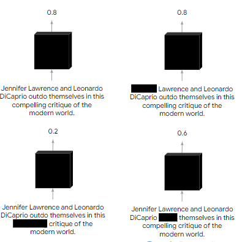

This can indicate the words for instance a model is picking up on to give a good probability to an answer. 

Occlusions will try taking out every combination of the input which takes a lot of time. So one word at the time.  

### Perturbations
With perturbations you basically sample masks which you use to take out some of the input data and you run the model. Then you try to predict these outputs with a linear model from the masks. This linear model will then assign importance scores to some of the words. So you use the fact that linear models are interpretable to interpret your model. 

This is like a faster version of occlusion where you don't try all possibilities but you sample possibilities. 

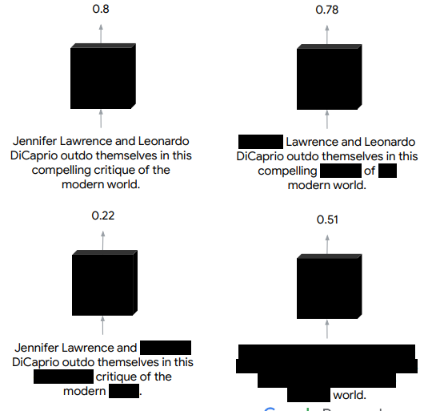


## Gradient $L_2$
Also known as Sensitivity Analysis (SA), we can use the gradient from a standard backpropagation pass as relevance scores:

In practice, we want a single scalar relevance score  per input word, instead of one for each word embedding dimension, so we take the L2 norm:  Requires one forward pass and one backward pass.

Gradient L2 says how much a change in a word's  embedding affects the output of a model.

Instead of using the gradient to improve the model, you use it to explain the results.

Grad L2 shows the sensitivity of the model, i.e., how  much a change in input changes the output.  

## Gradient x Input
You can also take the gradients and multiply them with the embedded inputs. This arrives at the gradients times input measure. To get a scaler you do the dot product between the embedded input and the gradient times. 

Gradient x Input shows the saliency, i.e., the marginal effect of each input word on the prediction

## Integrated Gradients

Integrated gradients (IG) is a gradient-based method  which deals with the problem of saturation: gradients may get close to zero for a well-fitted function.  

IG requires a baseline $b_{1:n}$e .g., all-zeros vectors or repeated [MASK] vectors. The math looks like this: $$\frac{1}{m}\sum\limits^{m}_{k=1} \nabla f_c(b_{1:n}+\frac{k}{m}(\mathbf{x}_{1:n}) \cdot (\mathbf{x}_i-b))$$
where m is the number of steps we take (i.e., the  number of gradients we get).

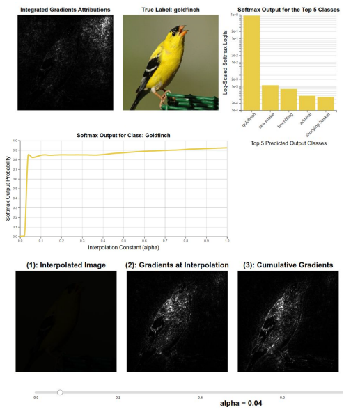

In the example above, it appears that the model above can already get a very good score with only a fraction of the image information. 

## Layer-wise Relevance Propagation (LRP)

Layer wise relevance propagation (LRP) starts with a forward pass to obtain the output  $f_c(x_{1:n})$, which is the top-level relevance.  

It then uses a special backward pass that, at each  layer, redistributes the incoming relevance among  the inputs of that layer.  Each type of layer has its own propagation rules.   E.g., different rules for feed-forward layers and LSTMs.  Relevance is redistributed until we arrive at the input.

For models with only ReLU and max pool nonlinearities, and ε=0, this is the same as Gradient * input.

## Attention 
Many models have attention mechanisms. These provide some sense of interpretability. If you visualize them, they show what  the model is "looking at" at one  particular layer.  

- Many papers were written on whether attention is explanation (or not) see [Transformers](Transformers.md)
- A major issue is that, when attention is applied  over hidden states, information from other time steps was already mixed in.  
- It's better to use saliency methods if you want  input importance scores as a model developer.

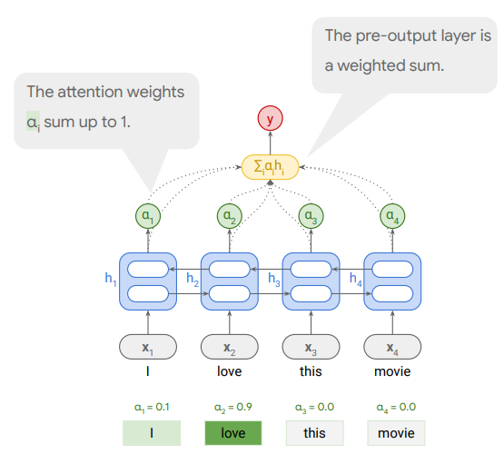

## Evaluation strategies:
- Use occlusion (or gradient) as the ground truth. 
- Use human annotations as the ground truth. 
- Train a model on a synthetic task for which a ground truth is available. 
- See if removing the most (least) important features results in a performance difference.
- Use a linguistic task and see if the explanation identifies the linguistically relevant words for predicting the linguistic feature.
- Concatenate an unrelated input text to each input text, and see if the explanation only indicates words in the original input text.
- Let humans simulate the model. 
- Train a student model with the explanations. 
- Retrain a model where the least important features are removed. 
- Inject special indicators in the data and see if the explanation picks up on those.

## Faithfull metrics 

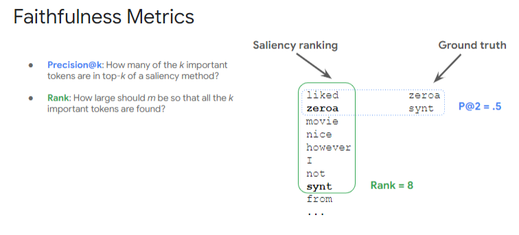

## Language interpretability tool (LIT)

The guest lecturer worked on a tool to interpret models better. 


# Towards effective explanations  
- Be careful about describing internal AI representations in human terms (concepts,  
rationalizations) as it communicates intentionality.  
- Be careful about attributing real causes to model reasoning.  
- Allow for interactive explanations to resolve contradictions.  
- Be clear on who the explainees are, what priors they may leverage.

# Transformers 

Transformers solve the problems with [Recurrent neural network (RNN)](Recurrent%20neural%20network%20(RNN).md) 

RNN seem to be useful in any application in [Natural Language](../Languages/Natural%20languages.md) Processing (NLP). However, they suffer from the [Vanishing gradient problem](Vanishing%20gradient%20problem.md).  

Transformers get rid of [recurrence](Recurrence.md) while still dropping the [Markov assumption](Markov%20assumption.md). This is done by introducing a **self attention layer**. This layer maps an input sequence $(x_{1}, x_{2}, ..., x_{n})$ to an output sequence ($y_1$, $y_2$, ... $y_n$). These sequences could be anything but this course focusses on sequences of [words](../Data/Words.md) which are [sentences](../Data/Sentences.md). These sequences can be any arbitrary length without compromises. How does the attention layer do this?

## Self attention layer
The self attention layer **compares** an element (word) to a collection of other elements (words) of the context (including the word itself).

### Example
So if you have the sentence. *He is biting the apple*. We then need [embeddings](../Semantic-Similarity/Embeddings.md) for each word like so:

| He      | is      | biting | the   | apple |
| ------- | ------- | ------ | ----- | ----- |
| $\mathbf{x}_{1}$ | $\mathbf{x}_{2}$ | $\mathbf{x}_3$  | $\mathbf{x}_4$ | $\mathbf{x}_5$ |

and lets say the target element is apple then $x_{5}$ is compared to $\mathbf{x}_{1},~\mathbf{x}_{2},~\mathbf{x}_{3},~\mathbf{x}_{4},~\mathbf{x}_{5}$. Each comparison is going to give a score which you call alpha. So the comparison give us $$a_{1.5},~a_{2.5},~a_{3},~a_{1},~a_{5.5}$$
So the first score of $a_{1.5}$ is expressed as $a_{1.5} = \text{score}(\mathbf{x}_{1}, \mathbf{x}_{5})$. **We want each score to tell how relevant the compared word is to predict the target word**. You can imagine apple being left out of the sentence, and we want to predict apple in that location. The scores tell us the relevance of each compared word to predict the target word. This is normally computed with the scaled dot product. Then to get an output of these comparison scores, you take the weighted sum of the (normalized) scores. This means taking all the alphas and multiplying with their representations (the $\mathbf{x}$-es) and then taking the sum. So that looks like this: $$y_{5} = \text{sum}(a_{1.5}\mathbf{x}_1,~a_{2.5}\mathbf{x}_{2},~a_{3}\mathbf{x}_{3},~a_{1}\mathbf{x}_{4},~a_{5.5}\mathbf{x}_{5})$$
The alphas are giving us weights which indicate how much we should consider each of the items in the sequence (in this case to predict the word at position 5). Or basically how much attention to give each item in the sequence. So $y$ is the weighted output. 

Then you compute the weighted output for all the target words to get $y_{1},~y_{2},~y_{3},~y_{4},~y_{5}$. 


### Self attention thermology
In the example above, each word can play 3 roles. These are given more specific names to which allows us to be more specific. 

So each item in the sequence can be:
- A **query** (q), when it is compared to other items in the sequence. 
- A **key** (k), when it is part of the sequence to compare with. 
	- So the scores are written as $a_{i,j} = \text{score}(\mathbf{k}_{i},\mathbf{q}_{j})$
- A **value** (v) when used to compute the output:
	- $y_{5} = sum(a_{1.5}\mathbf{v_1},~a_{2.5}\mathbf{v_{2}},~a_{3}\mathbf{v_{3}},~a_{1}\mathbf{v_{4}},~a_{5.5}\mathbf{v_{5}})$

In the example $x_{5}$ plays the query role.  $x_{1}$ , $x_{2}$ , $x_3$  , $x_4$  , $x_5$ all play the key role and  $x_{1}$ , $x_{2}$ , $x_3$  , $x_4$  , $x_5$ play the value role. 

As you can see, each word can play multiple roles. **The key to self attention is to learn separate weights for each role** This way get separate weights for each role. Then if you want to use an input as a certain role, you can just multiply the input with the correct weights. More concrete, each input $x_i$ is transformed into its role by multiplying the [embeddings](../Semantic-Similarity/Embeddings.md) with the corresponding weights. Like this:

- $q_{i}=W^Q\mathbf{x}_1$
- $k_{i}=W^K\mathbf{x}_1$
- $v_{i}=W^V\mathbf{x}_1$

These matrixes are obtained trough training. These matrixes give very fine-grained information about each item of the sequence (word in the sentence(s)). In practice, the representations of the words are different depending on the role the word is playing. 

So this means there are a lot of weights to learn. However, it is more efficient than recurrence as: 
- We get rid of the [Vanishing gradient problem](Vanishing%20gradient%20problem.md) 
- All the computations for each score are independent. This allows for large **parallelization**.

These matrixes are called the attention, I think. 

## Multi head attention 
You can vary the score function. Different ways of scoring might make more sense for different tasks depending on whether you focus on syntax, semantics, discourse. For all these tasks, you can compute different matrixes or attentions for each word when they play a certain role. You can even have attentions for when you want an attention for when both syntax and discourse are important. So each type of relation has its own weights, which is its own attention. With this, the model size increases, but it is not so bad because you can [learn](../Other/Learning.md) the weights in parallel. 

Each set of self-attention layers is called a *head*. So it is called multi head attention because you use multiple types of attention together, which is multiple heads.

## Losing word order
So for some reason using attention is good... but it is not clear how or why. 

Anyways getting rid of recurrence seems to solve the vanishing gradients' problem by training a matrix for each value in a sequence for different goals. Then if you want to do something with the value, you use the attention matrix to get an embedding which is good for that goal? 

However, by removing recurrence, you lose the positional information. The transformer architecture doesn't take the order into account anymore. So even though a transformer can deal with sequences of any length, which means it doesn't need the [Markov assumption](Markov%20assumption.md). What the model gets is more a bag of words than a sequence. This means that if you do the above example of "He is biting the ??" And instead do "Is he biting the ??" You would still get apple both times. The exact same output. So by dropping recurrence, word order information is lost. For this example it doesn't matter because apple is still right, but if you would give a random order of the sentence you would still get apple. This is a problem because the word order of most languages is quite predictable or quite constraint.

So you get position information back?  You just encode the position of the item in the sequence as a continues value that preserves order of the information. So basically you **add a feature to the input which encodes the position**. Often this is done with the sine or cosine functions. It is quite arbitrary how they encode the position feature.  

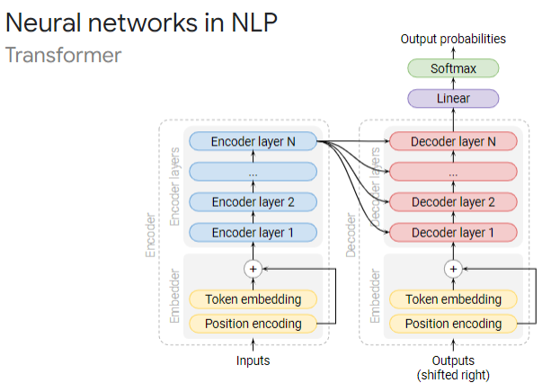

## Other explanation 
If you (like me) are still a bit confused about transformers then read [https://jalammar.github.io/illustrated-transformer/](https://jalammar.github.io/illustrated-transformer/) which has a good explanation with also more pictures. 

## Applications 
Using the architecture outlined above, the most powerfull NLP models in the world have been created. Some of the most popular ones are:
- BERT (Bidirectional Encoder Representations from Transformers) by Google
	- and variants like RoBERTam XLNet (bigger) and DistilBERT (smaller)
- GPT (Generative Pre-trained Transformer) by OpenAI (microsoft) 
	- GTP-1 to GTP-3 
	- These are the most popular in the world right now.


# Philosophical questions 
These models caused a transformer revolution because they perform so well. This sparks debates about what these models can and can't do, and how close they are to achieve human-like linguistic abilities and even general Artificial Intelligence. 

Open questions:
- How much do transformers really learn about natural language, or do they just do well because they are trained on a lot of data?
	- Do transformers learn the same syntactic relations defined in linguistics 
- Do Transformers emulate human linguistic abilities 
	- Do transformers process sentence in a similar way


## The paper
BERT especially has been studied a lot and this was covered in the lecture. The study of the BERT model is informally referred to as BERTOLOGY. This lecture consisted of the lecturer asking questions about the paper, which you were supposed to answer in groups. For instance, a question like this: 

Question 1: What is the advantage of the BERT model:
- More parallelable 
- No vanishing gradient problem. 

Marieke was kind enough to send me the questions and answers to these questions, and they can be found in the [Bert Lecture file](../Other/Bert%20Lecture.md) (Other/Bert Lecture.md)


# Contingency table 
A contingency table shows all the classifications that have been done with the real value. In a contingency table, you can see exactly how things were wrongly classified as what. 

# Example
Here is an example table in a result when classifying languages.

| Language | German | French | Dutch | Italian | English |
| -------- | ------ | ------ | ----- | ------- | ------- |
| German   | 4030.  | 1.     | 2.    | 4.      | 13.     | 
| French   | 3.     | 3385.  | 2.    | 11.     | 7.      |
| Dutch    | 20.    | 2.     | 1230. | 4.      | 24.     |
| Italian  | 0.     | 4.     | 2.    | 10682.  | 4.      |
| English  | 10.    | 20.    | 13.   | 43.     | 16559.  |

So what you can read from this table is that 4030 German words were classified as German 4030 times but also 3 French, 20 Dutch and 10 Italian words were classified as German. 

1 German word was also classified as French.
2 German words were also classified as Dutch.
4 German words were also classified as Italian.
13 German words were also classified as English. 

So that is how you read these tables. 

Here is example code to create the [evaluating classification models](Evaluating%20Classification%20models.md) scores.


```python
def perf_measure(y_actual, y_hat):
    TP = 0
    FP = 0
    TN = 0
    FN = 0

    for i in range(len(y_hat)): 
        if y_actual[i]==y_hat[i]==1:
           TP += 1
        if y_hat[i]==1 and y_actual[i]!=y_hat[i]:
           FP += 1
        if y_actual[i]==y_hat[i]==0:
           TN += 1
        if y_hat[i]==0 and y_actual[i]!=y_hat[i]:
           FN += 1

    return TP, FP, TN, FN

def precision(y_actual, y_hat):
	TP, FP, TN, FN = perf_measure(y_actual, y_hat)
    return TP / (TP + FP)


def recall(contingency_table, label):
	TP, FP, TN, FN = perf_measure(y_actual, y_hat)
    return TP / (TP + FN)

def F_measure(y_actual, y_hat, Beta=1):
    P = precision(y_actual, y_hat)
    R = recall(y_actual, y_hat)
    return ((Beta**2 + 1) * P*R) / (Beta**2 * P + R)
```

# Logistic Regression 

Logistic regression gives you the probability of a discrete outcome. You can know how sure the model is of predicting a certain class. 

In the case of computational linguistics, we classify our surface level items, let's say words, as discrete units. We can use logistic regression to uncover the probability of a word given some input instead of just [counting words](../Semantic-Similarity/Co-occurrence.md). 

The math for logistic regression looks like this: $$z = \mathbf{x} \cdot \mathbf{w} + b$$
- $\mathbf{x}$ is the feature representation of one input data point. For instance, a word as an [embedding](Embeddings.md) or a [connotations](Connotations.md) vector.
- $\mathbf{w}$ is a vector of weights assigned to each feature depending on the importance of each feature.
- $b$ is the bias term. This is an offset you start off with. The bias is a scaler you add to all the items of a weight vector. 
- $z$ is the result. The weighted sum of the evidence for a certain class. To get z you take the sum of the resulting vector you get by doing $\mathbf{x} \cdot \mathbf{w} + b$ to get a scaler. 

Logistic regression is a linear [classification](../Classification.md) method. It is also a **discriminative classifier**. This means it doesn't make use of likelihood terms but attempts to directly compute the [posterior](../Classification/Native%20baiyes/Bayes%20rule.md), i.e., $p(c|d)$ No knowledge of how to generate documents of a class is required. 

Logistic regression is also a **probabilistic classifier**. Rather than providing the best guess as the output, a probabilistic classifier gives the probability that the answer is a certain answer. This is great because it keeps options open and provides more information than just one answer as it could be interesting that the answer is 30 % to be class one and 28 % class 2 while the classes 3-100 are divided over the other 32%. Sometimes, however, there are too many classes to keep the probabilities for every class. In that case, you have to prune the lower probabilities. 

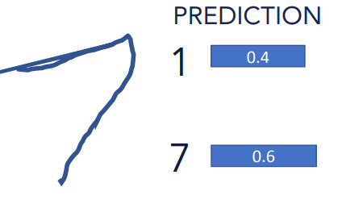

To get make a logistic regression, we need 4 components: 

## Feature representation 
A **feature representation**: a vector of numeric or symbolic features which encodes each input item. 

## Classification function 
A **classification function** computes the probability of the class given the input. This function you apply after you have calculated $z$. Remember, $z$ was the sum of the vector you get by multiplying the feature vector with the weights vector. This sum can be any value, and we want to bring it to a certain range because we want to interpret it as a probability. We are sort of [normalizing](../Data/Normalization.md) the outputs. A good choice is the sigmoid (σ) function: $$y = \sigma(z)=\frac{1}{1+e^{-z}}$$
After applying the classification function (in this case $\sigma$) we want to be able to interpret the output as probabilities. To this end, we need to make sure that the sum of all the outputs of $\sigma$ for every class is 1. For binary problems you can simply do you can do $p(y=1) = \sigma(z)$ and then for the other class you can do $p(y=0) = 1 - p(y=1)$. So you just say the probability of the second class is the probability that it is not the first class.  
Now the probabilities for all classes sum up to one, and we can interpret the output as the probability of a certain class given the input. That is what we want. As the probability of one answer being the correct one is 100%.

### Multi class problems 
For multi class problems like the one below, making the output probabilistic is harder. 

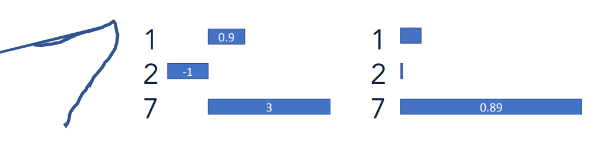

You make probabilistic by using the SoftMax function, with gives you the probability that your output is a certain class given the input. 

This works by estimating different weights and biases for every class rather than a single vector, and then you divide every single vector by the sum of all the vectors. When doing this the activation formula becomes like this:  $$p(y=c|\mathbf{x}) = \frac{e^{\mathbf{w}_{c} \cdot \mathbf{x} + b_c}}{\sum\limits^{K}_{k~=~1}e^{\mathbf{w}_{k}~\cdot~x+b_{k}}}$$
This might look daunting, but it becomes more clear if we call it the SoftMax function and replace with the part where you multiply in input vector with the weights vector + the bias with z. 


$$softmax(z_{i}) = \frac{e^{z_{i}}}{\sum\limits^{K}_{k~=~1}e^{z_{k}}} 1\leq i \geq K$$
The idea is to divide the classification function result of one class ($e^z$) by the sum of all the results, which is just calculating a probability. Doing this will always give you a result between 0 and 1. So you get this:

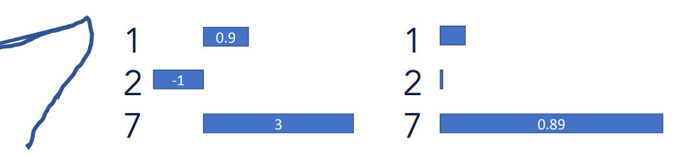

### Graphical representation
So above, you can see that you multiply the feature vector with the weights vector to get the resulting new vector. Then you take the sum of this vector, and you add the bias. Then you apply the **classification function** to bring the outputs to a certain range to be able to then turn the output of that into a probability.

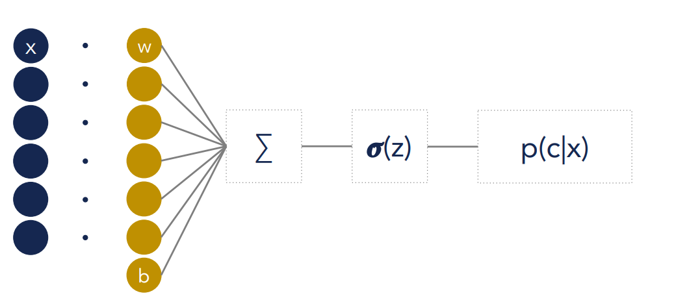

## Objective function
An **objective function** measures how close a model is getting to learning what it is supposed to [learn](../Other/Learning.md) i.e., the loss, error or cost, these are all the same. So you give this function what was predicted and the right answer, and the objective function will give a score which indicates how wrong the model is. You want to minimise this score. The higher the error score, the worse the model. The lower the error score, the better the model is at predicting the data (for which you know the answers).  

Multiple loss functions exist like Mean squared error (MSE) or cross entropy etc. For these functions to work, you need to know what a good result is or what the right answer is. 

For the problem of finding word embeddings, we will use cross entropy. 

### Cross entropy 
The cross entropy score is also known as **negative log likelihood**.  The cross entropy score is the lowest (no error) when the correct class has a 100\% prediction, or basically when $\sigma(z) = 1$ for the correct class. Then, if we want the loss of the whole data set, the idea is to calculate the average cross entropy for each item to obtain the loss for the whole dataset. You can interpret the resulting cross entropy number as the probability of predicting the reality given an input. 

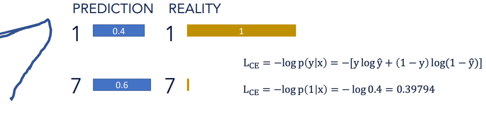

## Optimizer 
An *optimizer* updates the model based on the errors in the decisions it makes. Basically, based on the output of the objective function, it updates the weights. For instance, with gradient descent or an evolutionary approach. For example, you could use the derivative of the loss function to go move the weights into the direction which lowers the loss. 

-----

## Linear boundaries

A major downside of logistic regression that it can only make linear decision boundaries even though the problem could just be not linearly separable, for instance like the picture below: 

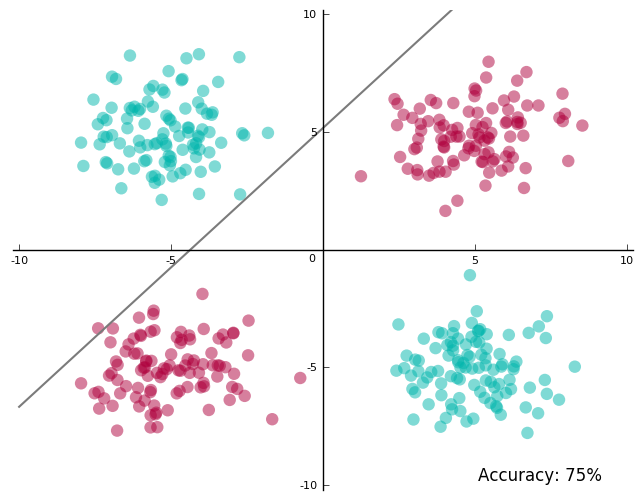

To overcome this problem, you have to turn to [feed forward neural networks (FFNN)](../Prediction/Feed%20forward%20neural%20networks%20(FFNN).md). Basically, connecting multiple logistic regression models together to create non-linearity. It is called feed forward because the output of a lower layer only affect higher layers and do not feed back into the same layer or lower layers. When you do have future layers affecting previous layers you have a [Recurrent neural network (RNN)](../Prediction/Recurrent%20neural%20network%20(RNN).md).


# Classification

Classification is when you get a data point that you have not seen before, and you have to assign it to a **class**. You do this based on some representation of the data point and evidence of how features relate to a class. 

## Types of classification relevant to CL
- Language identification 
- Author profiling 
- Spam filters 
- E-mail routing
- Topic detection
- Sentiment analysis → Is a text positive or negative 
- Fake news detection
- ...

## How do we do this (first attempt)?

### Rule systems 
A crude solution is rule based. This means a lot of if elif else rules. This gives you fine-grained control on classification outcomes, and we always know **why** something happened. 

Rule based is **robust** because you can make rules for even very rare cases which would otherwise be hard to train for. It is also a good way to add **intuitions** and **expert domain knowledge** into a system. You also don't need large datasets.

But language is too complex for this and changes too much to do it like this. It is probably **expensive** to write. You have to get the domain knowledge and if it is [ambiguous](../Languages/Ambiguity.md) then you have to write a lot of rules. 

## Supervised learning
The opposite of rule based systems is supervised [learning](../Other/Learning.md). Here the idea is that you have a large set of data points where you already know the correct classification, and you try to build a model that can predict the points you already have. The idea is that the model will learn the rules itself. The hope is then that the model will also do well on new data, this depends on bias and [overfitting](../Prediction/Overfitting.md). This is the most important. **We don't want to prove our self correct, we want to make a generalizable model**. This removes the need to write rules, but has many other problems.  

## Types of supervised learning classifiers 

### Discriminative Classifiers

Discriminative classifiers learn which features best predict a certain class. 

VS 

### Generative Classifiers

Generative classifiers learn a model of how the data are generated and could because of this also generate new data. Classification happens by choosing the class that most likely generated the data. It's like the reverse.

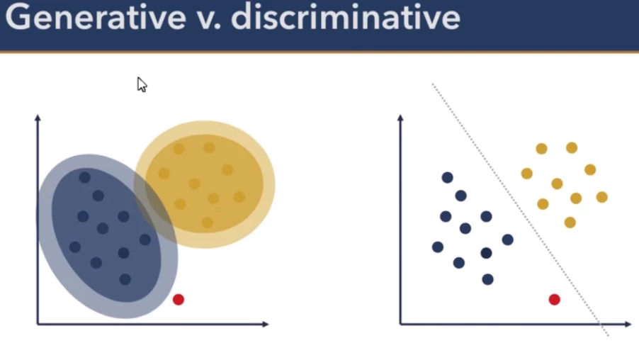

### Linear Classifiers

Linear classifiers can only draw a linear decision boundary. 

### Non-Linear classifiers
Non-Linear classifiers can draw a non-linear decision boundary. 

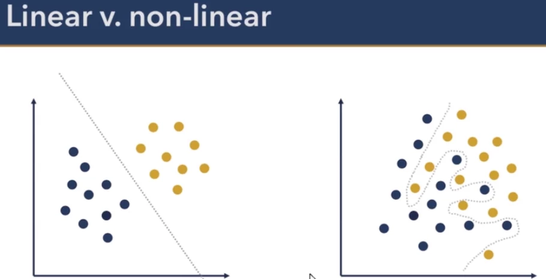


# Evaluating Classification Models
After you have made your [classification](../Classification.md) system, how do you evaluate it against other options?

## Intrinsic Evaluation
Define a metric and check which system does best.

## Extrinsic Evaluation
Embed a tool in a larger system and check how much performance on a downstream task improves given the output of two different versions of your tool. So you have the classifier, but you see how much the performance on something the classifier would be used for improves.  


## Example
Let's say spam detection.

- Intrinsic evaluation would be we have a bag of spam emails and normal emails. Then we could say the classifier was correct 95% of the times and incorrect 5% of the times.
- Extrinsic evaluation would be like we got 66% decrease in people that got scammed that used our tool. 

So extrinsic is not the tool itself you evaluate, but you see in how the tool helps to achieve a goal it was made for and if it helps at all. 

---

We would like a spam filter to be perfect, but this is not going to happen. Either you classify emails as spam when it's not spam, or you miss emails as spam when it is spam. You have to choose which one is worse for your application. 

# Intrinsic evaluation methods

Whenever you get results from your model, you get:

- True positives (TP): Correctly classified that it was this class.
- True negatives (TN): Correctly classified that it was not this class.
- False positives (FP): Incorrectly classified that it was this class.
- False negatives (FN): Incorrectly classified that it was not this class.

From these, we can come up with intrinsic evaluations.

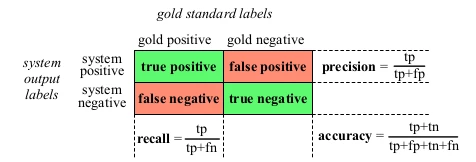

## Accuracy 

Accuracy is the number of correctly classified points. Simple.

## Precision 
The first one is precision. The idea of this is that you divide the true positives by all the data points that were classified as this class. So this means:
$$Precision = \frac{TP}{TP+FP}$$

This can be seen as a percentage of all points that were classed as this class that was correct. So precision really punishes false positives. It doesn't matter if you missed some true positives, as long as you don't have a lot of false positives. 

To use this measure you need to classify at least one true positive otherwise you try to divide 0 and then the score is 0. 

## Recall

Recall is the proportion of correctly classified data points out of the data points which belonged to that class. 

$$Recall = \frac{TP}{TP+FN}$$

You can see recall of the number of correctly classified spam emails out of the emails that should have been classified as spam. You don't care about the mistakes, but you care about that you catch everything you have to catch. 

With recall, it doesn't matter how often you wrongly guessed, as long as you got all data points which belonged to the class (the true positives). So this punishes false negatives. I think false negatives are the worst. 

There is another [explanation by google here](https://developers.google.com/machine-learning/crash-course/classification/precision-and-recall) about recall and precision. 

## F-Measure

F-Measure combines precision and recall into a new, shiny formula. F-Measure is described as the harmonic mean between precision and recall. The harmonic mean is more conservative than the arithmetic mean. 

This is the formula:

$$F~Measure = \frac{(β^{2} + 1) \cdot Precision \cdot Recall}{β^{2}  \cdot Precision + Recall}$$

The idea of the β is a weight that you can use to make either precision or recall more important. If you do β > 1 you make recall more important and β < 1 than you make precision more important.

Typically, you don't make one more significant than the other, and you just set $β = 1$. When you don't, you call the F-Measure score the **F1 score**. Setting β is mostly based on domain knowledge. If you don't have it, then just set it to 1.


### Code 

Here is code to get the scores in python.

```python
def precision(contingency_table, label):
    index = labels2ids[label]
    result = contingency_table.T[index]
    
    tp = result[index]
    
    mask = np.ones(len(result), bool)
    mask[index] = False
    
    fp = sum(result[mask])
    
    return tp / (tp + fp)


def recall(contingency_table, label):
    ct = contingency_table
    index = labels2ids[label]
    
    result = ct.T[index]
    
    tp = result[index]
    
    fn = sum(map(lambda x : x[[len(ct)]](ct|True if i == index else False for i in range(len(ct|[len(ct|[len(ct|[len(ct)](ct))])])), ct.T))
    
    return tp / (tp + fn)
    


def F_measure(contingency_table, label, Beta=1):
    P = precision(contingency_table, label)
    R = recall(contingency_table, label)
    return ((Beta**2 + 1) * P*R) / (Beta**2 * P + R)
```


### Macro averaging
When there are more than two classes, we compute the F-measure for all classes separately and then average them, assigning equal importance. **This is useful when good performance is necessary in all the classes**, regardless of the frequency in which they appear. Because if you do it like this, one class that has bad performance will decrease the averaged F1 score a lot. 

### Micro averaging
With micro averaging you collect all the decisions for all the classes in a single [Contingency table](Contingency%20table.md) and then compute precision and recall from that table. This is useful when good performance is more important for the most frequent classes. 

## Statistical test
You can often not use statistical test like t-test because often classification samples are not normally distributed. 

## Bootstrapping

Bootstrapping is when you artificially increase the number of test sets by drawing a lot of samples from a given test set with replacement (use multiple times), perform your task, record the score, factor the performance of the whole test set, then simply check the percentage of runs in which a system beats the other. This is not super important. 

So you pick samples of data points of the entire test set and then run multiple times. You can then see if one system is more better than the other on many samples. 


# Dependency parsing
With dependency parsing, you examine the dependencies between the phrases of a sentence in order to determine its grammatical structure. You parse an input sequence by staring at the root of the input, and then you jump from token to token based on grammatical binary relationships (dependencies). 

If you have jumped to every part of the sentence, then you have parsed the sentence. The [parse tree](Parse%20Tree.md) is the sentence you get a **directed graph. 

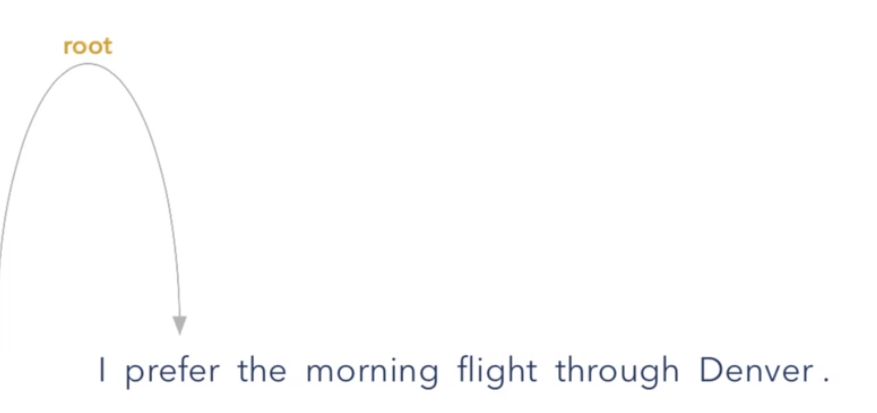

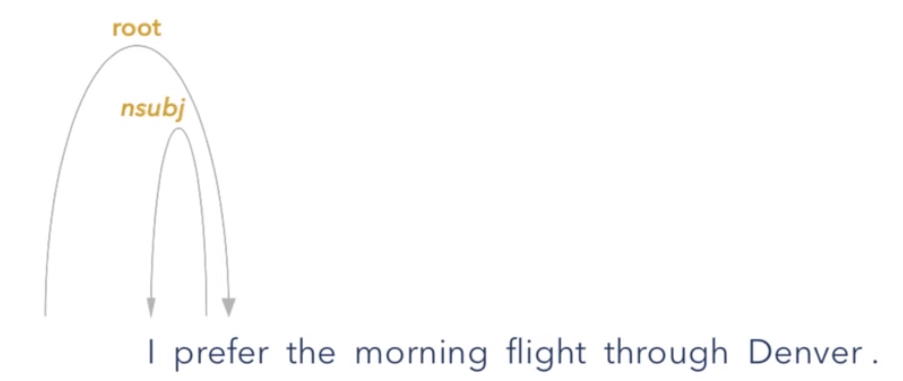

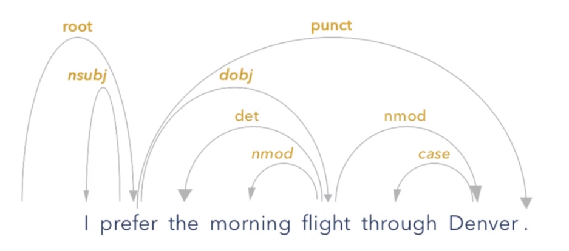

The description of images above: You start with the root, which then goes into the main verb of the sentence. Then you go to the subject of that verb. Then you get the argument of the verb. Then you get modifiers of the argument. For instance morning. 

So there is no hierarchy, you just describe the sentence based on the relationships which exists between the tokens. It is mostly based on structure and not on meaning, but you can also base on meaning. 

## What is this for
Dependency parsing explicitly and directly encode information about relationships across  tokens which are often quite buried and hard to see in constituent based trees like a context free grammar.

**Dependency parsing also deals very well with morphological complex languages with free word order** (which is not like English) without needing to have super specific grammar. For instance, an affix could mark the subject. For these types of languages, [chunking](Chunking.md) or [constituency](Constituency.md) based parsing works worse. So it's like a set of words connected together by grammar binary relationships. 

The main content words in the sentence are called heads, and the relations are based on the heads. 

## Types of relations 

### Clauses 
Syntactic roles like subject, object. Like the verb 

### Modifier
There are modifiers of heads like blue sky where blue is a modifier of the head sky.  

## Data structure 
After you have analysed a sentence, you can store it as a graph. You can store a graph as a set of tuples with two items. $\{(a,b), (b,c), (c,d)\}$. So in this sentence there would be an arc from $a$ to $b$, $b$ to $c$ and $c$ to $d$. 

We call this here $G$ with $G = (V,A)$ where $V$ is a set of vertices (tokens in the vocabulary or stems and affixes) so like the sentence or what you can connect. $A$ is a labelled ordered pais of vertices (the arcs). This includes the type of the binary relationship as well.   

$V$ is what you can connect and $A$ is how it is connected.

## Dependency tree

A dependency tree is a **directed graph** where 

- There is one root node with no incoming arc.
- Every other vertex has exactly one incoming arc. 
- There is only one path from the root to each vertex in V. 

These conditions are necessary to have the dependency tree in the way we care about.

## How to get these models?
Using special [treebanks](../Data/Treebank.md). Dependency treebanks. Linguists have created [corpora](../Data/Corpus.md) with annotated typed binary directed decency relations that are used to train dependency parsers. 

If you don't have a dependency treebank, you can also use deterministic approaches with a constituent based treebank, but this does not work very well. A trained linguist can do better. 

## Evaluation

### Label score
This checks if it went to the correct label. So it's ok if you come from the good head as long as where the relationship goes is the correct label. 

### Unlabelled score
This does not check if it went to the correct label. So it's ok if you come from the correct head as long as where the relationship goes is the correct head. 

### Label detached score

This combines the labelled and unlabelled scores. 

This scores how many estimated dependencies have the same head and dependent as the gold standard, and also the correct type. 

# Probabilistic Context Free Grammar 

A Probabilistic Context Free Grammar is a [Context free grammar](Context%20free%20grammars.md) which also has probabilities assigned to every production rule, which indicates how likely the right-hand side (RHS) of the rule is transformed into the left-hand side (LHS).  So each rule looks like this:

$$X \rightarrow YZ[p(YZ|X)]$$ or another example:
$$X \rightarrow y[p(y|X)]$$
So you can see the second part (p(y|X)) means the chance of y given X. Or the chance of YZ given X. 


## Getting the probability of a parse tree
With a PCFG, it is possible to calculate the probability of a whole [parse tree](Parse%20Tree.md). So how is this done? With this formula: $$P(T, s) = \prod^{|T|}_{i=1}{p(RHS_i|LHS_i)}$$
> T = the parse tree 
> s = a sentence 
> p(T,s) = the joint probability of the parse and the sentence
> $\prod$ = multiply together just like $\sum\limits$

The left-hand side is asking what is the probability of this parse tree on this sentence?

Then you just multiply the probability of each rule to expand the non-terminals in the parse tree T. Here, we make the assumption that one grammar rule appearing is independent of another grammar rule appearing. This allows us to multiply the probabilities of the grammar rules together. So you basically go through the parse tree and at every step you multiply the probabilities of all the production rules you used to parse the sentence.

With an [ambiguous](Ambiguity.md) sentence, there will be more than one [Parse Tree](Parse%20Tree.md) possible. So in that case you just use the above formula to calculate the probability of each possible parse tree, and you pick the one with the highest probability. This is the maximum probability tree is then called $\hat{T}$. 


Doing the multiply for every parse tree is captured in the |T| above the $\prod$ here you basically say for all possible parse trees that we can derive from this sentence multiply this.  


We call the parse trees of a sentence the parse trees which **yield** s.

----

Calculating the probability this way actually gives you two things. It gives you the probability of the parse tree occurring on this sentence: $p(T,s)$ but it also gives you the probability of the parse tree in general in this PCFG. So why is this?

Basically what we did above is this: $$P(T,s) = p(s|T_{i})p(T_{i})$$
This is just [Bayes rule](../Classification/Native%20baiyes/Bayes%20rule.md). But in this specific case of parse threes we can actually reduce this to $$p(T_{i},s) = p(T_i)$$ because $p(s|T_i)$ is always 1 because we only consider parse trees which can actually parse the sentence. So the probability of the parse tree given the sentence is always 100%. Because of this, we can say that we can also get the probability of the parse tree in general. Now this allows us to go backwards with this because an equality goes both ways. We can now say that to get the probability of a parse tree and sentence together, we only have to calculate the probability of the parse tree. 

So once you have seen a parse tree before for another sentence, you know the probability of it already.

We can use this with a dynamic programming solution to get all the possible parse trees. 

So basically we can just multiply production rules. 

---- 

In peoples heads it seems to work similar, that they build up parse trees out of constituents of the grammer based on probabilities. When a parse tree then is weird like. The cabin behind the horse race fell. Apparently, fell is not expected there. This confuses humans and requires more processing power. AI which generates language should keep this cost in mind. 


## How to make PCFG?
To do this you need to traverse a parse tree which requires tree banks. 

You can also use have probabilistic [CKY](CKY.md). The changes are that you represent a sentence using a tensor t of the shape n+1 x n+1 x V where n is the length of the sentence and V is the size of the non-terminals. Each cell t[i,j,A] contains the probability of type A to span positions from i to j. So the idea is to add another dimension. There is also this rule change:

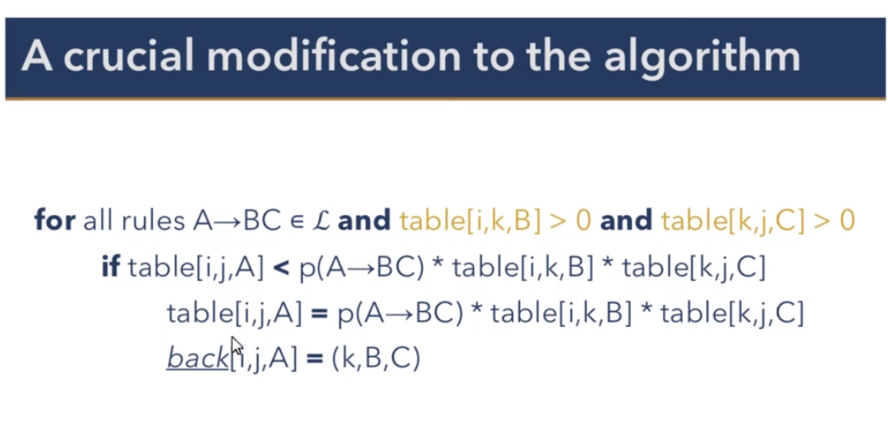

So whenever you update table[i,j,A] because you found a parse from i to j with a higher probability you need to record where you were and were coming from in back[i,j,A] so that if and when you find the state  S in the final cell, you can recompute the best parse by going through the best sub parses. 

## Deriving the probabilities 
You derive the probabilities for the productions by using [treebanks](../Data/Treebank.md). The idea is to count how many times each expansion of a non-terminal occurs and normalize by the occurrence of the non-terminals. So you basically count how often a certain non-terminal goes to non-terminal and terminal out of all the options and divide by all the options. Just like the counting [N-grams](N-grams.md) but now with by looking at each LHS going to which RHS.

## Problems of PCFGs 
Two assumptions have to be made.

- **Independence** of productions occurring. 
	- Of course, it is not independent. But this kind of shortcoming of the whole context free grammar and trying to use it for natural languages as the grammar of a natural language is not context free. So independent assumption is caused by the context freedom assumption.  
	- This is needed to be able to calculate easily. 
- (P)CFG **don't know about lexical items,** which results into poor solutions to structural ambiguities. Humans seem to have no problems with this, and this often solves ambiguity. So it ignores rules which are based on specific lexical items and rules. But of course, the meaning has large effects on the probabilities. 
	- For instance The guy looked at the girl with the telescope AND the guy waved at the man with the telescope. Because of the meaning it is clear to humans what is what but the computer won't know because it doesn't know about the meaning. It will always prefer one of them. So either the guy is holding the telescope or the girl. The model will always choose the same and sometimes will be wrong. 


### To try to solve the independence: 

Another problem with the current setup of PCFG is that we never change the probability of a production. This means that if you always take the highest probability that you will also be garandeert to be wrong in the other cases. At least you will be right most of the cases. 

One solution to this is making more productions which are more finely tuned for different types of grammar productions. So you have one where the object is at the start and one where the verb is at the start, for instance. This gives you separate distributions. However, this requires very fine-tuned annotations which don't really exist.  

However, you can do **parent annotations** where you annotate text by the parent terminal it came from.  You can also do this for lexical categories, which I think makes it more clear. So you can look how often cat was RHS of Noun and how often it was RHS of verb. Then you can assign different productions to each of those, so you have cat_verb and cat_noun. However, this leads to overfitting because if you split too much the results are not generalizable, so you have to pick the right granularity for splits of non-terminals and pre terminals or use algorithms that do this for you like split and merge but it's not covered.

### To try to solve the no lexical:
You can also try to make productions which also involve the lexical annotations. But this becomes infeasible fast, and you overfit fast. 

In order to deal with sentences and complex grammar, we have to make an assumption to be able to compute it, but this also means we won't get a perfect model because we made the assumptions. 

If you want to take into account lexical information, you have to look into assigning vectors to words to encode their meaning. This is called [Vector semantics](../Semantic-Similarity/Vector%20semantics.md). 

# Parts-of-Speech (PoS)

PoS are clusters of words which have a similar behaviour in a language. For instance, they have a similar context of occurring, or they can be combined with the same set of morphological affixes. PoS tags are also called lexical clusters. 

You should think of examples as: Nouns, Verbs, Adjectives, Pronouns etc. These parts of speech again contain smaller parts which are even more consistent with themselves. For instance, past verbs, present verbs or irregular verbs etc. Different languages have different PoS tags. The closer a language, the more close the PoS. 

## Open Class words
One very famous PoS is the open class of words. This includes nouns, verbs, adjectives, adverbs. This class is called **productive** because it changes often. New words are added to this class all the time. Other words disappear or go undercover. Typically, open class words are content words. This means the words that convey the contents of a message. Most languages have all 4 major open classes.

## Closed Class Words
This class is words is closed. It includes conjunctions, determiners, pronouns, prepositionsm, etc. This class is **not productive**. It barley changes and is basically fixed. The words in this class can be contained in a single courses. 

## Special corpora 
There are special corpora with information about the PoS of every word in it. Examples are:
- Brown Corpus – 1 million words, balanced
- WSJ – 1 million words, news articles 
- Switchboard – 2 million words, transcribed phone conversations.

Often these annotations are hand corrected versions of an automated system which assigned PoS to words. Doing this is called PoS tagging. 

# PoS Tagging
The process of **automatically** assigning PoS tags to words in a corpus. This process takes a tokenized corpus as input and outputs a sequence of PoS tags for each input token. 

First of all why not just have a list of words and their PoS tags? We could even use dictionaries for this. We can't do this because of [ambiguity](Ambiguity.md). PoS tagging aims to resolve this ambiguity.  

PoS tagging is useful for [parsing](Parsing.md), named entity recognition and co-reference resolution and more!

## Baseline
Most of the [types](../Data/Type.md) in a corpus are nouns. The baseline is to assume everything is a noun. This will get you an accuracy of around 60% on types, but much lower on tokens.  

## Most frequent 
We can already do better by looking at the most frequent examples of tags. Cat can be a verb, but it is almost always a noun. If you hit an ambiguous word, then you just assign the most frequent PoS tag (which is noun). However, if you do this you are bound to make mistakes because you are ignoring the lower frequency explicitly. 

## Context
Can we do better? We can look at words that come before to predict a PoS just like with [Language Modeling](../Prediction/Language%20Modeling.md). You can also look at words that come after (preceding words).

# Parse Tree

A parse tree is a proof that you can parse a sentence of a language under a certain [grammar](Grammar.md). If the sequence is properly formed according to the productions of a certain grammar, then you can create the parse tree to show how you can [parse](Parsing.md) it. Parse trees are basically the proof of a parse while also being a useful data structure. Parse trees are useful because one you have them, computers can iterate over them while being able to make assumptions the grammar gives them. 

You make a parse tree by using the [grammar](Grammar.md) rules to make a path from the input sequence to non-terminals to terminals. Then you can then visualize these paths with a parse tree.

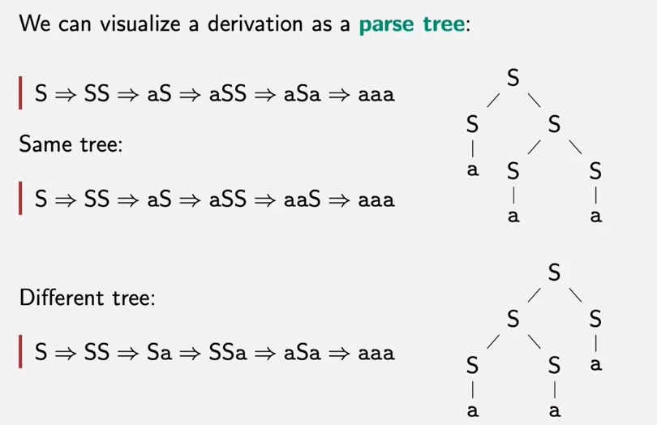

When multiple parse trees exist under a grammar for the same input, you have a grammar with [ambiguity](Ambiguity.md). One way to resolve this ambiguity is by using a [Probabilistic Context Free Grammar](Probabilistic%20Context%20Free%20Grammar.md).

# Grammars 
A grammar is a language for defining [languages](../Languages.md).  If you write rules for a language, then these rules are also called the grammar. The individual rules you write are called a production. Grammars define the structure of the [sentences](../Data/Sentences.md) in the language.

A grammar consists of multiple productions. Productions can be seen as rewrite rules. If the left side matches, you can replace it with the other side. Also, if you already have something that is part of the language, you can make more things in the language.

Formally you have:
- N - A finite set of non-terminals (states)
- $\sum\limits$ - A finite set of terminals, disjoint from N 
- P - A finite set of production rules 
- $S \in N$ A distinguished start non-terminal state from N. 

The symbol from the [alphabets](Alphabet.md) are also called **terminals**. $\epsilon$ is also a terminal. Remember, epsilon is the empty input.

The grammar makes use of auxiliary symbol which is called **non-terminals**. These are not part of the alphabet and hence cannot be part of the final word/sentence. The non-terminals are supposed to be replaced with terminals when you're parsing. This is called a rewrite rule. Non-terminals can be of two types. 

- Pre-terminals like PrN and V are [Parts of Speech](Parts%20of%20Speech.md). Or atomic non-terminals. The production rules indicate which sequences they can generate.
- [Constituents](Constituency.md) (NP and VP) are abstract units which absolve complex syntactic functions. 

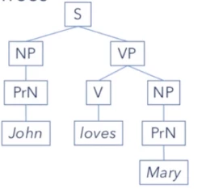


The grammar rules are kind of defined like inductive rules.

The idea is that you replace the non-terminals with a parse tree or an abstract syntax tree. This abstract syntax you can then evaluate. 


The start state is nice because if you can get from an input to the start state by following the rewrite rules, then you know your input is in the language. The start state represents to most abstract place in your language. 

We usually read the rules left to right, butt you can always go back if you want. 

## Writing down the rules
There are different ways to write down the rules. There are also different formats. Once such format is the [Chomsky Normal Form](Chomsky%20Normal%20Form.md).

Also remember that the rules in a grammar for a language HAS to be finite. Otherwise, you would also have to consider another rule. 

You can use non-terminals on both sides. This allows for good abstraction. This is done using [Constituency](Constituency.md).


## Examples

If you have this grammar:

- A → aAa
- A → bAb
- A → $\epsilon$

Then this word is in the language: abaaba. Because you can parse it like this:
1. abaaba
2. abAba
3. aAa
4. A

Usually the non-terminals are capitalized. 

## Examples

## Palindrome example

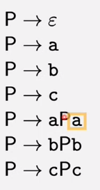

The idea is that it sort of does not matter what P is here. 

When still talking about palindrome. 

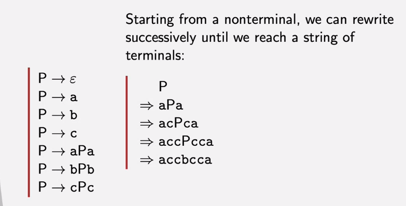

S is a start. 

So you can define a grammar like this:

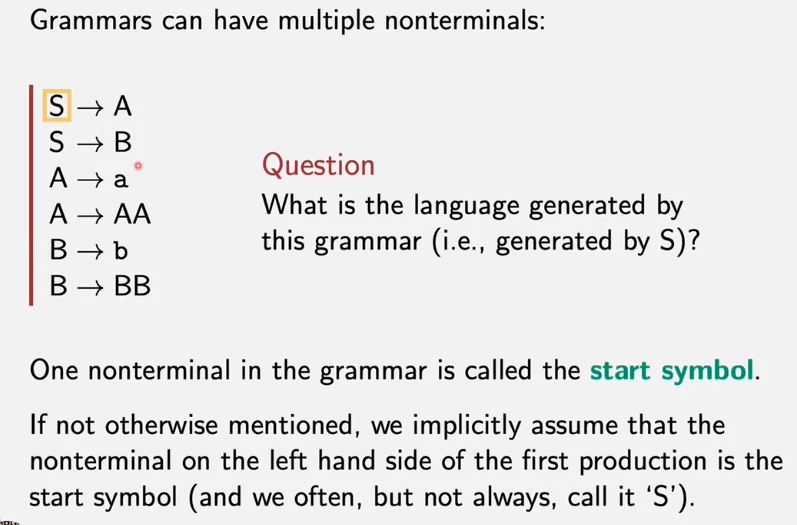

This is an example of a grammar which only allows strings of a and b.

This is a special grammar where there is only non-terminal on the left. This is a **Context Free** grammar. If there are multiple non-terminal characters than you have a context-sensitive grammar.

In this course we are only looking at context free languages. There are a lot of languages that we can't describe with this. There are also languages that you could never describe with a grammar. There are sadly more languages that you can't describe with grammar. Most programming languages are context free. 

You can also have more grammars for the same language. 


This makes sense because the CPU also looked very different for everyone. 

## More examples with digit

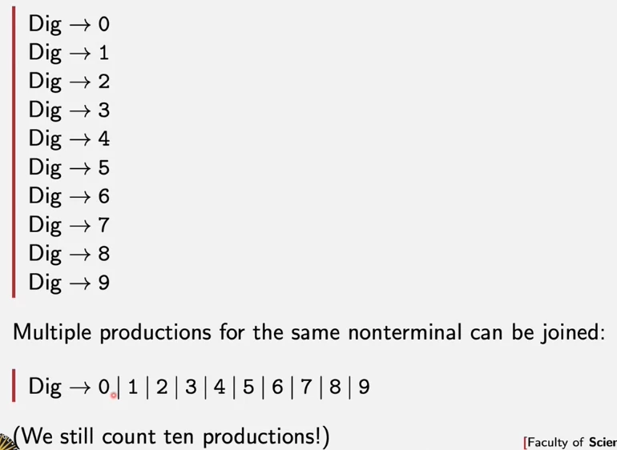

Here there is one non-terminal Dig that can be rewritten to each digit. 

We can also now define Digs which is at least two digits. With this we can define any sequence of numbers. 

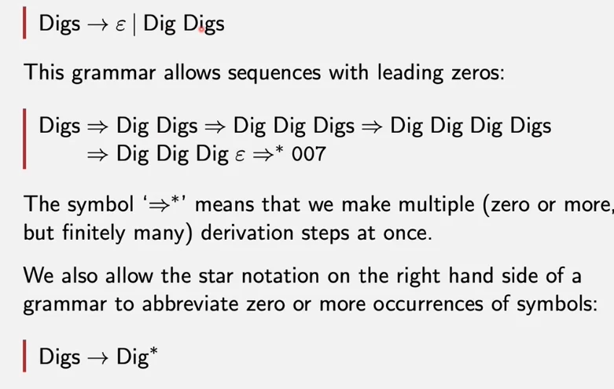

So we can do Digs → Dig* to say Digs is 0 or more Dig

What about numbers that don't start with 0?

We can make Dig-0 → 1 | 2 | 3 | 4 | 5 | 6 | 7 | 8 | 9
Then with that we can define a sequence of natural numbers like:
Nat → 0 | Dig-0 | Digs

Then we can define integers by defining a sign:
Sign → +|-
Int → Sign Nat | Nat 

This means an Int is a natural number with an optional sign. There is a shorthand for this like:

Int -> Sign ? Nat 

This means the sign can be there but does not have to be. 

## Letters
Letters are a lot like digits, but we just have more things. 

SLetter → a|b|....|z
CLetter → A|B|...|Z

This also means that you before you write down the grammar you have to specify what you can use as non terminal. 

Letter → SLetter | CLetter

Now we can set up something like an identifier. Like a var name. 

Identifier -> Letter | AphaNum* 
AlphaNum -> Letter | Dig

You can easily extend this with _ or other things you want to be in identifiers. Honestly I really like this so far!

The reason we do a letter first is that this way the compiler does not get confused that something is actually a number like a Nat. 

# Fragment of C #

With this we can actually define programming languages grammar to.

Var -> Identifier
Op -> Sign 
Stat -> Var = Expr; 
	| if (Expr) Stat else Stat
	| While (Expr) Stat
Expr -> Integer
	| Var
	| Expr Op Expr


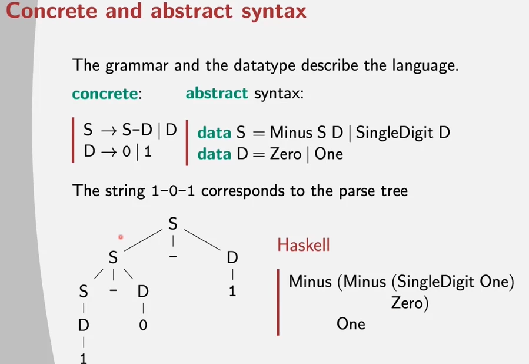

# Ambiguity 
When something is ambiguous, it means that it can mean multiple things. Additionally, it is also not really clear what the correct meaning should be.

Often humans can deal with things like ambiguous sentences by looking at the context of the sentence or the speaker's face expression and body language but dealing with ambiguity is really hard for computers. Rule based systems can not deal well with ambiguity.  

When something is unambiguous, the meaning is clear and can only mean one thing.

## Structural ambiguity

Structural ambiguity is a kind of ambiguities which occurs when a phrase, clause or sentence can be given two or more different interpretations as a result of the arrangement of words (the structure).

### Example 

An example of structural ambiguity can be seen in this sentence: `I shot an elephant in my pajamas`  

Were you in your pyjamas when you shot the elephant, or did you shoot the elephant into your pyjamas? This ambiguity can only be solved by looking at the meaning. But that is hard for computers, and so you can also try to solve it by looking at what types of **structures** appear more often in a language. Typically the propositional phrase (the in my pyjamas part) modifies the subject. So if you know that bias, then you can try to solve structural ambiguity using a language models based on structures. 

## Coordination Ambiguity
An example of this is `Tasty sandwiches and flowers make my grandma happy`. Do we mean tasty sandwiches and tasty flowers? Or only tasty sandwiches. Both are valid. But we probably don't eat flowers, so just tasty sandwiches. This can be resolved with [Lesk similarity](../Data/Thesaurus.md) or by trying to [represent words as vectors](../Semantic-Similarity/Vector%20semantics.md).

# Resolution
We can show that there is ambiguity with the [CKY](CKY.md) algorithm. However, when we know that a sentence is ambiguous, how do we pick one? We can look at the structure to assign probabilities to different options and pick the one with the highest one. One step deeper, we can assign a probability to every production rule in the [Grammar](Grammar.md).  Then with that you can assign a probability to every possible right-hand side of a production rule [given](../Classification/Native%20baiyes/Bayes%20rule.md) the left-hand side. This allows you to calculate the likelihood of a parse tree given the grammar.  

When we assign probabilities to rules in a [context free grammar](Context%20free%20grammars.md), it becomes a [probabilistic context free grammar](Probabilistic%20Context%20Free%20Grammar.md) (PCFG). So a PCFG is a CFG whose rules are augmented with probabilities. 


# Natural languages 

Natural languages are [languages](Languages.md) that are:

- Conventional 
- A set of related systems
- There is redundancy 
- Subjected to change over time
- Context dependent. 
- [Ambiguous](Ambiguity.md)
- Follow a [Zipfian Distribution](Zipfian%20Distribution.md) with their [words](../Data/Words.md).

Natural languages aren't:
- Formal logic
- A Programming language
- A Machine language 
- Mostly static
- [unambiguous](Ambiguity.md)

## Examples 

Examples of natural languages are: English – Dutch – Spanish - Japanese – Chinese – German – Spanish etc.


# Synonyms 

Synonyms are 2 or more [Words](../Data/Words.md) which mean the same thing, or at least mean something very similar. For instance, scream and screech mean about the same thing but are different words. 

More specifically, you can say that two [word forms](../data/lemma.md) a synonym when they share (almost) the same [word sense](../data/lemma.md). 


>**Formal definition of the book page 104**
>More formally, two words are synonymous if they are substitutable for one another in any sentence without changing the truth conditions of the sentence, the situations in which the sentence would be true. We often say in this case that the two words have the same propositional meaning.

> **Definition in the lecture**
> Synonyms are words which can be substituted with each other in some context. Hence, two words are more similar when the overlap of their contexts is large. 

Often the meaning is not exactly the same.  You can use [this website](https://www.thesaurus.com/browse/scream) to find synonyms. Words can also be similar in other ways, see [word similarity](../Semantic-Similarity/Word%20similarity.md).

## Principle of contrast
If you take *water* and $H_2O$ they mean exactly the same thing. However, if you are on a hike you would say water and in scientific contexts you say $H_2O$. This difference is part of the meaning of the word. 


# Parsing

Parsing is proving that a sequence is in the [language](Languages.md) set. 

Parsing can be described by a problem statement:

Given a grammar G and a string s. Does s belong to L(G). Or $s \in L(G)$$

L is a function that returns the [languages](Languages.md) set from a [grammar](Grammar.md). Many problems can be reduced to parsing problems. 

> 	Having a parser for a language is extremely useful. For instance, if you load a .json file into Python and turn it into a dictionary, this is actually parsing happening. The JSON parser verifies (create a proof with a parse tree) that the content of the file you opened belonged to the JSON language. If this is the case Python can use the resulting parse tree to construct the dict. 
> 	
> 	Standard protocols like https, json or toml or pdf are often just standardized languages which means everyone can use the same parsers.  
> 	
> 	Compiling programming languages are also just parsing problems with a code generation step at the end using the parse tree. This is why programming language input has to be 100% correct. If the computer can't parse your code, no parse tree, and then nothing can happen. 
 
If the parser thinks this is the case, we also want a proof or evidence that this is the case. This usually takes the form of a [parse tree](Parse%20Tree.md). So this is a tree to go from the grammar to s! But it can also make a [Dependency graph](Dependency%20Parsing.md).

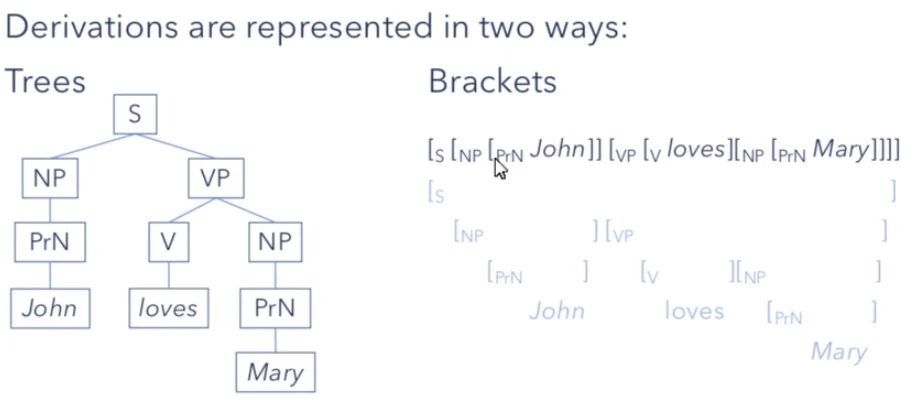

You can also represent parse trees with brackets. But this is only done because of language limitations. 

Of course, a *no parse* answer is also always possible. It is also possible to prove that a sequence does not belong to a language set, but this is harder. One way to do it is with pumping lemmas. 

An example of a succesvol parsing is like defining [regular expression](Regular%20expression.md) that finds something. If they find something, then you have a valid parse and your sequence belongs to the language. If they don't then you don't have a valid parse and your sequence does not belong to the language set under the given grammar. 

# Approaches to parsing

The [CKY](CKY.md) algorithm is a way to parse [Context free grammars](Context%20free%20grammars.md). More approaches are below:  

## Parser generator

You give this a grammar, and it generates a parser for your grammar.

- External program
- Based on a bottom up algorithm, usually LL or LR
- Can be complex theory
- Limited look ahead, usually one token
- Only build in abstractions (from the program you use)
- Generated parsers are extremely fast!
- An example is [Regular expressions](Regular%20expression.md) you define the grammar and the parser program ([finite state machine](finite%20state%20automata.md)) is generated. 

## Parser Combinators 
- Library
- Based on top down algorithm
- Underlying theory is simple
- In principle unlimited look-ahead
- User definable abstractions
- Fast as long as certain constructions are not used (like a lot of look ahead)

A combinator is a self-contained function in lambda calculus. The formal system that is the basis of Haskell and other functional programming languages. So parser combinators are a set of small (library) functions that can be used to construct parsers for parts of the language. The idea is that in context free languages, the context can't change the parse of the string. This allows you to write parser combinators for small problems, which can then be combined to parse bigger problems, basically writing the [Constituents](Constituency.md) as parser functions and building until you have covered the entire grammar. This results in one function which can parse the entire grammar, starting at the most abstract. 

Both approaches place certain but different restrictions on the grammar that you can use.

## Handrolling your own parser
-   You can also do whatever you want with while and for loops, but this can get quite hard and messy quick.


## Complexity 

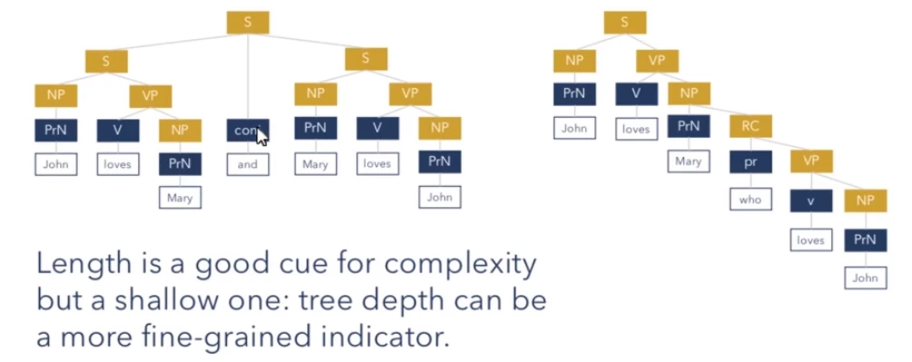

If a parse tree is deep or long, then the sentence tends to be more complex. 


# Chomsky Normal Form

A [Grammar](Grammar.md) is in **Chomsky Normal Form** if each production rule has one of the following forms:

-   S → BC
-   B → x

Here A B and C are non-terminals. 

- x is a terminal. 
- S is the start symbol of the grammar.
  
Any non-terminal which is not the start state can not be empty. So **B and C cannot be S**. If it's not the start state, it's not empty.

So what is important is that each non-terminal can only be rewritten to a rule with ends in only one terminal. So you can have Ab, but not Abb. 

These are the bullet points from the slide. A grammar is in CNF if:
- There are no rules generating the empty string
- Rules have either terminals or sequence of two non-terminals as the right-hand side.

You can rewrite any [Context free grammars](Context%20free%20grammars.md) to Chomsky normal form. This means you can also rewrite any [regular grammar](Regular%20Languages.md) to Chomsky normal form.


## Types of grammars 
The Chomsky hierarchy species types of languages. 

- Type 0: unrestricted grammars, recursively enumerable languages. 
	-	Require a Turing machine for acceptance (successful parsing)
	-	As expressive as any other computational formalism 
-	Type 1: Context sensitive grammars and languages 
-	Type 2: [context free grammars](Context%20free%20grammars.md) and languages 
	-	Parsed using a push down automata in polynomial time
-	Type 3: [Regular grammars and languages](Regular%20Languages.md) 
	-	Recognized by a finite state automata
	-	Require only linear time and constant space
	-	Equivalent to [regular expressions](Regular%20expression.md) 

## Constituency

You can use [grammar](Grammar.md) rules to make constituents out of terminals. For instance if you have the terminals $\{0,1,2,3,4,5,6,7,8,9\}$ then you could define the constituent N. For instance defined as: 

N = 0 | 1 | 2 | 3 | 4 | 5 | 6 | 7 | 8 | 9

The cool thing is that you can now include these constituencies to create more abstract things. For instance, what if we also have:

L = a | b | c | d | e | f | g | h | i | j | k | l | m | n | o | p | q | r | s | t | u | v | w | x | y | z 

Then now you could define the constituent POSTCODE as:

POSTCODE = NNNNLL

This way you can keep abstracting parts of language. 


## Coordination
Constituencies can be put behind each other without problems. You could have a grammar rule PP = POSTCODEPOSTCODE, and it would be fine. This is often used as a test of constituency. If two phrases can be coordinated without violating any rules, then they are constituents.


### Evaluation

Recall (correct in hypothesis over correct in gold standard), precision (correct in hypothesis over hypothesized) and f1 is used.

A constituent is labelled as correct if there is a constituent in the gold standard with the exact same starting point, end point and non-terminal symbol.  

# N-Gram 

N-Grams is a contiguous sequence of _n_ items from a given sample of text or speech.

When doing [Normalization](../Data/Normalization.md) of a sequence, your first intuition when working with a language that has spaces might be to split the words along the spaces, but often having shorter splits of maybe 2-3 symbols gives better results. These remaining symbols are N-grams. So when splitting this sentence: "Attack at dawn" up into 3-Grams you get:  ["Att", "ack", " at", "Daw", "n"]

## Word N-Gram
A word N-Gram is a sequence of n words:
- Uni-Gram: Dog
- Uni-Gram: You are 
- Tri-Gram: The building blocks 
- Tetra-Gram: City of shivering darkness 
...


## Encoding position
[Naïve Bayes Classifier](../Classification/Native%20baiyes/Naïve%20Bayes%20Classifier.md) is bad for making [language models](../Prediction/Language%20Modeling.md) because the bag of words assumption but the idea where it splits off the words to normalize the probability can also be used for making language models. 

## Predicting N-grams
A great use case for N-grams is using them for language models. 

### Predicting next word
For instance, to predict the next word: How likely is it that given words W1 to Wn we observe Wn+1? So given a Tree, how likely is it we observe a number. 

### Predicting the likelihood of whole sentences
Out of all the sequences of n words, how likely is sequence A? Out of all sequences of 6 words, how likely is “The earth revolves around the sun”. 

## Getting probabilities 

We can calculate chance of number given A tree has with : $$p(\text{leaves}|\text{A tree has }) = \text{c}\frac{\text{leaves}}{\text{c(a tree has)}}$$

Here c is a count function which counts how many times “a tree has” appears (regardless of continuation) in the big [corpus](../Data/Corpus.md) and how many times it is followed by “leaves” in the corpus. Then you divide them to get a probability. This is always between 0…1 because the continuation is at most all the times, and then you get x/x = 1.


### Probabilities for sequences 
To get the probability for a sequence we do the same, but we divide how often the sequence you are interested in appears by the number of all the sequences of the same length. So for 4 word sequences that is: $$p(\text{a tree has leaves}) = \text{c}\frac{\text{c(a tree has leaves)}}{\text{c(sequences of 4 words)}}$$

Because there are probably a lot more sequences of the length than the sequence that you are interested in, the probabilities are going to be very small (sparse). So small even that it could be considered unreliable. This is why it is better to calculate the probability of a sentence based on the probability of each word $*$ the probability of the words before it appearing before it. We can just calculate the probabilities like this because of the **probabilities chain rule**. So that looks like this: $$p(w_{1},...,w_{m})$$ $$= p(w_{1} \cdot p(w_2|w_{1}) \cdot p(w_3|w_{1},w_{2}) \cdot ... p(w_{m}|w_1,...,w_{m-1})$$ $$=\prod_{{i}=1}^m(p(w_i|w_{1:i-1}))$$

So every time, you multiply the probability of the word by the probability of the sequence before it. This you repeat for the entire sequence. 

### Problem's 
Language is infinite, which makes language models age, but it also means that you can come up with sequences that are not in the corpus. The higher the n of an n-gram, the lower the chance that the n-gram appears at all in the corpus. Or the larger the n-gram, the higher the chance that we won't find it anywhere in a finite corpus. This is solved by assuming the [Markov assumption](../Prediction/Markov%20assumption.md).

### Log space
Whenever you deal with chained probabilities, it is best to convert all probabilities to logs so that we can sum instead of multiplying and avoid having very little numbers. This is a risk because of underflow. (Computers can't deal well with very small numbers). Another benefit is that we can sum instead of having to multiply. 

$$\log \text{p}(w_{1},...,w_{m} \approx \sum\limits^{m}_{i=1} (\log p(w_{i}|w_{i-n:i-1}))$$


## Sequence boundaries
It is very important to put sequence boundaries at the start and end of your sequence. When using N-grams the start boundaries need to be N-symbols long while the end boundaries are N-1. This way there you can still have valid N-grams. 

### Example
^^Hi there^ when using bigrams. This way you can go over the text with n-gram length. Kind of like a sliding window, but you still know what is at the start because of the ^. 

### Abbreviations 

End of sequence is activated so EoS. 
Beginning of sequence is activated so BoS. 

## Overfitting
The longer the N-gram choice the better you can fit the specific training data you have, which means the more chance of [Overfitting](../Prediction/Overfitting.md). The more overfitting, the less general your model becomes. 


# Finite State Automate

Finite state atomata is to a network with finate states. 

If every state has a transition for each possible input than it is **total**.

They are deterministic when each state has only one path for each state.

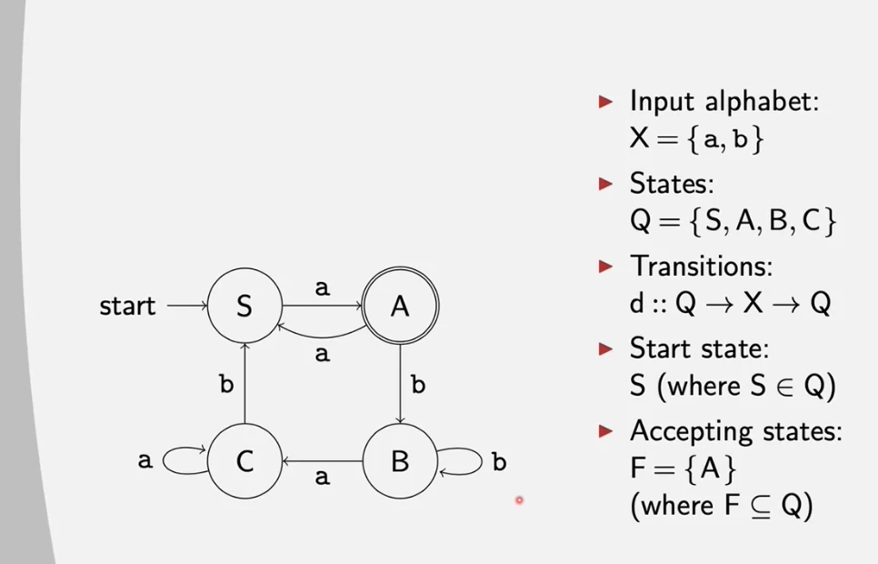

We can express this in a tuple of 5 things.

(X, Q, d, S, F)

- X is an input [alphabeth](Alphabet.md) 
- Q is a set of states
- d is a transition function of type Q -> X -> Q
- a start state S $\in$ Q
- A set of final states $F \subset Q$

Now that we have this general we can just make one function to run the automata!

You can also have multiple start points or multiple connections for the same input these things cause nondeterminism. So you have deterministic and non-deterministic state machine.   You can resolve this non determinism by going down all the path. You could then follow the shortest path or something. You can always transform the NFA into one that does have a single start state.  

This way you can parse. If there is at least one path then you can parse the world.

Double circles are other finite states. 


We call non deterministic finite automata NFA.
We call deterministic finite automata DFA.

These are actually equivalent. We can express every DFA as a NFA and otherwise. The idea is to make them as NFA and then compile them to DFA, so you can run them without worry.  

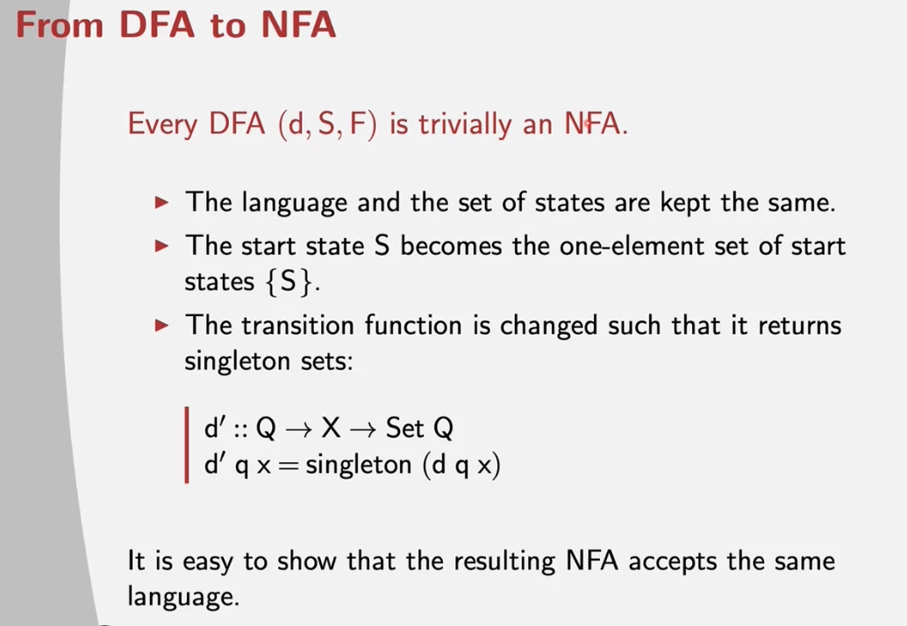
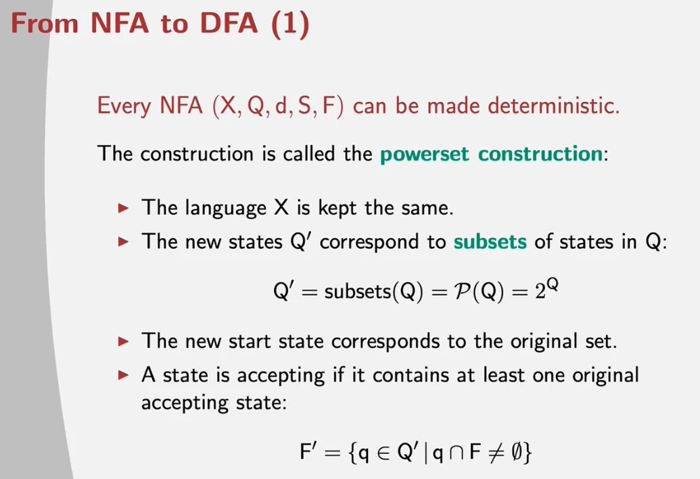

## Example:

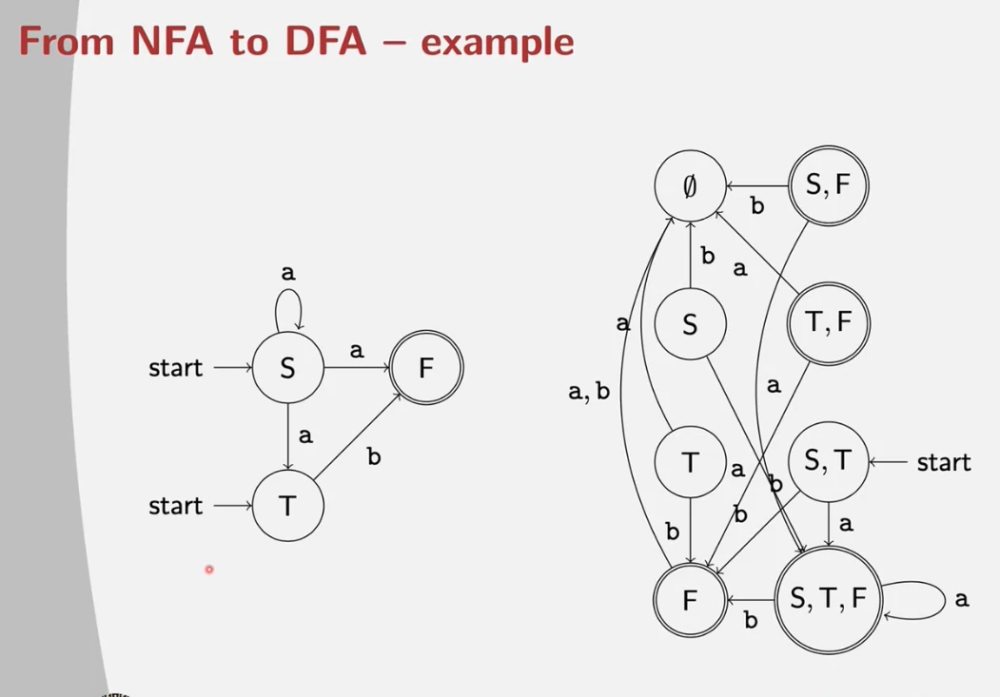

The empty set is like to stop state. 

You can actually simplify it to:


So this means that you can use the algorithm to turn a NFA into a DFA, but this won't give you the only one or the smallest one. A better way is to do a simulation this gives you the best. 

Another way to do this is that you add a transition state that always goes. So this way you create new states because you can have these lambda transitions.  This is great because then you can have one start state for your NFA. 

NFA are closed under:
- union
- concatenation
- intersection
- star closure
- complement

Being closed under an operation means that if we take languages defined by NFA we can build another NFA which recognizes the language defined by applying the operation.

# Lookahead 
Sometimes you have finite state machines that only go forward. In this case you need to have lookahead to decide what you have to choose. This slows everything down. But you can paralyze this. But really this is more of a problem with pushdown automata. You can always define a finite state machine that does not need lookahead. Calculating lookahead is not really that simple. 


# What is an alphabet?

An **alphabet** is a (finite) set of symbols that can be used to form [sentences](../Data/Sentences.md) or [words](../Data/Words.md). 

An alphabet is the set of symbols that can be used to construct valid sequences in a [language](../Languages.md).   

Some examples: 
- ${a, b, c}$
- ${a, b, c, d, e, f, g, h,i, j, k, l,n, o,p, q,r,s, t,u, v,w, y,z}$
- ${a, d, e, f,g, h, i, k,l, n, o, p,q, r, s, t, u, v,y, z}$
- ${0,1}$
- The set of Latin characters.
- Unicode set
- {if, else, while, for, return, try} ← keywords. Here if, then, else are their own symbols. 
- {if, else, raise, for, while, return, try} $\cup$ ASCII set 

## Examples
Given that the alphabet is almost always finite, we can consider sequences of elements from the alphabet.  

For instance, if the alphabets is {a, b, c} you can have sequences like this:
- a
- b
- c 
- ab
- cab
- $\epsilon$ ← Empty sequence. Always valid! Don't put the empty sequence in your alphabet.


# Regular expression

Regular expressions are a domain specific [language](Languages/Languages.md) for the concise description and [parsing](Parsing.md) of [regular Languages](Regular%20Languages.md). 

Regular languages officially start and end with /. So you have /regular expression/. Often you leave these / out.

So let's have a regular expression for god. The regular expression is /god/. 

The grammar for this language looks like this:

- S → gA
- A → oB
- B → d

Regular languages can be expressions in regular expressions which can be expressed in [finite state automata](finite%20state%20automata.md). This is great because this makes regular expressions really fast to parse.

## Symbols
You can parse symbols at a position by just including them in the regular expression /hello/ [parses](Parsing.md) the word hello. But what if we want to parse multiple words. Then we have to define a regular expression where one position of the sentence can have multiple symbols. This is done with symbol ranges.

### Symbol Ranges

Now you can have groups at any position. So if we want to pare: [god, bod] then we can have a regular expression like this: /[gb]od/. This is like having a regular grammar rule like this. 

- S → gA
- S → bA
- A → oB
- B → d

There is special syntax for ranges /[a-z]od/ here we can parse any lowercase letter of the [alphabet](Alphabet.md) followed by od. These ranges are defined by the [ASCII](https://en.wikipedia.org/wiki/ASCII) number of the symbol which happens to be convenient. Some common ranges:
- [A-z] is all letters lowercase uppercase
- [0-9] is all numbers 0 to 9 
- [4-7] is all numbers 7 to  7. 

### The wildcard
If you don't care what the symbol of a position in the word is then you can use the . wildcard. So /h.i/ can match hai hoi hbi etc. The only thing the . does not match with is a newline character. This is like an enter or maybe \\n. 

### Negation
If you use ^ at the start of a character range than everything that is not this range matched. So you say [\^0-4] then everything that is not in the set $\{0,1,2,3,4\}$ is parsed. 


## Counters (repeating)
Often you want to repeat certain parts in a parse. This can be done with counters. 

### One or more
If something has to occur once or more than we can use the +.

So /so+/ will parse so, soooo, sooo but not s because o has to appear at least once. 

### Zero or more
Sometimes you want to check that the same part repeats sometimes. You can just define that like this: /aaaao/ but what if you don't know how often the a will appear? Then there are special symbols for this. /a* o/ will parse a string that starts with zero or more a's followed by a space followed by an o. 

This is for instance how we can parse so and sooooo as the same word. /so*/ However this also parses s because * means zero or more. 

### Zero or once 
Sometimes you have something optional that can occur or not. For instance in someone's last name. This is also sometimes called the optional. You can specify this with a ? So if you have /hi?/ then it would parse both h and hi.

### Custom repeat 
You can also define custom ranges. If we only want to parse a so with 4 to 10 o then we can say /so{4,10}/. The ? is a shortcut for {0,1}. If you have {n,m} n is the minimum number it has to appear and m is the maximum it can appear. 

### Combining with symbol ranges
You can use +, * , ? and {} with character ranges as well. So you can say /age:[0-9]{1,3}/ to parse any string like: "age:32" or "age:120".  

Or let's say /d[a-z]+d/. This parses any string starting and ending with a d with one or more lowercase letter in between them.

## Markers (End and start of the line)
^ can also mean start of the string where $ means end of the string line. This is based on newline characters. This means that something it only parsed if it is at the start or end of a line. So if you have /^hi/ then it will only parse something like:

**hi** there but it won't parse this hi

## Escaping

So far we defined special characters like . ? \* + {} [] and there are more like ^{ and $ which mean end of string start of string or ^ can also mean negation. However maybe you want to literally check for these characters. When you want this you have to put \ before the special character to indicate this. So you could use /.+\./ to check if sentences end with a string. The . is escaped here. Or what if you want to check for something like [1,2,3,4] then you have to do /\\[[0-9, ]\*\ \]/. Basically you want to literally check for the \[ and \] characters. Note that this also matches \[,9,9,9]\ we need groups to fix this.

### Special escapes
If you escape things that are letters so only a literal meaning you get opposite. So \\n is a new line (very common thing). But \\t is a tab or \\b is a word boundary for instance. A word boundary is anything that is not a letter, digit or underscore. Often the opposite of this selection is the capital version of this so \\B only match word boundary. These can be very useful. You can also use these special escapes in ranges like: [\\b] is the same as [A-z0-9_] is the same as \\b.


## Grouping
Often you want to repeat longer productions. In this case you can use groups. A group is (). So you can say (ha)+ which means the string ha repeated. So that can match ha, haha, hahaha, but not hah. These groups can contain anything we defined before, so you can have something like:

`/\[([0-9],)*\]/` which matches  \[\] and also  \[1,2,4,\]

The point of grouping is that it involves multiple characters. 

### Capture groups
Any time you define a group you can refer back to it by using the index with a \\ in front. The index is just the number that you defined the group as. 

So if you have /a(b)\\1/ then this matches abb. You repeat the group with the b again. You could also have /(a)(b)\\2\\1/ this would match abba. 

Now this is the thing what the \\1 has to match what you found in the group! So if you define /my_age:([0-9]{1-3})-I_am_\\1_years_old\\./ Then this can match: my_age:12,I_am_12_years_old. But it couldn't match my_age:12,I_am_33_years_old. Because the capture group and the referral back to it are not the same! So the result is really stored in memory. This is also great if you want to get the results of the group later.

## Actions

### Substitution (replace)
If you start your regular expresion with an s you define a replacement. Something like this for instance replaces one or more white spaces with a tab.

`s/ +/\t/` The s indicates replace the first block by the second block. The block is defined by what's between the / / .

You can add a g at the end to do this everywhere. This means global. So then you get `s/ +/\t/g`.

Or lets say you have: s/[0-9]/|number|/g this would replace:

Counting goes like 1, 2, 3, 4, 5!
with 
Counting goes like |number|,|number|,|number|,|number|,|number|!

If you don't have the g it would go to:

Counting goes like |number|, 2, 3, 4, 5!

You can also replace by capture group!

# Online resources
You can use websites to test your regular expressions. For instance this one is usefull: 

https://regex101.com

Play around with it. This website can also export Python code so that is pretty cool. 

This is a website I made to obfuscate minecraft behavior packs. It also uses a lot of regular expressions to figure out what to replace. https://minecraft-obfuscator.dev 

## Example of email regex

>```(?:[a-z0-9!#$%&'*+/=?^_`{|}~-]+(?:\.[a-z0-9!#$%&'*+/=?^_`{|}~-]+)*|"(?:[\x01-\x08\x0b\x0c\x0e-\x1f\x21\x23-\x5b\x5d-\x7f]|\\[\x01-\x09\x0b\x0c\x0e-\x7f])*")@(?:(?:[a-z0-9](?:[a-z0-9-]*[a-z0-9])?\.)+[a-z0-9](?:[a-z0-9-]*[a-z0-9])?|\[(?:(?:25[0-5]|2[0-4][0-9]|[01]?[0-9][0-9]?)\.){3}(?:25[0-5]|2[0-4][0-9]|[01]?[0-9][0-9]?|[a-z0-9-]*[a-z0-9]:(?:[\x01-\x08\x0b\x0c\x0e-\x1f\x21-\x5a\x53-\x7f]|\\[\x01-\x09\x0b\x0c\x0e-\x7f])+)\])```

This one works for 99.99 % of all emails.

# Edit distance 

When you see a mispeled word, for instance snowbakl. Did the writer mean snowball or snowplow? Both are valid, but if you as a human look at this your intuition will say snowball. Why is this? This can be quantified with the edit distance. 

If you want to go from snowbakl to snowball you need one step, but if you want to go from snowbakl to snowplow you need 4 steps. 

> Another reason why snowbakl is more likely is that the k is next to the l on a US keyboard, which makes it a likely mistake. 

## Transformations 
The steps are called transformations. You get the edit distance by counting the minimum number of needed transformations from one word to another. How are transformations defined? 

- Insert → Insert a new character. 
- Delete → Delete a character. 
- Substitute → Switch a character for another.  

You could also ban substitutions (and replace them with delete-insert) which basically means substitutions count for 2 transformation.

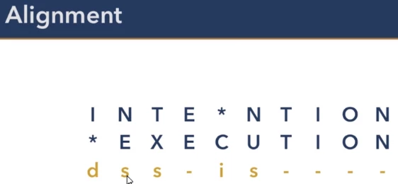

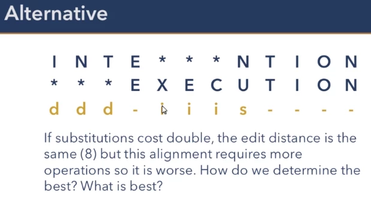

## How to find the shortest path

This is expressed in dynamic programming. You identify sub problems and then solve those, and then combine the solution you found to solve the bigger problem.

The search space is very large, but caching helps, and also you can keep track of the minimum you have found so far and then discard branches that go further than that. 

The in the lecture he gives an algorithm for it:

```python
def D(source: str, target: str) -> int:
	for i in range(len(source)):
		for j in range(len(target)):
	    	if source[i] != target[j]:
				D(i, j) = 1 + arrgmin( D(i-1), D(i-1, j-1), D(i, j-1))
			else:
				D(i,j) = D(i-1, j-1)
	return D(n,m)
```

So if the item in the source is the target then move on if it's not, find out the shortest distance.  

#### Alignment 
To get the best alignment, we have to store **back pointers** in each cell, so we know where we came from when we reached a transformation. 

Then we **trace back** our steps and favour the substitution every time we can. 


## Graphically

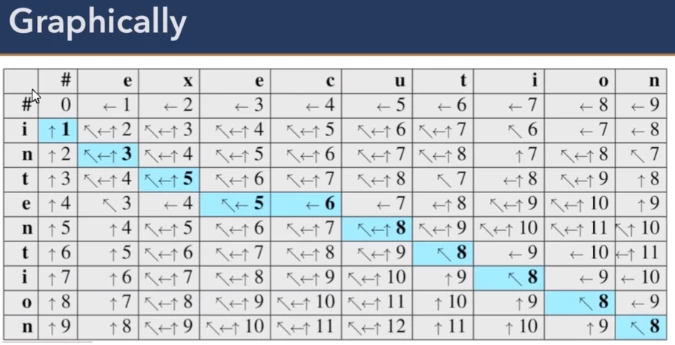

The # is the empty string. Moving over the diagonal is a substitution, so you could count this as 2. You can go fast by first only considering the outer layers. This is the simplest, where you just go from the empty string to the other word. Then use this information when making decisions. Then, when going further, the number only goes up if the letter is not the same. If the number is the same, the number goes down.

You have to be able to solve problems like this on the exam:

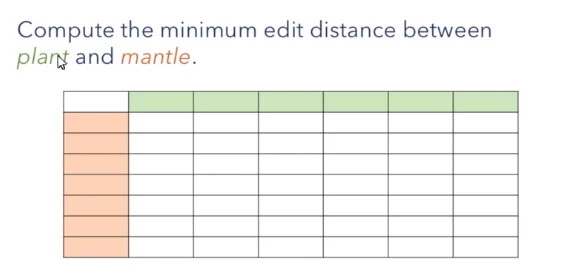

## Minimum Edit distance full tutorial:

f3 help: edit distence, editdistance, edit distanse, edit distense, minimum edit distense

We will now calculate the edit distance from Dirt to Flirt.

### Steps

1. Get cost for Insert, Delete, Substitute (given in the question)
2. Make a table with one word on top and one on the left one letter in each cell. Starting with the empty string (#)

|     | #   | D   | I   | R   | T   | 
|-----|-----|-----|-----|-----|-----|
| #   |     |     |     |     |     |
| F   |     |     |     |     |     |
| L   |     |     |     |     |     |
| I   |     |     |     |     |     |
| R   |     |     |     |     |     |
| T   |     |     |     |     |     |

3. Now we have to fill everywhere how many actions it takes. Start with the first row and column. The first is from the empty string, so it starts at 0 (actions to go from # to # is 0) going up by 1. So from # to D is 1, from # to DI is 2 etc.

With Flirt, you are deleting letters. With Dirt, you are inserting letters. So you have to delete 3 letters from FLI to get to #.

| x   | #   | D   | I   | R   | T   | 
|-----|-----|-----|-----|-----|-----|
| #   |  0  | 1   | 2   | 3   | 4   |
| F   |  1  |     |     |     |     |
| L   |  2  |     |     |     |     |
| I   |  3  |     |     |     |     |
| R   |  4  |     |     |     |     |
| T   |  5  |     |     |     |     |

Ok now we do the column with D at the top. Look at the empty cell and ask these questions:

- Are the two letters different? (Yes D != F).
  - If they are different, look at the cell to the left, above left diagonal and above. So that is: [1,0,1] Take the minimum value = 0, add 1. 
  - If the minimum came from above left diagonal it is a substitution, and you add another 1 (This is a choice, cost of substitution, be sure to read the question if it is required).
  - So 0 + 1 + 1 = 2 

| x   | #   | D   | I   | R   | T   | 
|-----|-----|-----|-----|-----|-----|
| #   |  0  | 1   | 2   | 3   | 4   |
| F   |  1  | 2   |     |     |     |
| L   |  2  |     |     |     |     |
| I   |  3  |     |     |     |     |
| R   |  4  |     |     |     |     |
| T   |  5  |     |     |     |     |

Now repeat for next cell down (L,D):
- Are they the same? No
    - If no take minimum of above cell, left cell, up, left diagonal cell = 1
    - Add 1, so 1 + 1 and add another one because the min was the diagonal so 1 + 1 + 1 = 3 

| x   | #   | D   | I   | R   | T   | 
|-----|-----|-----|-----|-----|-----|
| #   |  0  | 1   | 2   | 3   | 4   |
| F   |  1  | 2   |     |     |     |
| L   |  2  | 3   |     |     |     |
| I   |  3  |     |     |     |     |
| R   |  4  |     |     |     |     |
| T   |  5  |     |     |     |     |

Now one more:

Cell: I,D, same? no
- min(3,2,3) = 2
- was min diagonal? 
	- yes?, add 2
    - no?, add 1
- 2 + 2 = 4

| x   | #   | D   | I   | R   | T   | 
|-----|-----|-----|-----|-----|-----|
| #   |  0  | 1   | 2   | 3   | 4   |
| F   |  1  | 2   |     |     |     |
| L   |  2  | 3   |     |     |     |
| I   |  3  | 4   |     |     |     |
| R   |  4  |     |     |     |     |
| T   |  5  |     |     |     |     |

I am going to continue now till we hit a case where the letter is the same:

| x   | #   | d   | i   | r   | t   | 
|-----|-----|-----|-----|-----|-----|
| #   |  0  | 1   | 2   | 3   | 4   |
| f   |  1  | 2   | 3   |     |     |
| l   |  2  | 3   | 4   |     |     |
| i   |  3  | 4   |     |     |     |
| r   |  4  | 5   |     |     |     |
| t   |  5  | 6   |     |     |     |

Now we have I,I these are the same.
In this case, just copy the value from above left diagonal cell!

| x   | #   | d   | i   | r   | t   | 
|-----|-----|-----|-----|-----|-----|
| #   |  0  | 1   | 2   | 3   | 4   |
| f   |  1  | 2   | 3   |     |     |
| l   |  2  | 3   | 4   |     |     |
| i   |  3  | 4   | 3   |     |     |
| r   |  4  | 5   |     |     |     |
| t   |  5  | 6   |     |     |     |

The **minimum edit distance** is the value of the bottom right cell.

To get the best alignment, you need to store where you came from every time. You can also do it by looking at the best path, working back. Basically you can only go to cells up, left, left up diagonal from the bottom right cell if they have a lower value then the current cell. So with this cell I, I you can only go to l,d (to get the best alignment). When working back, you always prioritize diagonal to go back.

Ok next one:

| x   | #   | d   | i   | r   | t   | 
|-----|-----|-----|-----|-----|-----|
| #   |  0  | 1   | 2   | 3   | 4   |
| f   |  1  | 2   | 3   |     |     |
| l   |  2  | 3   | 4   |     |     |
| i   |  3  | 4   | 3   |     |     |
| r   |  4  | 5   |     |     |     |
| t   |  5  | 6   |     |     |     |

- Cell: i,r
- Same? no
- min(5,4,3) = 3
  - was min diagonal? 
    - yes?, add 2
    - no?, add 1
- 3 + 1 = 4 


| x   | #   | d   | i   | r   | t   | 
|-----|-----|-----|-----|-----|-----|
| #   |  0  | 1   | 2   | 3   | 4   |
| f   |  1  | 2   | 3   |     |     |
| l   |  2  | 3   | 4   |     |     |
| i   |  3  | 4   | 3   |     |     |
| r   |  4  | 5   | 4   |     |     |
| t   |  5  | 6   |     |     |     |

Ok now I will fill in the whole thing:

| x   | #   | d   | i   | r   | t   | 
|-----|-----|-----|-----|-----|-----|
| #   |  0  | 1   | 2   | 3   | 4   |
| f   |  1  | 2   | 3   | 4   | 5   |
| l   |  2  | 3   | 4   | 5   | 6   |
| i   |  3  | 4   | 3   | 4   | 5   |
| r   |  4  | 5   | 4   | 3   | 4   |
| t   |  5  | 6   | 5   | 4   | 5   |

See the image above for how to work back. 

Be sure to check the question if substitution has a cost of 2! 

--- 

With Growing and Glowing you get this:

| X   | #   | G   | r   | o   | w   | i   | n   | g   |
|-----|-----|-----|-----|-----|-----|-----|-----|-----|
| #   | 0   | 1   | 2   | 3   | 4   | 5   | 6   | 7   |
| G   | 1   | 0   | 1   | 2   |     |     |     |     |
| l   | 2   | 1   | 2   | 3   |     |     |     |     |
| o   | 3   | 2   | 3   | 2   |     |     |     |     |
| w   | 4   | 3   | 4   |     |  2  |     |     |     |
| i   | 5   | 4   | 5   |     |     | 2   |     |     |
| n   | 6   | 5   | 6   |     |     |     | 2   |     |
| g   | 7   | 6   | 7   |     |     |     |     | 2   |

Subs count for 2.

You know that it will be 2, and you can skip a lot because the rest of the word matches. Marking matching cells beforehand can help. 


# Context free grammars

The context free grammars are grammars where you can form rules of the form:

- N = (N $\cup$ $\sum$)*

The left-hand side can only be ONE non-terminal. The right-hand side can be any ordered combination of terminals and non-terminals, of any length. 

Context free grammars are much more expressive than [regular grammars](Regular%20Languages.md).

You can [parse](Parsing.md) context free grammars with parser combinators, parser generators or the [CKY](CKY.md) algorithm. There are a lot more options as well. 

Context free grammars are called context free because there is no [context](../Semantic-Similarity/Context.md) on the right-hand side of the [grammar](Grammar.md) production, as in there is only one non-terminal on the right. Knowing this makes parsing much easier. 


# Regular languages
A regular language is a [Languages](Languages/Languages.md) that can be described by a grammar where all the productions are in the following form:
 
 - S → xB
 - B → b

This defines a languages of a sequence of x and then one b at the end. 

Where x is a possibly empty **sequence** of terminals and A and B are non-terminals. Every right-hand side has at most one non-terminal that must occur at the end.

You can see the overlap between [finite state automata](finite%20state%20automata.md). You have one state, and you can go to another. 

We call a language regular if it can be described by a regular grammar. Those are grammars like the above.

Regular languages can be described by [regular expression](Regular%20expression.md).

Often the first grammar production is S.


# Chunking
Sometimes you don't need the full [parse tree](Parse%20Tree.md) of a sentence, but you only need the main building blocks of a sentence. This is also called shallow or partial [parsing](Parsing.md). 

Chunking stays on the surface level. There is only one layer of non-terminals, and the non-terminals can not be rewritten to other non-terminals. 

The idea of chunking is that you chop a sentence into non-terminals or chunks. These chunks don't overlap, and you are not going to chunk the chunk.

Chunks are not recursive, they never contain smaller phrases of the same type.  

## Example

**The man** - *guarding* - **the door** - *fell asleep* - **and the thieves** -- *managed to enter* -- **the building and run away** - ~~with the diamonds~~.

So here we have verbs and nouns and at the end a prepositional phrase. 

So it boils down to determining the boundaries of the chunks.  For instance, you can keep going until you hit something that is not in the same group as before and if it's not, you put a boundary. So you do **splitting**, but you also **classify** what the chunk is. 

## Evaluation
A correct chunk starts and ends at the right place and has the right token. We use precision, recall and f1 scores to evaluate this. 

**Precision** is the ratio between the correct chunk produced by the system and all the chunks produced by the system. **Recall** weights the correct chunks over the correct chunks in the text. F-measure combines recall and precision. 

### Parseval 

 Parseval is a competition to evaluate chunking algorithms. This measures to what existent the [constituents](Constituency.md) in the hypothesized parses look like the actual constituents, defined by linguists (gold standard [corpus](../Data/Corpus.md) with annotations is required for this)

Performance is assessed at the constituent level because parsers will probably make some mistakes. 


# CKY algorithm 
The CKV algorithm is a dynamic programming solution to parsing [Context free grammars](Context%20free%20grammars.md). 

## Pseudocode

```python
def CKYparser(string, grammar):
	for j in 1:length(string)  
		for all rules A | A→s[j] in ℒ  
			table[j-1,j] = table[j-1,j] union A  
		for i in reverse(0:j-2):  
			for k in i+1:j-1  
				for all rules A→BC in ℒ and B in table[i,k] and C in table[k,j]  
					table[i,j] = table[i,j] union A  
	return table
```

## Actual python function

```python
def CKYparser(string: str, grammar: 'Grammar') -> list[list[str]]:
	table = [[for i in range(len(string))] for i in range(len(string))]
	rules = grammar.rules
	for j in range(1, len(string)):
		for rule in rules:
			table[j-1,j] = table[j-1,j] or A
		for i in reverse(range(0,j-2)):
			for k in range(i+1, j-1):
				for rule in rules:
					for B, C in table[i,k], table[k,j]:
						table[i,j] = table[i,j] or A
	return table
```

Don’t reinvent the wheel! Use existing and optimized libraries to do statistical language modelling, for instance like KenLM.
## Tutorial 

### A grammar
This grammar is in [Chomsky Normal Form](Chomsky%20Normal%20Form.md):

- S → AB | BC
- A → BA | a
- B → CC | b
- C → AB | a

Can we get to S from abba? 

Yes!

So we have a table with a row for each input string. So let's take input = abba

|     | a   | b   | b   | a   |
| --- | --- | --- | --- | --- |
| X   |     |     |     |     |
| X   | X   |     |     |     |
| X   | X   | X   |     |     |
| X   | X   | X   | X   |     |
| X   | X   | X   | X   | X   |


What are the rules where a appears on the right side?
This is A and C. So we fill these non-terminals into the table.

|     | a   | b   | b   | a   |
| --- | --- | --- | --- | --- |
| x   | A,C |     |     |     |
| X   | X   |     |     |     |
| X   | X   | X   |     |     |
| X   | X   | X   | X   |     |
| X   | X   | X   | X   | X   |

Now we do the same for b.

|     | a   | b   | b   | a   |
| --- | --- | --- | --- | --- |
| x   | A,C |     |     |     |
| X   | X   | B    |     |     |
| X   | X   | X   |     |     |
| X   | X   | X   | X   |     |
| X   | X   | X   | X   | X   |

Now you want to put in the cell between the cell with A, C and B the rules that contain combinations of those non-terminals on the right-hand side. The possible combinations are: AB and CB. The thing to the left has to come first. Now we basically try to find a constituent of a and b.

The possibilities are S and C so let's fill it in.

|     | a   | b   | b   | a   |
| --- | --- | --- | --- | --- |
| x   | A,C | S,C |     |     |
| x   | x   | b   |     |     |
| x   | x   | x   |     |     |
| x   | x   | x   | x   |     |
| x   | x   | x   | x   | x   |

Now the bottom of the next row is B again just like before. This is the only non-terminal that can come from b. 

|     | a   | b   | b   | a   |
| --- | --- | --- | --- | --- |
| x   | A,C | S,C |     |     |
| x   | x   | b   |     |     |
| x   | x   | x   | b   |     |
| x   | x   | x   | x   |     |
| x   | x   | x   | x   | x   |

But now we have to fill in the things above the b in the row. To do this, we only look at the cell directly 1 up from the last be we did. So we only look at the cell marked K now.  

|     | a    | b   | b   | a   |
| --- | ---- | --- | --- | --- |
| x   | A, C | S,C |     |     |
| x   | x    | B   | K   |     |
| x   | x    | x   | B   |     |
| x   | x    | x   | x   |     |
| x   | x    | x   | x   | x   |

If we do this, we can repeat what we did before and look at sequences of non-terminals in the grammar of BB. If we found this non-terminal, you would fill it in and move one cell up in the row. Do you feel the abstraction building? There is no BB, so we put empty set ($\emptyset$). 


|     | a    | b    | b   | a   |
| --- | ---- | ---- | --- | --- |
| x   | A, C | S, C |     |     |
| x   | x    | B    | $\emptyset$   |     |
| x   | x    | x    | B   |     |
| x   | x    | x    | x   |     |
| x   | x    | x    | x   | x   |

Now we move up again. However, now we have to combine this cell with a lot of other cells because if you look from the right then you do include the whole column. Because basically the lowest cell in the second b row is saying we can rewrite b to B. Then the one above that says can we rewrite BB? No. The one above that should look for SB or CB. Because you try to rewrite what came before. However, SB or CB do not exist in the grammar, so it is empty set again. 

|     | a    | b    | b   | a   |
| --- | ---- | ---- | --- | --- |
| x   | A, C | S, C | $\emptyset$   |     |
| x   | x    | B    | $\emptyset$   |     |
| x   | x    | x    | B   |     |
| x   | x    | x    | x   |     |
| x   | x    | x    | x   | x   |

Now we can basically fill in the table. The first is simple, how can you write a. We already did this.  

|     | a    | b    | b           | a   |
| --- | ---- | ---- | ----------- | --- |
| x   | A, C | S, C | $\emptyset$ |     |
| x   | x    | B    | $\emptyset$ |     |
| x   | x    | x    | B           |     |
| x   | x    | x    | x           | A, C | 
| x   | x    | x    | x           | x   |

Then the cell above it looks for BA or BC. BA occurs in A and BC occurs in S. So we write S and A. 

|     | a    | b    | b   | a    |
| --- | ---- | ---- | --- | ---- |
| x   | A, C | S, C | $\emptyset$   |      |
| x   | x    | B    | $\emptyset$   |      |
| x   | x    | x    | B   | S, A |
| x   | x    | x    | x   | A,C  |
| x   | x    | x    | x   | x    |

For the next one, we check BS and BA. BA occurs in A and BS does not occur.  So we put A. So we looked at marked cells.

|     | a    | b              | b   | a                 |
| --- | ---- | -------------- | --- | ----------------- |
| x   | A, C | S, C           | $\emptyset$   |                   |
| x   | x    | <mark>B</mark> | $\emptyset$   | A                 |
| x   | x    | x              | B   | <mark>S, A</mark> |
| x   | x    | x              | x   | A,C               |
| x   | x    | x              | x   | x                 |

For the last one, we have to check all the cells in the top row with A. 

So we check for AA, CA, SA and CA. All these rules do not occur, so its $\emptyset$

|     | a    | b    | b   | a    |
| --- | ---- | ---- | --- | ---- |
| x   | A, C | S, C | $\emptyset$   | $\emptyset$    |
| x   | x    | B    | $\emptyset$   | A    |
| x   | x    | x    | B   | S, A | 
| x   | x    | x    | x   | A,C  |
| x   | x    | x    | x   | x    |

We conclude that the word is not in the language. 


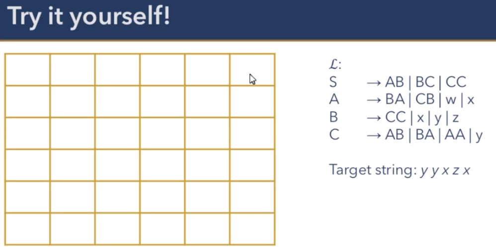


# Languages

Languages are the set of valid combinations of an [alphabet](Alphabet.md) following the [grammar](Grammar.md) productions specified. The process of proving that a sequence belongs to a language is called [parsing](Parsing.md). 

Let's do another definition:

A language is a set of [sentences](../Data/Sentences.md) build from an [alphabet](Alphabet.md), which for some reason we call correct. This reason is that the sentences follow the grammar rules we defined for the language. 

Parsing is the act of proving that some input belongs to a set of correct sentences (the language set). 

# Types of languages 
**[Natural languages](Natural%20languages.md)** are languages where you can also have sentences that are almost correct, and they will still be accepted mostly without any complaints. **Formal Languages** are languages where every sentence has to be from the set of correct sentences, otherwise there will be complaint (by the compiler).

**Formal Language** A formal language is a language where you **have** to follow the rules, and you can not deviate. This means that you can always use the rewrite rules. Every sentence has to be from the set of correct sentences, otherwise there will be complaint (by the compiler). There are different classes of formal languages based on the rules that the grammar may use.  For instance, you have regular languages and context free languages. These types of grammars are defined by the [Chomsky Hierarchy](Chomsky%20%20Hierarchy.md).


# Zipfian Distribution 
With a Ziphian the most frequent class, in this course words, is twice as likely to occur than the second most frequent word in a language. The second most frequent is twice as likely to occur than the third frequent word in a language, and so on. It doesn't have to be twice as likely, but it just means each rank is much less likely. This means that most of the probability mass is given to the smallest top. 

A Ziphian distribution is often seen with [Natural languages](Natural%20languages.md).  

How frequent a word is can be expressed in the rank. The most frequent word has rank 1, the second most frequent word has rank 2 etc. 

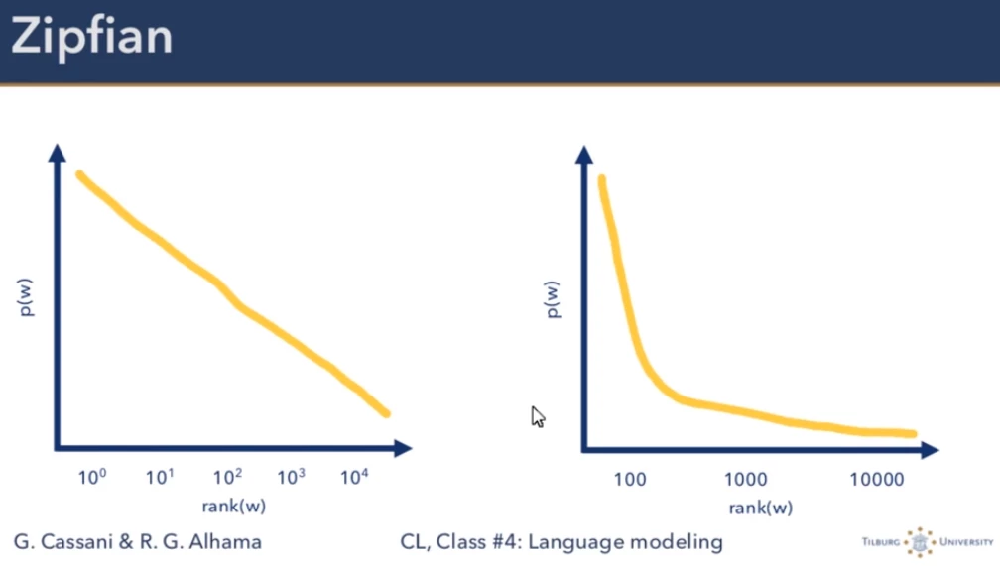

This also holds for almost all natural languages. It also holds at the level of letters. Some letters appear more often than others.  

So each thing outside the top 50 is rare, but all the rare things together still make up 30% of everything, so you still have to deal with it. 


# Explanation / Analysis  Questions 
Practice open questions were provided. 

>These are the Answers are by Marieke.

## 8 pts - 100 words: EXPLANATION/ANALYSIS QUESTIONS

### Explain the steps involved in computing PPMI  and what role PPMI plays in the pipeline used to derive a count-based DSM (distributional semantic network).

PPMI ([Positive Point wise mutual information](../Semantic-Similarity/Point%20wise%20mutual%20information%20(PMI).md)) is a measure of how informative a word and context combination is by finding the ratio of the word occurring in the context divided by the occurrence of the word and the context on their own (count based probabilities). All negative values are set to 0 to have a sense of interpretability of the informativeness. The PPMI is then used as weights when computing cosine similarity between vector embeddings to give more importance to more informative data points. These weighted cosine similarities can then be leveraged to find semantic groupings. (95 words)


### Break down the working of the CKY algorithm focusing on the three nested loops used to fill out the parse table

The [CKY](../Languages/CKY.md) algorithm is used to determine whether a sentence is valid given a grammar by applying a nested looping algorithm. It first determines for each item in the sentence which forms it may take given the grammar, rewriting each item that appears as RHS of a rule as the LHS. Then each further cell of the table is filled; take all combinations of subsets of sentence items up to that point, note the LHS’s of the rules for which the subsets make up a RHS. If the top right cell contains the ‘S’ symbol, the sentence is valid. (99 words)

### Consider Bayes rule and PoS tagging using HMMs (hidden Markov models). Explain how transition and emission probabilities relate to prior and likelihood.

In [Bayes rule](../Classification/Native%20baiyes/Bayes%20rule.md), the prior represents the expectations the algorithm is given regarding how often the class will appear. This is the ratio of how often the class occurs and the size of the document. In HMMs, the transition probabilities capture this idea by representing how often each state follows another state. The likelihood in Bayes’ rule says how likely an item is to occur given that its class is known. This relates to emission probabilities in HMMs because the emission probability also shows the ratios of each word occurring given a tag. (93 words)

## 12 pts – 200 words. EVALUATION QUESTIONS

### Compare and contrast a Markov Chain and an LSTM for language modeling. Highlight similarities and differences in training data, assumptions, goals, architecture (the design of the algorithm) and evaluation

Both MC’s and LTSMs take some form of history into account, but the MC does it based on the Markov assumption (probability of a word given total history can be approximated with local history) whereas the LTSM instead learns to consider some history and forget other parts. MC’s also require smoothing, while LSTM’s don’t. MC are evaluated with perplexity, and LSTMs are evaluated by calculating loss between the prediction and expectation. (71 words)

### Compare lexical-semantic representations in thesauri (a synonym dictionary) and in DSMs, focusing on how they are derived; mention one advantage of DSMs over thesauri and one advantage of thesauri over DSMs; finally, compare how word-similarities are computed in both approaches.

[Thesauri](../Data/Thesaurus.md) are created by people, in an intentional way. The people making thesauri leverage world knowledge and their linguistic reasoning and understanding to express an agreed upon definition of the semantic meaning of a word. This has the advantage that there is transparency of how the representations came to be. Word similarities can be determined in thesauri by calculating edit distances, finding Lesk similarity (gloss overlap), or in the case the thesaurus holds synsets or a tree structure, also with path-length similarity or Resnik similarity. Another advantage is that the information in a thesaurus is easier for human interpretation. 

DMSMs on the other hand use statistical methods to learn semantic distributions in an unsupervised way. Each word type gets a vector embedding based on a chosen metric, such as co-occurrence counts. These vectors can then be weighted by their information content ((P)PMI) and the weighted cosine between these vectors then indicates something about the similarity between words. This has the advantage that no linguistic experts are needed to index the language, only one or a few computational linguists and their computers, which makes it cheaper and faster. It may also reveal latent information about the structure of language and semantics. (200 words)

## 20 pts - 300 words. SYNTHESIS QUESTION

### People read more predictable words given the preceding context faster. Discuss how you would extrinsically evaluate two language models, an n-gram model and an LSTM, using a dataset which provides the average time it took to people to read each word in a sentence as measured with an eye-tracker. What information would you extract from each model? How do you expect it relates to reading times? What data would you use to train the language models for them to be good at predicting reading times? Justify your choice.

The extrinsic evaluation of each model can be done by comparing the reading times to the probability output of each model for certain words (correlation). From the [N-grams](../Languages/N-grams.md) model, we would take the perplexity for each word and expect it to be a good predictor for reading time, with lower perplexity correlating with shorter reading time and vice versa. In the LSTM the expectation would be that a higher probability for a word given a context leads to shorter reading times and vice versa. The data for training the models should be representative for the goal, so in this case it should be text that is usually read by people, such as Wikipedia articles or subtitles. This should ideally be related to or match with the dataset that was used to generate the reading times. (135 words)

# Goals

The goals of looking at natural languages are:

- Infer the components symbols of a language, their roles, the rules for combining them, and their meaning.
- Formalize the rules for combining symbols
- Combine atomic meanings. Atomic is the smallest part so how do you combine the meanings of the smallest parts.
- Understand large portions of text.
- Produce complex sentences. 


# Computational linguistics class about the BERT paper

BERTology. (Bidirectional Encoder Representations from Transformers). Headings are per section of the paper.

> Thanks to Marike for this file
  
## Advantages of BERT as compared to other (neural net) language models.

BERT is better at dealing with longer sentences (long-range dependencies). This is because it is a transformer model (not a neural net, not exactly deep learning). Problem with recurrent neural nets: [Vanishing gradient problem](../Prediction/Vanishing%20gradient%20problem.md). This means that if you go too far back in the input, it gets multiplied by the 0-1 parameters over and over again and gets smaller and smaller; this makes it so that the model stops learning. The BERT model (transformer) doesn’t have this issue, as it uses a different version of recurrence.

Parallel processing is also efficient in BERT given the right hardware. The model is pre-trained on a huge amount of data, and it is very big; the architecture itself is efficient (more than LSTM) but very big.


## Explain the workflow of BERT.

1.  Pre-training, self-supervised. Train model with a large amount of data (Wikipedia, books, etc). To learn general knowledge about language.
    
    1.  Masked language modelling: given a sentence, mask out a word and train the model to predict the missing word (MLM)
        
    2.  Next sentence prediction: given two sentences, the model predicts whether they are consecutive (NSP)
        
2.  Finetuning (adding one or more layers on top of the pre-trained architecture). Here, the model is trained on a more specific task or dataset, such as sentiment analysis or POS tagging.
    

  

## Which type of syntactic information does BERT seem to learn

_Syntax in language is very symbolic. Finding information in a NN about its syntactic knowledge is hard; is it representing the right thing?_

The model has some representations of hierarchical information (word dependency tree structures). More specifically; part-of-speech and chunks and thematic roles (agent-patient) are embedded in the model. This is impressive as the model learns unsupervised using NSP and MLM. Model is not very good at Negative Polarity Items (between syntax and semantics); it can understand the use of ‘Whether..ever’ but not the correct scope of those or negations. The syntactic information that the model learns is not necessarily similar to annotated linguistic resources.

  

## What is the reason why BERT struggles with world-based reasoning?

My guess: maybe the MLM unsupervised learning leads to this difficulty and the other way around (predict sentence from word) might improve the ability of the model to perform reasoning tasks. Raquel says, ‘idk, but interesting!’.

The model might also improve when training on structure and relationship (tagged) data, rather than pure unsupervised learning. Humans might have a specific reasoning ability that is not built into the model. A lot of knowledge and reasoning and world-awareness is known by people, which is not built into our language. This means the data the model is trained on is not complete with this inferred information; we don’t say ‘I walk into the house because the house is bigger than I am’. When we say ‘I walk into the house’, there is a natural implication and social understanding that the house is indeed bigger than I am. The model does not have this information in the training data and as such cannot (does not) learn the reasoning.

## If you have a BERT model with vectors that reflect semantic relations, then which part of the model represents the semantic similarity space? (Higher layers, intermediate, combinations?)

Semantic information is represented throughout the model’s layers. In later stages, it involves tokens (individual occurrences of words) and in earlier layers, the semantic value of the word more generally speaking. Then there is also the vector space which collapses the semantic information into a sort of ‘cone’ shape in the vector space.

Semantics are learnt from the context in the MLM task. The model gives us a different vector for each token; so every occurrence of a word, even if it’s the same word, gets its own representation vector. These need to be aggregated for getting type information. The BERT model is very deep (word2vec is not deep; only the first layer is used). In BERT you can use different layers’ information depending on your task. Probing can be done to see which layer is more useful, can also do averages or weighted averages. For example, can take the first layer(s) because they are more useful for getting a certain type of information about a sentence.

## How would you change your answer to the previous question after reading the following section, 4.3 BERT Layers, if at all?

Combining information from different layers is the best (only?) way to get the semantic information. This is spread across all layers of the model, independent of the model size. The first layers capture simple word order rules, middle layers syntactic information, and later layers capture task specific information. The semantics are weaved through all layers; this makes intuitive sense too because often the semantic meaning of our real-world language use also changes based on context (task) and social situation (grammar, word order).

In the end, language is used to communicate; semantics (what does it _mean_) is a basic goal of language use. Everything else always interacts and interfaces with semantics.

## Why is overparametrization a problem?

Typically, the more parameters a model has, the more it can learn, though it can also lead to [overfitting](../Prediction/Overfitting.md). However, with BERT the problem is more so that the enormous amount of parameter also leads to intense computational complexity and electricity use. This is an environmental concern, especially as long as the majority of power is not generated in a clean (green) way. It also leads to differences between countries, companies and individuals with more vs less resources (financial, hardware, human). Reproducibility is also a big issue; the bigger the model, the harder it is to reproduce and do science on whether it is really that good or if they be lyin’ to us.

# Quiz 1 Resources 


<style type="text/css">
    ol { list-style-type: upper-alpha; }
</style>


## Question 1

In CL we use a lot of statistics and probability theory. Why?

- A: They give us several distributions to characterise how people use language.
- B: Natural languages are ambiguous. 
- C: We need to perform statistical tests to compare models.
- D: They offer a set of efficient algorithms for automating processes.
 
## Question 2

Which of the following features does not apply to natural languages?

- A: Subjected to change
- B: Unambiguous 
- C: Conventional
- D: Context-dependent
 
## Question 3

Which level of linguistic analysis deals with the meaning of morphemes and words?

- A: Lexical semantics 
- B: Syntax
- C: Morphology
- D: Compositional semantics
 
## Question 4

Which of the following is a diachronic corpus?

- A:  CHILDES
- B:  SubtLex
- C:  Corpus of Historical American English 
- D:  TASA
 
## Question 5

Which of the following resources is not a lexicon?

- A:  Words with proportion of native speakers who know the word meaning
- B:  Words with concreteness ratings
- C:  Words with age of acquisition estimates
- D:  Words with their meaning definition 
 
## Question 6

What is a valid hyponym of dog in WordNet?

- A: Dalmatian 
- B: Animal
- C: Canine
- D: Cat

## Correct Answers Quiz 1
1. B: Natural languages are ambiguous. 
2. B: Unambiguous 
3. A: Lexical semantics 
4. C: Corpus of Historical American English 
5. D: Cat


# Quiz 2 Naïve Bayes Classification

## Question 1

Which of the following is not an example of text classification?

- A: Essay grading (pass/fail) 
- B: Text simplification 
- C: Sentiment analysis 
- D: Cyberbullying detection
 
## Question 2

Which of the following is an advantage of rule systems?

- A: Robust to rare events 
- B: Cheap to write 
- C: Cannot incorporate domain knowledge 
- D: Can deal with ambiguity effortlessly 
 
## Question 3

Which of the following statements about discriminative classifiers is wrong?

- A: They can only address binary classification problems 
- B: They learn the hidden process which yielded the data sample 
- C: They can only learn linear boundaries 
- D: They are non-deterministic classifiers 

## Question 4

Which of the following is an example of extrinsic evaluation?

- A: Run a t-test between precision scores in automatic grading 
- B: Compute the difference in accuracy between two classifiers 
- C: Measure the customer satisfaction when interacting with two different bots 
- D: Compare translation quality between two machine translation models 
 
## Question 5

What does the likelihood capture in Bayes Rule?

- A: The probability of the class given the input 
- B: The probability of the input 
- C: The probability of the input given the class 
- D: The probability of the class 
 
## Question 6

What does the conditional independence assumption entail in NBC?

- A: An NBC doesn't track feature co-presence 
- B: An NBC doesn't consider the probability of the document given the class 
- C: An NBC doesn't track sequential information 
- D: An NBC doesn't consider all classes when classifying 
 
## Question 7
Which of the following is not a stop word?

- A: I 
- B: Child 
- C: Do 
- D: Because 
 
## Question 8
In a dataset consisting of 100 tweets, 20 contain instances of cyberbullying. For the sake of argument, we pretend to be dealing with 2 binary features: whether the tweet contains at least a curse word and whether the tweet contain non-alphabetic characters. The likelihood that a tweet containing at least a curse word is an instance of cyberbullying is 0.8 while the likelihood that a tweet containing non-alphabetic characters is not an instance of cyberbullying is 0.7.

What is the prior of the cyberbullying class?

- A: 0.1 
- B: 0.8 
- C: cannot tell 
- D: 0.2 

## Question 9

In a dataset consisting of 100 tweets, 20 contain instances of cyberbullying. For the sake of argument, we pretend to be dealing with 2 binary features: whether the tweet contains at least a curse word and whether the tweet contain non-alphabetic characters. The likelihood that a tweet containing at least a curse word is an instance of cyberbullying is 0.8 while the likelihood that a tweet containing non-alphabetic characters is not an instance of cyberbullying is 0.3.

Consider a test tweet with at least a curse word and only alphabetic characters. What is the probability of the test tweet being an instance of cyberbullying?

- A: 0.8 $*$ 0.8 $*$ 0.3 
- B: 0.8 $*$ 0.2 $*$ 0.7 
- C: 0.2 $*$ 0.8 $*$ 0.3 
- D: 0.2 $*$ 0.2 $*$ 0.7 
 
## Question 10

In a dataset consisting of 100 tweets, 20 contain instances of cyberbullying. For the sake of argument, we pretend to be dealing with 2 binary features: whether the tweet contains at least a curse word and whether the tweet contain non-alphabetic characters. The likelihood that a tweet containing at least a curse word is an instance of cyberbullying is 0.8 while the likelihood that a tweet containing non-alphabetic characters is not an instance of cyberbullying is 0.3.

Consider a test tweet with at least a curse word and only alphabetic characters. Would an NBC using these features classify it as an instance of cyberbullying?

- A: Yes 
- B: Not enough information given 
- C: It'd be a tie 
- D: No 


## Correct Answers Quiz 2
1. B: Text Simplification 
2. A: Robust to rare events
3. B: They learn the hidden process which yielded the data sample 
4. C: Measure the customer satisfaction when interacting with two different bots 
5. C: The probability of the input given the class 
6. A: An NBC doesn't track feature co-presence 
7. B: Child
8. D: 0.2
9. C: 0.2 $*$ 0.8 $*$ 0.3 
10. D: No


# Quiz 3 Pre-processing

## Question 1

How many lemmas are there in the sentence: 

"The children were curious about whether there would be a surprise at home or whether there had been enough surprises already." 

Punctuation doesn't count.

- A: 21 
- B: 19 
- C: 18 
- D: 16 
 
## Question 2

How many affixes are there in the word untrustworthy?

- A: 3 
- B: 2 
- C: 0 
- D: 1 
 
## Question 3

Which of the following words is inflected?

- A: Touchstone 
- B: Colourful 
- C: Children 
- D: Professor 
 
## Question 4

Which normalisation technique would you use before doing language identification?

- A: Lemmatisation 
- B: Case folding 
- C: None of them 
- D: Tokenisation 
 
## Question 5

Consider two regular expression /^[a-zA-Z]{2,6}\b/. What does it match?

- A: alphabetic strings between two and six characters at the beginning of a line followed by a word boundary Correct!
- B: any string but alphabetic strings between two and six characters 
- C: Lines containing alphabetic strings between two and six characters 
- D: any string between three and six characters
 
## Question 6

What is the minimum edit distance between glowing and growling? 

- A: 4 
- B: 1 
- C: 2
- D: 3 

## Correct Answers Quiz 3
1. D: 16
2. B: 2
3. C: Children
4. C: None of them
5. A: alphabetic strings between two and six characters at the beginning of a line followed by a word boundary
6. C: 2

# Quiz 4 Language modelling 

## Question 1

How do we use language modelling in machine translation?

- A: To make sure the translation has the same meaning as the source
- B: To predict the next sentence in the translation
- C: To pick the most fluent candidate translation  
- D: To pick the best word among possible candidate translations for a word in the source

## Question 2

Why do we care about the chain rule of probability?

- A: It tells us how to compute the probability of a sentence 
- B: It deals with the infinite nature of language
- C: It tells us how to use limited context to approximate larger contexts
- D: It tells us how to deal with underflowing problems

## Question 3

How do we get ML estimates for bigram transition probabilities?

- A: Get co-occurrence counts and normalise by row marginals 
- B: Get co-occurrence counts and take the log
- C: Get co-occurrence counts and normalise by column marginals
- D: Get co-occurrence counts and normalise by the matrix total

## Question 4

Which of the following is NOT a component of Markov Chains?

- A: Transition counts
- B: Initial probability distribution
- C: Accepting state 
- D: History states

## Question 5

If we fit a 4-gram language model, how many BoS symbols do we need to prepend to the sentences?

- A: 1
- B: 4
- C: 2
- D: 3 

## Question 6

In linear interpolation, lambdas have to meet a strict requirement. Which one?

- A: Their sum must equal 1 
- B: They must be lower than 1
- C: The highest value matches the largest n-gram available
- D: Their algebraic sum must be 0

## Correct Answers Quiz 4
- C: To pick the most fluent candidate translation
- A: It tells us how to compute the probability of a sentence 
- A: Get co-occurrence counts and normalise by row marginals
- C: Accepting state
- D: 3
- A: Their sum must equal 1

# Quiz 5 PoS Tagging

## Question 1

Which of the following lexical categories is an example of open class words?

- A:  Auxiliaries 
- B:  Possessive pronouns
- C:  Adverbs 
- D:  Conjunctions 
 
## Question 2

In terms of PoS tag ambiguity, types tend to be .... tokens?

- A:  More ambiguous than 
- B:  As unambiguous as 
- C:  Less ambiguous than 
- D:  As ambiguous as 
 
## Question 3

What does the emission probability matrix encode in a bigram HMM?

- A:  The probability of a word given a word 
- B:  The probability of a tag given a word 
- C:  The probability of a tag given a tag 
- D:  The probability of a word given a tag 
 
## Question 4

Which component of the HMM encodes the Markov assumption?

- A: The sequence of observations 
- B: The observation likelihood matrix 
- C: The initial distribution 
- D: The state transition probability matrix 
 
## Question 5

The Viterbi algorithm is an example of?

- A:  A classifier 
- B:  A dynamic programming algorithm 
- C:  A rule-based system 
- D:  A vector space 
 
## Question 6

What is the complexity of the Viterbi algorithm? Q is the set of states, t is the length of the sentence, n is the order of the model, V is the vocabulary size.

- A:  $O(Q^t)$ 
- B:  $O(V^t*n)$
- C:  $O(Q^n*t)$ 
- D:  $O(Q*V)$ 
 
## Question 7

Which of the following quantities does not contribute to the computation of the new posterior probability of observing each tag given the sequence of observed events up to that point?

- A: Transition probabilities from state $q_i$ to state $q_j$ 
- B: Emission probability for observation o_j given state $q_j$ 
- C: Posterior probability up to the previous observed event 
- D: The likelihood of state $q_j$ given observed event $o_j$  

## Question 8
In the Viterbi algorithm, we apply the argmax function. What is the input?

- A: The last column in the trellis 
- B: The product of the last column in the trellis, the transition probability matrix and the emission probability matrix 
- C: The product of the last column in the trellis and the transition probability matrix
- D: The product of the transition and emission probability matrices

## Correct Answers Quiz 5
1. C: Adverbs 
2. D: Less ambiguous than 
3. D: The probability of a word given a tag
4. D: The state transition probability matrix
5. B: A dynamic programming algorithm
6. C: $O(Q^n*t)$
7. D: The likelihood of state $q_j$ given observed event $o_j$
8. C: The product of the last column in the trellis and the transition probability matrix

# Quiz 6 Syntax 

## Question 1 

Which of the following is not a component of a grammar?

- A: a finite set of non-terminal states
- B: a distinguished start state
- C: a finite set of terminal states
- D: an infinite set of production rules 
 
## Question 2

Which of the following rules is in CNF?

- A: S → he ran
- B: S → NP VP NP
- C: S → you VP
- D: S → NP VP 
 
## Question 3

What kind of corpus do we need to estimate a CFG?

- A: Plain corpus
- B: Parallel corpus
- C: Treebank 
- D: Corpus with PoS annotations
 
## Question 4

Which is the defining feature of an S constituent?

- A: Its main verb has all its arguments 
- B: Can only occur as the LHS of rules
- C: Cannot be coordinated with other S constituents
- D: Always contains at least one NP
 
## Question 5

What is the relation between CFGs and dynamic programming?

- A: We can use dynamic programming because context changes our sub-parses
- B: We cannot use dynamic programming because context will change our sub-parses
- C: We can use dynamic programming because context cannot change sub-parses 
- D: They're unrelated
 
## Question 6

In order to initialise the table for the CKY, what do we need to know?
Group of answer choices.

- A: The number of possible rules in the grammar
- B: The number of non-terminals in the grammar
- C: The number of terminals in the grammar
- D: The symbols in the target sentence 
 
## Question 7

How do we use the CKY to know if a string is grammatical?
Group of answer choices.

- A: We check whether the final cell contains the S state 
- B: We check whether the final cell is not empty
- C: We check whether the S state happens anywhere in the table
- D: We check whether all terminals appear as the RHS in at least one rule
 
## Question 8

Which of the following is a pre-terminal symbol?

- A: N 
- B: NP
- C: PP
- D: do


## Correct Answers Quiz 6
1. A: an infinite set of production rules
2. D: S → NP VP
3. C: Treebank 
4. A: Its main verb has all its arguments
5. C: We can use dynamic programming because context cannot change sub-parses
6. D: The symbols in the target sentence
7. A: We check whether the final cell contains the S state
8. A: N

# Things he said come at the midterm 
- [Evaluating Classification models](../Classification/Evaluating%20Classification%20models.md) evaluation 
- Coming up with your own intrinsic extrinsic evaluation methods 
- Filling out part of the [Viterbi Algorithm](../Prediction/Viterbi%20Algorithm.md) square
- [Bayes rule](../Classification/Native%20baiyes/Bayes%20rule.md)
- Just look and practice the quizzes
- [Regular expression](../Languages/Regular%20expression.md)

# Things he said come at the final 
- Calculate the [PMI](../Semantic-Similarity/Co-occurrence.md) between two words given a [Co-occurrence](../Semantic-Similarity/Co-occurrence.md) matrix. 

# Things he said
- Grammar is a descriptive tool, not a normative tool.
- CKY algorithm.

# What is learning

Learning is an experience-driven, long term, relational process which results in a change in how we interact with the environment due to the information we have come into contact with. 

Learning is when a system can use the information it has seen in the past to infer general rules about other information in the future. Learning is not memorizing.

Learning = generalize, infer, analogize (building analogies for different situations), adaptive (if the environment changes then you don't break down). 

Learning is always a change. If you don't change you probably have not learned a lot. The change manifests itself in a long-lasting change with how the system interacts with the environment. 

