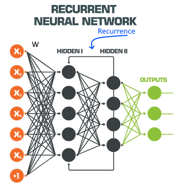

# Recurrence 

Recurrence is the idea of allowing the**previous state of a model to influence the current state**, rather than using the previous [N-grams](../Languages/N-grams.md) to [predict](../Prediction/Prediction.md) the next event based on the [Markov assumption](Markov%20assumption.md). When using recurrence in a [neural networks](Feed%20forward%20neural%20networks%20(FFNN).md) it becomes a [recurrent neural network (RNN)](../Prediction/Recurrent%20neural%20network%20(RNN).md).

Thanks to **recurrence**, the value of a hidden unit doesn't simply reflect the weighted sum of the input, but also **reflects the previous hidden state**. 

The idea is that you update a hidden layer not only based on the current input, but also based on another hidden layer from previous [predictions](Prediction.md). 

Using recurrence suffers from the [vanishing gradient problem](../Vanishing%20gradient%20problem.md).
