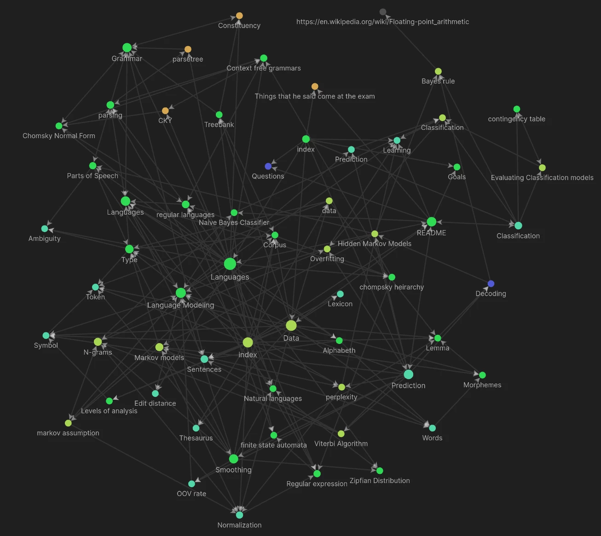

# Topics 
Hi, this is the summary for computational linguistics course from Tilburg University (for now up till the midterm) created by Quinten Cabo. 

There are 4 topics:

- [Data](Data.md)
- [Classification](Classification.md)
- [Prediction](Prediction.md)
- [Languages](Languages.md)

There are also some notes that are not in a topic. These are:

- [Goals](Other/Goals.md)
- [Learning](Other/Learning.md)
- [Things that he said come at the exam](Other/Things%20that%20he%20said%20come%20at%20the%20exam.md)
- [Questions](Prediction/Questions.md)

# Disclaimer 
Although I have tried my best to make sure this summary is correct, I will take no responsibility for mistakes that might lead to you having a lower grade. 

# Issues 
If you see anything that you think might be wrong then please create an issue on the [Github repository](https://github.com/tintin10q/computational-linguistics-summary) or even better, create a [pull request](https://www.dataschool.io/how-to-contribute-on-github/) 😄 

# Support
If you appreciate my summaries and you want to thank me then you can support me
here: 

- [PayPal](https://www.paypal.me/quintencabo)
- [Tikkie](https://tikkie.me/pay/tvc88f91200qmq9fujar)

>Every model is wrong, but some models are usefull.