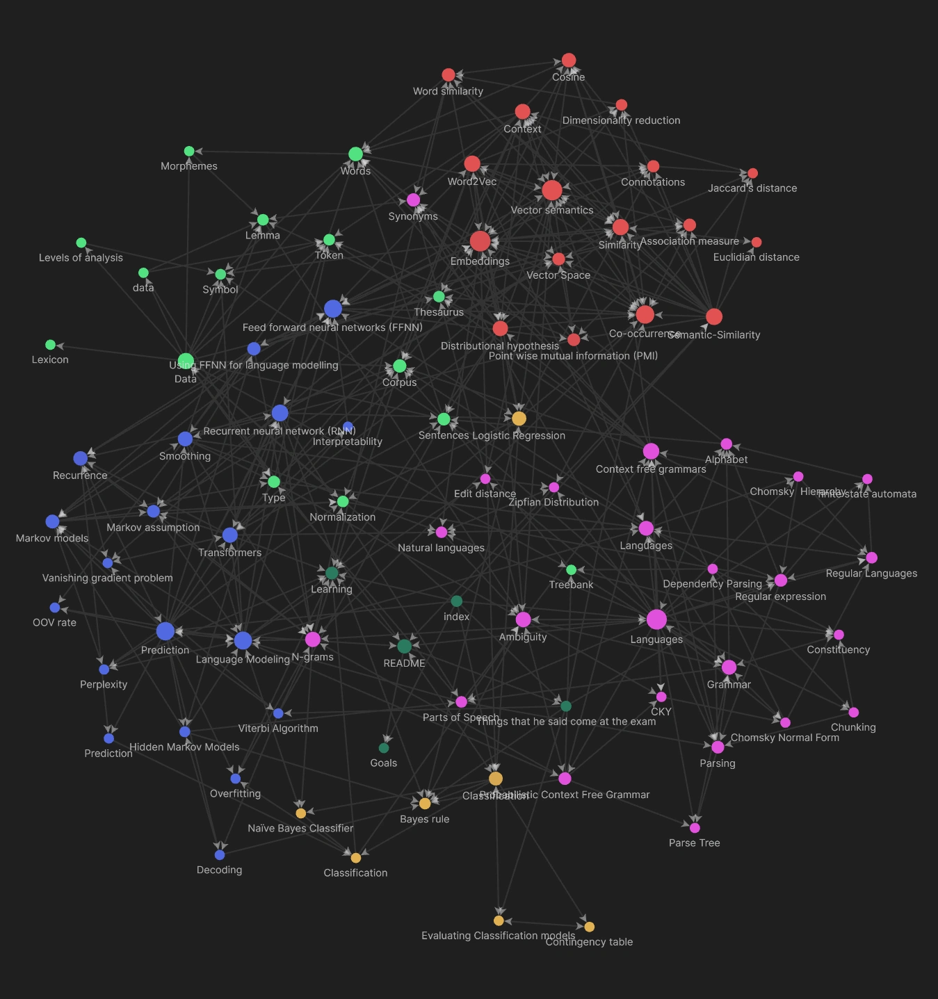

# Topics 
Hi, this is the summary for the Computational Linguistics  [(800962-B-6)](https://uvt.osiris-student.nl/#/onderwijscatalogus/extern/examenprogramma/16322/8B218-2021?taal=en) course from Tilburg University created by Quinten Cabo. 

There are 5 topics:

- [Data](Data.md)
- [Classification](Classification.md)
- [Prediction](Prediction.md)
- [Languages](Languages.md)
- [Semantic-Similarity](Semantic-Similarity.md)

There are also some notes that are not in a topic. These are:

- [Goals](Goals.md)
- [Learning](Learning.md)
- [Things that he said come at the exam](Other/Things%20that%20he%20said%20come%20at%20the%20exam.md)
- [Bert Lecture](Other/Bert%20Lecture.md)
- [Quiz Questions](Other/Quiz%20Questions.md)
- [Practice Questions](Other/Practice%20Questions.md)

https://user-images.githubusercontent.com/24190849/172181536-56f2cde6-9682-4f2c-a3a5-c7ed3dae0db2.mp4

# Disclaimer 
Although I have tried my best to make sure this summary is correct, I will take no responsibility for mistakes that might lead to you having a lower grade. 

# Issues 
If you see anything that you think might be wrong then please create an issue on the [Github repository](https://github.com/tintin10q/computational-linguistics-summary) or even better, create a [pull request](https://www.dataschool.io/how-to-contribute-on-github/) 😄 

# Support
If you appreciate my summaries and you want to thank me then you can support me
here: 

- [PayPal](https://www.paypal.me/quintencabo)
- [Tikkie](https://tikkie.me/pay/c3cp0dcfd8mautn8ud79)

>Every model is wrong, but some models are useful.
