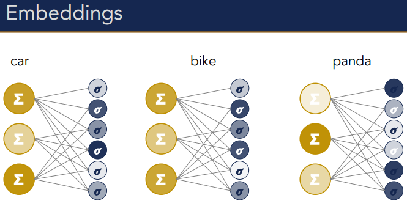

# Word2Vec
The Word2Vec model is a popular way to use [neural networks](../Prediction/Feed%20forward%20neural%20networks%20(FFNN).md) to create [word Embeddings](Embeddings.md). Using neural networks, you can immediately get dense vectors instead of the space vectors you get with [counting based methods](Co-occurrence.md).  

Word2Vec has **two possible architectures**. One of them is called **skip gram with negative sampling (SKNS)** this tries to predict the words in the context from the target word. The other one is **continues bag of words (CBoW)** which tries to predict the target word from the context. 
With both methods we don't care about the actual predictions but rather the hidden layers which are created as a result of training for good predictions. **The hidden layers are selected as the embeddings**. This is called representational learning. Let's now go in more detail below. 

## Skip gram with negative sampling – SKNS 
The idea behind SKNS is build around the intuition that you don't need to count [Co-occurring](Co-occurrence.md) words, but you should **predict co-occurring words**. The prediction is not the goal, but the way to learn the representations. If the prediction gets good results, you have a good [embedding](Embeddings.md). We don't care about the prediction outcome, only about how it influences the embeddings.  The embeddings are taken directly from the weights used in the neural network. 

### How to do this?
1. Pick a target word.
2. Isolate a window of co-occurring context words. Window = context size. The window is a bag of words.
3. Update the representation (the weights used in the network) of the target word such that it **maximizes the probability of predicting its neighbours as neighbours** and minimizes the probability of predicting the other words as neighbours. 

So we try to train a neural network which will predict high co-occurring words for a target word while not predicting non co-occurring words for a target word. The weights which lead to the best model are chosen to represent the target word. Using the weights of a good performing network to represent the target word I find really clever. 

The reason why this is called skip gram with negative sampling is that you (would) have to use all the negative example classes (words which don't co-occur with the target word) to train the model. However, this would take waayy too long. Plus, not all words are equally informative. So instead we only **sample** a few **negative classes** (words which don't co-occur also called foils) to train on, and this also works well. **Sample the negative words by picking the words with probability inversely proportional to word frequency.** This makes sure words which are very frequent don't get used as negative class as these tent to be words like the or of which are not very informative because they appear everywhere. When training the model, you do always use all the positive words (the words which do co-occur) as classes.

This is a form of unsupervised learning. Text supervises itself as using this method embeddings can be learned without having annotated data. You don't need annotations to calculate the loss. Everything you need is already in the text. This is great because annotating data is expensive. 

### A simple binary prediction task
Word2Vec was designed to be very efficient. It achieves this by framing what is described above as a binary problem. The system doesn't predict which word occurs in the context, but **only if a word does**. This is binary instead of multinomial, which is much more efficient to calculate. 

In practice, this is done by first paring the target word with a co-occurring word and updating the network until the probability of predicting the positive word is high. Then you also take one negative sample and keep updating the model until the weights don't predict that word. Then you just repeat these two steps by paring the target word with another positive word and negative word. Typically, you do this until you have gone through every positive word. This is many comparisons, but they are cheap individually. The weight vector in the end becomes the word embedding. 

However, we are still going to use the [softmax](../Classification/Logistic%20Regression.md) function instead of a sigmoid function because we would like to have a probability for every word in the corpus at every position and not just a probability for negative or positive words. Naturally, you want the probability for the words which appear in the context to be bigger and smaller for the words which don't. The number in each output node is **the probability of picking the corresponding word as neighbour of the target**.

This approximates meaning because if two words have similar meaning the [Distributional hypothesis](Distributional%20hypothesis.md) says there are used around the same words (or generally have the same neighbours). So the model should generate similar hidden layer representations (weights) for words with similar meaning, as this generates similar output. Another way to view this is that the network with push or put vectors closer together in the [Vector Space](Vector%20Space.md) which have similar contexts. 

That results in something like this:

 

### Representation learning
This type of learning described above is called representation learning. The goal of the training is to get good internal representation of the words. **By optimizing for prediction, we learn better representations.** You don't really care about the predictions. They are just the way to do unsupervised learning to get the representations. The loss function, if you will. 

Usually good representations are a by product of good predictions, but in this case we are actually more into the representations as we can use measures like [Cosine](Cosine.md) to actually compare the meaning of the resulting word representations. This is quite different to what we have seen with machine learning up till now. One example of this mentioned is to compute the representation of sentences and then compare how similar a paraphrased sentence is. 

### Two embeddings 
In practice we actually get two embeddings per word as each word can be the target word or the in the context (positive or negative). After doing Word2Vec you will get an embedding for the word-as-context and the word-as-target. 

## Continues Bag-Of-Word (CBoW)
The other architecture of Word2Vec is continues bag of words (CBoW). This is similar to SKNS, but you flip the problem. Instead of predicting the context (neighbouring words) from the target word, you try to **predict the target word from the context words**. You also **discard the order information** (bag of words). 

This is kind of like a fill in exercise like this  

But remember that you discard the order of the words. So from the bag of words you want to get the target word. 

But how do we feed the context to the model? Some contexts might be different sizes as well. The best way is to combine the vectors of the words in the bag somehow into one vector. There are infinite ways to do this, but Word2Vec gets the input to the network with by taking the average vector of all the word vectors which co-occur in the context bag of words. This is quite a simple method, but it actually works well. 

So if you have *I like banana*, and you want to predict *like* you get *I ___ banana* which gives the context bag {"I",  "banana"}. Then you average the vectors of I and banana to get the input vector like, and then you train the model to predict like.

## Comparing CBoW and SGNS

### Rare words

**CBoW** maximizes the probability of the target word given the context. Hence, given the context *yesterday was a really ___ day*, CBoW will get rewarded more often for predicting *beautiful* or *nice*, then for saying delightful. As delightful appears less in [language](../Languages/Languages.md) than *nice* and *beautiful*. 

**SGNS** predicts the context from the target. Given the word *delightful*, it assigns a large probability to the context words *yesterday*, *was*, *really*, *day*. **Independently,** as these are trained separately. 

With **CBoW** the word *nice*, *beautiful* and *delightful* kind of compete to fill the space. 
In **SGNS** the words *delightful* + context pairs are treated as new observations which avoid the competition and **penalizes rare words**. 

>This sort of gets back to [the problem with words having multiple senses](Distributional%20hypothesis.md). SGNS I think kind of solves the problem of multiple senses, as the representation of the word is trained to deal well with all the different contexts it appears in. But this is just what I think. Let me know if you think this is wrong. 

>I think CBoW is more in line with what people do when processing language. You learn words by the contexts they appear in. 

Because Skip-gram rely on single words input, it is less sensitive to overfit frequent words, because even if frequent words are presented more times that rare words during training, they still appear individually, while CBOW is prone to overfit frequent words because they appear several times along with the same context.

### Efficiency 
The CBoW architecture is computationally more efficient than the SKNS method because you only use the context once instead to predict the target word, instead of doing a lot of training for all the positive context words and samples of negative context words. So there are fewer comparisons with CBoW. This can also be seen in this image below.

In the original paper of Word2Vec they wrote that CBOW took hours to train, SGNS 3 days.

### Choosing between CBoW and SGNS
Choose SGNS or CBoW depending on your task and constraints. 

## Semantic drift 
If you have a diachronic [Corpus](../Data/Corpus.md), you can also estimate different embedding spaces for different time periods and look at **which words have changed in meaning** and track this change. 

## Evaluation 

### Visualizations 
One way to intrinsically evaluate your model is making sense is by creating visualizations. This is done by reducing many dimensions to just 2 or 3 to be able to plot them in our word. This can be done with PCA or tSNE (in combination with PCA for lage spaces). This is effectively a form of [Dimensionality reduction](Dimensionality%20reduction.md). 

When you plot the vectors that are [more similar](Similarity.md) should be the ones with similar meaning. While the ones which are far apart should not have similar meaning. If this is shown in the visualization, the model works well. 

Below is a visualization of a 60 dimensional space visualized in 2 dimensions. 

### Intrinsic evaluation 
Further intrinsic evaluation assess the goodness of a semantic space by how well it can capture **human intuitions about word relations**. Basically ask a bunch of humans how they think words relate and average the results and see if the model can perform in this way. There are datasets for this, for instance TOEFL or SimLex999. You can also say that some words contain other words. So for instance if you subtract the vector of paris with France and add the Itally vector you should get Rome. 

## Extrinsic evaluation 
This is when you use the resulting representations for another downstream task. If the performance of this task improves, then you know your model does well. Basically, it seems that the performance of every task in computational linguistics improves. For this reason, word embeddings are part of almost every architecture.

## Biases
The models are not magic and only as good as our data. **Garbage in is garbage out**. If your data incorporates societal biases, these will occur in the results of your model.    Choose your data carefully without biases. This is currently an active problem in the field. 

For instance, if in your corpora fathers are more often doctors and mothers are more often nurses then this will be encoded in the word encodings. Or when using [connotations](Connotations.md) what if the names of one nationality are more often closer to positive sentiment, while other nationality names are closer to negative words. This can have an unwanted effect on sentiment analysis predictions for instance.  

What can you do about this? This is still an active research field. There seem to be two ways either change the data to represent society in the way that we want. For instance you can apply [Normalization](../Data/Normalization.md) and replace all sex words like girl or boy with SEX for instance. Or you can try to subtract a special bias vector. Or you can try to change the model which actively debias things they find in the data. 

## Summary of Word2Vec
With word2vec we use neural networks to learn better word embeddings by optimizing hidden layers to yield better prediction in a binary classification task. Given a source and a target word, predict whether the target is a co-occurring word or a foil. After learning, the hidden layer for each word encodes its semantic representation as learned from text. This is called representation learning. You have to be careful with biases.

